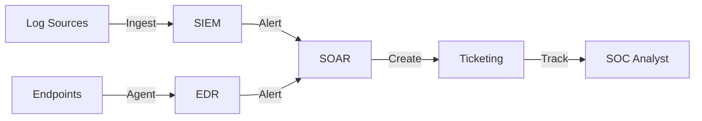

# Standard SOC Infrastructure Setup

This document outlines the standard infrastructure requirements and setup procedures for a modern Security Operations Center (SOC).

## 1. Core Components

A fully functional SOC requires the following core components:

### 1.1 SIEM (Security Information and Event Management)
-   **Purpose**: Centralized log aggregation, correlation, and alerting.
-   **Requirements**:
    -   High availability and scalability.
    -   Retention policy compliance (e.g., 90 days hot, 1 year cold).
    -   Support for common log formats (Syslog, CEF, JSON).

### 1.2 EDR (Endpoint Detection and Response)
-   **Purpose**: Real-time monitoring and prevention on endpoints.
-   **Deployment**: Agents must be deployed to all workstations, servers, and critical assets.
-   **Policy**: Enforce prevention policies (Block/Quarantine) for known malware.

### 1.3 SOAR (Security Orchestration, Automation, and Response)
-   **Purpose**: Automate repetitive tasks and orchestrate incident response workflows.
-   **Integration**: Must connect with SIEM, EDR, and Ticketing systems.

### 1.4 Ticketing / Case Management
-   **Purpose**: Track incidents, investigations, and analyst activities.
-   **Workflow**: Seamless integration from SIEM alerts to case creation.

## 2. Infrastructure Hardening

### 2.1 Access Control
-   **MFA**: Enforce Multi-Factor Authentication for all SOC tools.
-   **RBAC**: Implement Role-Based Access Control (Analyst, Engineer, Manager).
-   **Segmentation**: SOC infrastructure should reside in a secure, segmented network zone.

### 2.2 Monitoring
-   **Health Checks**: Continuous monitoring of tool availability and performance.
-   **Audit Logs**: Enable audit logging for all SOC analyst actions.

## 3. Network Architecture

-   **Log Shippers**: Use dedicated forwarders to send logs to the SIEM securely (TLS encryption).
-   **Jump Host**: Use a secure Jump Host or VPN for administrative access to SOC infrastructure.

## References
-   [NIST Cybersecurity Framework](https://www.nist.gov/cyberframework)
-   [CISA SOC Best Practices](https://www.cisa.gov/topics/cyber-threats-and-advisories)
