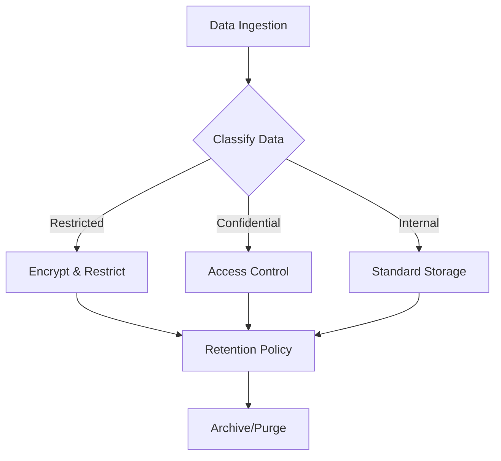
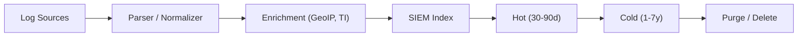

# Data Governance & Retention Policy

This document outlines the standard procedures for managing security data throughout its lifecycle.

## 1. Data Classification

Data within the SOC must be classified to determine appropriate handling and retention controls:
-   **Restricted**: Sensitive PII, Credentials, Private Keys. (Highest Protection)
-   **Confidential**: Internal IP, Network Diagrams, Vulnerability Reports.
-   **Internal**: Standard operational logs.
-   **Public**: Publicly available threat intelligence.

## 2. Retention Policy

### 2.1 Hot Storage (Immediate Access)
-   **Duration**: 30 - 90 Days.
-   **Purpose**: Real-time analysis, correlation, and immediate incident investigation.
-   **Technology**: High-performance storage (SSD/NVMe) usually within the SIEM.

### 2.2 Cold Storage (Long-term Archive)
-   **Duration**: 1 Year - 7 Years (based on compliance requirements like PCI-DSS, GDPR).
-   **Purpose**: Forensic analysis, historical trending, compliance audits.
-   **Technology**: Object Storage (S3, Blob) or Tape backup.

## 3. Data Integrity & Security

-   **Encryption**:
    -   **In-Transit**: TLS 1.2+ for all log forwarding.
    -   **At-Rest**: AES-256 encryption for storage volumes.
-   **Immutability**: Log archives should be immutable (WORM - Write Once Read Many) to prevent tampering.
-   **Access Control**: Strict least-privilege access to raw logs.

## 4. Backup & Recovery

-   **Frequency**: Daily configuration backups; Real-time or hourly data backups.
-   **Testing**: Disaster Recovery (DR) drills must be conducted quarterly to verify data restoration capabilities.

### Recovery Time Objectives

| Data Type | RTO | RPO | Backup Method |
| :--- | :---: | :---: | :--- |
| SIEM Config | 1 hour | 15 min | Automated config backup |
| Alert/Case Data | 4 hours | 1 hour | Database replication |
| Raw Logs (Hot) | 8 hours | 1 hour | Snapshot + replication |
| Raw Logs (Cold) | 24 hours | 24 hours | Object storage |
| Forensic Evidence | N/A | 0 (immutable) | WORM storage |

## 5. Log Source Data Management

### 5.1 Ingestion Pipeline

### 5.2 Data Volume Monitoring

| Metric | Threshold | Alert |
| :--- | :--- | :--- |
| Daily Ingestion Rate | > 120% of baseline | ⚠️ Capacity Warning |
| Storage Utilization | > 80% | ⚠️ Expand Storage |
| Index Size Growth | > 10% week-over-week | 📊 Review log sources |
| Query Latency (P95) | > 5 seconds | 🔴 Performance Issue |

### 5.3 Capacity Planning

- Review monthly: ingestion rate, storage growth, query performance
- Forecast quarterly: storage needs for next 12 months
- Budget annually: infrastructure costs based on data growth trends
- Monitor EPS (events per second) against SIEM license limits

## 6. Data Lifecycle Automation

| Phase | Action | Schedule | Owner |
| :--- | :--- | :--- | :--- |
| Ingest | Parse + normalize + enrich | Real-time | SOC Engineering |
| Index | Store in hot tier | Real-time | SOC Engineering |
| Tier | Move hot → cold | After 90 days | Automation |
| Archive | Compress + encrypt to cold | After 90 days | Automation |
| Purge | Delete per retention policy | Per schedule | Automation |
| Audit | Verify integrity + access logs | Monthly | SOC Manager |

## 7. Audit & Compliance

- All data access must be logged with timestamp, user, and action
- Quarterly access review of raw log data permissions
- Annual audit of retention policy compliance
- PDPA data subject access requests handled within 30 days

## Related Documents
-   [Data Handling Protocol (TLP)](../06_Operations_Management/Data_Handling_Protocol.en.md)
-   [Deployment Procedures](Deployment_Procedures.en.md)
-   [SOC Infrastructure Setup](../10_Training_Onboarding/System_Activation.en.md)

## References
-   [NIST SP 800-53 (Security/Privacy Controls)](https://csrc.nist.gov/publications/detail/sp/800-53/rev-5/final)
-   [GDPR Data Retention](https://gdpr.eu/)
