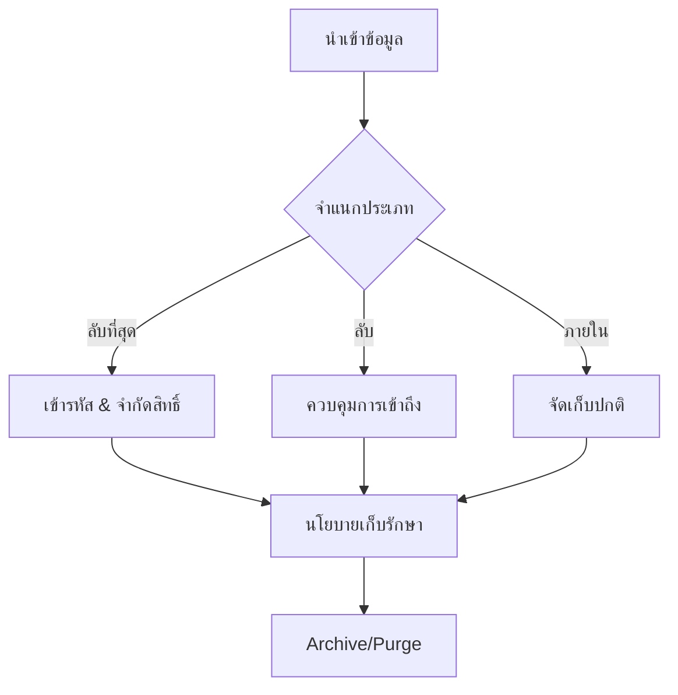

# ธรรมาภิบาลข้อมูลและนโยบายการเก็บรักษา (Data Governance & Retention Policy)

เอกสารนี้ระบุขั้นตอนมาตรฐานในการจัดการข้อมูลความปลอดภัยตลอดวงจรชีวิตของข้อมูล

## 1. การจำแนกประเภทข้อมูล (Data Classification)



ข้อมูลใน SOC ต้องได้รับการจำแนกเพื่อกำหนดการจัดการที่เหมาะสม:
-   **ลับที่สุด (Restricted)**: PII ที่ละเอียดอ่อน, รหัสผ่าน, Private Keys (ต้องป้องกันสูงสุด)
-   **ลับ (Confidential)**: ทรัพย์สินทางปัญญาภายใน, แผนผังเครือข่าย, รายงานช่องโหว่
-   **ใช้ภายใน (Internal)**: Log การทำงานทั่วไป
-   **สาธารณะ (Public)**: Threat Intelligence ที่เปิดเผยทั่วไป

## 2. นโยบายการเก็บรักษาข้อมูล (Retention Policy)

### 2.1 Hot Storage (เข้าถึงทันที)
-   **ระยะเวลา**: 30 - 90 วัน
-   **วัตถุประสงค์**: การวิเคราะห์ Real-time, Correlation, และการสืบสวนเหตุการณ์ด่วน
-   **เทคโนโลยี**: Storage ประสิทธิภาพสูง (SSD/NVMe) มักอยู่ใน SIEM

### 2.2 Cold Storage (เก็บระยะยาว)
-   **ระยะเวลา**: 1 ปี - 7 ปี (ขึ้นอยู่กับข้อกำหนดทางกฎหมาย เช่น PCI-DSS, GDPR)
-   **วัตถุประสงค์**: การวิเคราะห์ทางนิติวิทยาศาสตร์ (Forensics), ดูแนวโน้มย้อนหลัง, ตรวจสอบ (Audit)
-   **เทคโนโลยี**: Object Storage (S3, Blob) หรือ Tape backup

## 3. ความถูกต้องและความปลอดภัยของข้อมูล (Data Integrity & Security)

-   **การเข้ารหัส (Encryption)**:
    -   **In-Transit**: TLS 1.2+ สำหรับการส่ง Log ทั้งหมด
    -   **At-Rest**: เข้ารหัส AES-256 สำหรับพื้นที่จัดเก็บ
-   **ความไม่เปลี่ยนแปลง (Immutability)**: Log archive ควรเป็นแบบแก้ไขไม่ได้ (WORM - Write Once Read Many) เพื่อป้องกันการปลอมแปลง
-   **การควบคุมการเข้าถึง**: ให้สิทธิ์เท่าที่จำเป็น (Least Privilege) ในการเข้าถึง Raw Log

## 4. การสำรองและกู้คืน (Backup & Recovery)
-   **ความถี่**: สำรองค่า Configuration ทุกวัน; สำรองข้อมูล Real-time หรือทุกชั่วโมง
-   **การทดสอบ**: ต้องมีการซ้อมแผนกู้คืนภัยพิบัติ (DR) ทุกไตรมาสเพื่อยืนยันว่าสามารถกู้คืนข้อมูลได้จริง

### เป้าหมายเวลาการกู้คืน

| ประเภทข้อมูล | RTO | RPO | วิธีสำรอง |
|:---|:---:|:---:|:---|
| SIEM Config | 1 ชั่วโมง | 15 นาที | สำรอง Config อัตโนมัติ |
| Alert/Case Data | 4 ชั่วโมง | 1 ชั่วโมง | Database replication |
| Raw Logs (Hot) | 8 ชั่วโมง | 1 ชั่วโมง | Snapshot + replication |
| Raw Logs (Cold) | 24 ชั่วโมง | 24 ชั่วโมง | Object storage |
| หลักฐานทางนิติวิทยาศาสตร์ | N/A | 0 (immutable) | WORM storage |

## 5. การจัดการวงจรชีวิตข้อมูล

| ขั้นตอน | การดำเนินการ | กำหนดเวลา | ผู้รับผิดชอบ |
|:---|:---|:---|:---|
| รับเข้า | Parse + normalize + enrich | Real-time | SOC Engineering |
| จัดเก็บ | เก็บใน Hot tier | Real-time | SOC Engineering |
| ย้ายชั้น | Hot → Cold | หลัง 90 วัน | ระบบอัตโนมัติ |
| เก็บถาวร | บีบอัด + เข้ารหัส | หลัง 90 วัน | ระบบอัตโนมัติ |
| ลบ | ลบตามนโยบาย Retention | ตามกำหนด | ระบบอัตโนมัติ |
| ตรวจสอบ | ตรวจสอบความถูกต้อง + Log การเข้าถึง | รายเดือน | SOC Manager |

## 6. การตรวจสอบและการปฏิบัติตาม

- การเข้าถึงข้อมูลทั้งหมดต้องมีบันทึก timestamp, ผู้ใช้ และการดำเนินการ
- ทบทวนสิทธิ์การเข้าถึงข้อมูล Raw log รายไตรมาส
- ตรวจสอบนโยบาย Retention ประจำปี
- ดำเนินการคำขอของเจ้าของข้อมูลตาม PDPA ภายใน 30 วัน

## คู่มือการวางแผน Capacity

### สูตรประมาณ Storage
```
Storage ต่อวัน (GB) = EPS เฉลี่ย × ขนาด Event (bytes) × 86,400 / (1024^3)

ตัวอย่าง:
  1,000 EPS × 500 bytes × 86,400 = ~40 GB/วัน
  Hot storage (90 วัน): 40 × 90 = 3.6 TB
  Cold storage (1 ปี): 40 × 365 = 14.6 TB
```

### Sizing ตามขนาดองค์กร

| ขนาดองค์กร | EPS ประมาณ | ปริมาณ/วัน | Hot (90 วัน) | Cold (1 ปี) | SIEM แนะนำ |
|:---|:---:|:---:|:---:|:---:|:---|
| เล็ก (<500 users) | 100-500 | 4-20 GB | 360 GB-1.8 TB | 1.5-7 TB | Wazuh (single node) |
| กลาง (500-5K) | 500-5,000 | 20-200 GB | 1.8-18 TB | 7-73 TB | Elastic (3-node) |
| ใหญ่ (5K-50K) | 5,000-50,000 | 200 GB-2 TB | 18-180 TB | 73-730 TB | Splunk/Elastic cluster |

### แผนสำรองข้อมูล

| Component | ประเภท Backup | ความถี่ | ระยะเก็บ | เป้า Recovery |
|:---|:---|:---|:---|:---|
| SIEM config | Full | รายวัน | 30 วัน | < 1 ชม. |
| Detection rules | Git version control | ทุกครั้งที่เปลี่ยน | ถาวร | < 15 นาที |
| Ticketing data | Incremental | รายวัน | 3 ปี | < 4 ชม. |
| TI platform (MISP) | Full | รายสัปดาห์ | 1 ปี | < 2 ชม. |
| SOAR playbooks | Git version control | ทุกครั้งที่เปลี่ยน | ถาวร | < 15 นาที |
| Dashboards | Export/JSON | รายสัปดาห์ | 1 ปี | < 1 ชม. |

## สคริปต์ตรวจสุขภาพ Database

รันทุกสัปดาห์เพื่อตรวจสอบสุขภาพ SIEM database:

```bash
#!/bin/bash
# siem_health_check.sh — ตรวจ DB สุขภาพ SIEM ประจำสัปดาห์

echo "=== SIEM Database Health Check ==="
echo "Date: $(date -u +%Y-%m-%dT%H:%M:%SZ)"

# 1. ตรวจ disk usage
echo "--- Disk Usage ---"
df -h /var/lib/elasticsearch 2>/dev/null || df -h /opt/splunk 2>/dev/null

# 2. ตรวจขนาด index (Elasticsearch)
curl -s 'localhost:9200/_cat/indices?v&s=store.size:desc' | head -20

# 3. ตรวจ cluster health
curl -s 'localhost:9200/_cluster/health?pretty'

# 4. ตรวจ indices เก่าสำหรับ cleanup
echo "--- Indices เก่ากว่า 90 วัน ---"
curl -s 'localhost:9200/_cat/indices?v&h=index,creation.date.string,store.size' | \
  awk -v cutoff="$(date -v-90d +%Y.%m.%d)" '$2 < cutoff { print }'
```

## เอกสารที่เกี่ยวข้อง (Related Documents)
-   [โปรโตคอลการจัดการข้อมูล (TLP)](../06_Operations_Management/Data_Handling_Protocol.th.md)
-   [ขั้นตอนการ Deploy](Deployment_Procedures.th.md)
-   [การติดตั้ง SOC](../10_Training_Onboarding/System_Activation.th.md)

## Database Performance Monitoring

### Key Metrics

| Metric | Target | Alert Threshold |
|:---|:---|:---|
| Query latency | < 100ms | > 500ms |
| Connection pool | < 70% used | > 90% |
| Storage utilization | < 75% | > 85% |
| Replication lag | < 1 sec | > 10 sec |
| Index fragmentation | < 10% | > 30% |

### Backup Verification Schedule

| Backup Type | Frequency | Verify | Retention |
|:---|:---|:---|:---|
| Full backup | Daily | Weekly restore test | 30 days |
| Transaction log | ทุก 15 min | Monthly | 7 days |
| Archive | Monthly | Quarterly | 1 year |

### Index Maintenance Schedule

| Task | Frequency | Impact |
|:---|:---|:---|
| Reindex | Weekly (off-peak) | Medium |
| Statistics update | Daily | Low |
| Vacuum/optimize | Monthly | High |
| Archive old data | Quarterly | High |

## References
-   [NIST SP 800-53 (Security/Privacy Controls)](https://csrc.nist.gov/publications/detail/sp/800-53/rev-5/final)
-   [GDPR Data Retention](https://gdpr.eu/)
