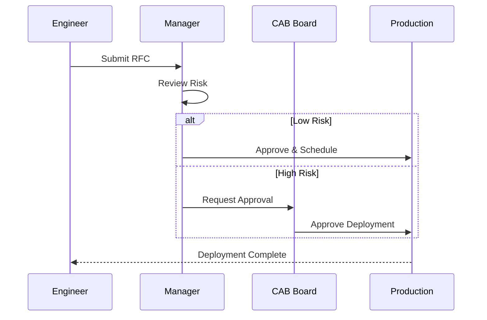

# Change Management & Deployment Standard

This document outlines the standard process for managing changes and deployments within the SOC environment.

## 1. Change Management Process

All changes to the production SOC environment (Alert Rules, Parsers, Infrastructure) must follow a structured process.

### 1.1 Request (RFC)
-   Submit a Request for Change (RFC) documenting:
    -   Description of change.
    -   Justification/Impact.
    -   Risk assessment.
    -   Rollback plan.

### 1.2 Review & Approval (CAB)
-   **Change Advisory Board (CAB)** reviews High-risk changes.
-   Peer review is required for Alert Rule modifications (Detection Engineering).

## 2. Deployment Procedures

### 2.1 Environment Strategy
-   **Development/Lab**: Sandbox environment for testing new rules and integrations.
-   **Staging**: Mirror of production for final verification.
-   **Production**: Live environment.

### 2.2 Deployment Steps
1.  **Test**: Validate functionality in the Lab environment.
2.  **Snapshot**: Take a backup/snapshot of the current configuration.
3.  **Deploy**: Apply changes to Production during the approved window.
4.  **Verify**: Confirm operational status and check for errors.

### 2.3 CI/CD for Detection Rules
-   Manage detection rules as code (Detection-as-Code).
-   Use Version Control (Git) for all rule logic.
-   Automate testing (Syntax check, Unit test) via CI pipeline before merging to `main`.

## 3. Rollback Plan

-   Every deployment must have a predefined rollback strategy.
-   If verification fails, immediately revert to the pre-deployment snapshot.
-   Conduct a Root Cause Analysis (RCA) for failed changes.

## Related Documents
-   [Change Request Template](../templates/change_request_rfc.en.md)
-   [Data Governance & Retention](Database_Management.en.md)
-   [SOC Infrastructure Setup](../01_Onboarding/System_Activation.en.md)

## References
-   [ITIL Change Management](https://www.axelos.com/best-practice-solutions/itil)
-   [DevSecOps Manifesto](https://www.devsecops.org/)
