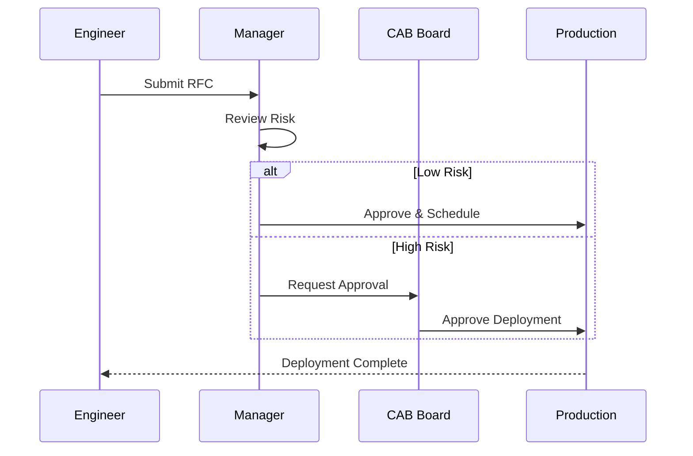
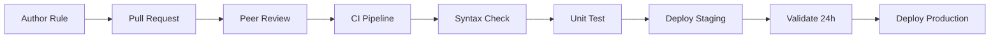

# Change Management & Deployment Standard

This document outlines the standard process for managing changes and deployments within the SOC environment.

## 1. Change Management Process

All changes to the production SOC environment (Alert Rules, Parsers, Infrastructure) must follow a structured process.



### 1.1 Request (RFC)
-   Submit a Request for Change (RFC) documenting:
    -   Description of change.
    -   Justification/Impact.
    -   Risk assessment.
    -   Rollback plan.

### 1.2 Review & Approval (CAB)
-   **Change Advisory Board (CAB)** reviews High-risk changes.
-   Peer review is required for Alert Rule modifications (Detection Engineering).

## 2. Deployment Procedures

### 2.1 Environment Strategy
-   **Development/Lab**: Sandbox environment for testing new rules and integrations.
-   **Staging**: Mirror of production for final verification.
-   **Production**: Live environment.

### 2.2 Deployment Steps
1.  **Test**: Validate functionality in the Lab environment.
2.  **Snapshot**: Take a backup/snapshot of the current configuration.
3.  **Deploy**: Apply changes to Production during the approved window.
4.  **Verify**: Confirm operational status and check for errors.

### 2.3 CI/CD for Detection Rules
-   Manage detection rules as code (Detection-as-Code).
-   Use Version Control (Git) for all rule logic.
-   Automate testing (Syntax check, Unit test) via CI pipeline before merging to `main`.

## 3. Rollback Plan

-   Every deployment must have a predefined rollback strategy.
-   If verification fails, immediately revert to the pre-deployment snapshot.
-   Conduct a Root Cause Analysis (RCA) for failed changes.

## 4. Change Risk Assessment

| Risk Level | Criteria | Approval | Maintenance Window |
|:---|:---|:---|:---|
| **Low** | Cosmetic, documentation, non-impacting | SOC Lead | Anytime |
| **Medium** | New detection rule, parser update | SOC Manager | Business hours |
| **High** | SIEM config, integration change | SOC Manager + CAB | Maintenance window |
| **Critical** | Infrastructure, network, auth changes | CISO + CAB | Scheduled downtime |

## 5. Maintenance Windows

| Window | Schedule | Duration | Use For |
|:---|:---|:---|:---|
| **Standard** | Tuesday & Thursday 02:00–06:00 | 4 hours | Medium/High changes |
| **Emergency** | As needed (CAB approval) | 2 hours | Critical hotfixes |
| **Extended** | Last Saturday of month 00:00–08:00 | 8 hours | Infrastructure upgrades |

## 6. Deployment Checklist

| # | Step | Owner | Done |
|:---:|:---|:---|:---:|
| 1 | RFC submitted and approved | Engineer | ☐ |
| 2 | Peer review completed (detection rules) | Detection Eng | ☐ |
| 3 | Pre-deployment snapshot/backup taken | Engineer | ☐ |
| 4 | Change tested in staging environment | Engineer | ☐ |
| 5 | Rollback plan documented and tested | Engineer | ☐ |
| 6 | Deployment window confirmed | SOC Manager | ☐ |
| 7 | Stakeholders notified of change | SOC Lead | ☐ |
| 8 | Change deployed to production | Engineer | ☐ |
| 9 | Post-deployment verification completed | Engineer | ☐ |
| 10 | Monitoring for 30 min post-change (no errors) | SOC Lead | ☐ |
| 11 | RFC closed with results documented | Engineer | ☐ |

## 7. Detection-as-Code Pipeline



## Rollback Procedures

### When to Rollback
| Indicator | Action |
|:---|:---|
| SIEM stops receiving logs | Rollback immediately |
| Alert volume drops to 0 | Investigate first, rollback if not resolved in 15 min |
| False positive rate spikes > 50% | Rollback rule change, investigate |
| Dashboard/query errors | Rollback config change |
| Agent crash after update | Rollback agent version |

### Rollback Checklist
```
□ Identify the change that caused the issue
□ Notify SOC Manager that rollback is in progress
□ Apply rollback from backup/git
□ Verify system returns to normal operation
□ Document the failed change and root cause
□ Schedule post-mortem within 48 hours
```

## Change Window Schedule

| Change Type | Allowed Window | Approval Required | Rollback Time |
|:---|:---|:---|:---|
| Detection rule (new) | Anytime (test mode) | SOC Lead | < 5 min |
| Detection rule (production) | Business hours | SOC Lead + peer review | < 5 min |
| SIEM configuration | Maintenance window (Sun 02:00-06:00) | SOC Manager | < 30 min |
| Agent update (fleet) | Staged: 10% → 50% → 100% over 3 days | SOC Manager + IT | < 1 hour |
| Major platform upgrade | Maintenance window + CAB approval | CISO | < 4 hours |

## Related Documents
-   [Change Request Template](../templates/change_request_rfc.en.md)
-   [Data Governance & Retention](Database_Management.en.md)
-   [SOC Infrastructure Setup](../10_Training_Onboarding/System_Activation.en.md)

## References
-   [ITIL Change Management](https://www.axelos.com/best-practice-solutions/itil)
-   [DevSecOps Manifesto](https://www.devsecops.org/)
