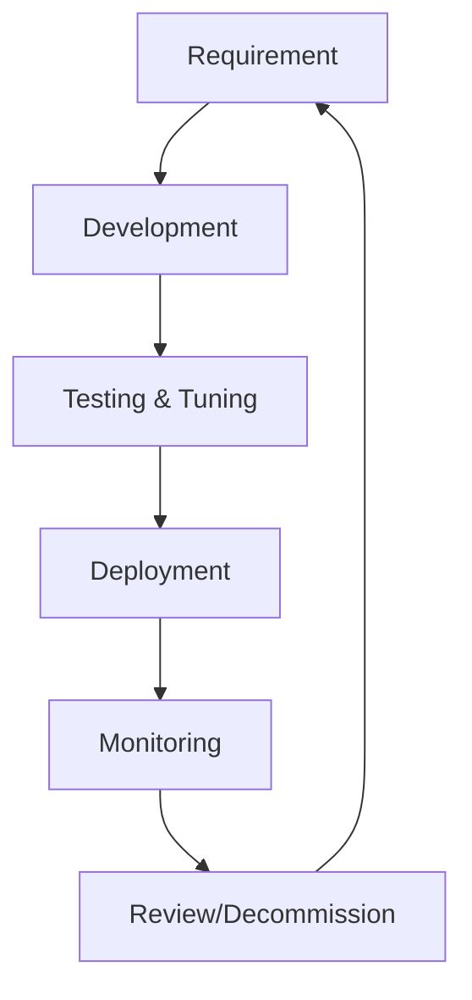

# Detection Engineering Lifecycle

This document defines the lifecycle for creating, maintaining, and retiring detection rules within the SOC.

## 1. Requirement & Research

-   **Threat Intelligence**: Analyze recent threat reports, CVEs, and adversary inputs.
-   **Gap Analysis**: Identify missing coverage in the MITRE ATT&CK dashboard.
-   **Business Context**: Understand critical assets and risks specific to the organization.

## 2. Development (Sigma/YARA/Snort)
-   **Standard Format**: Use **Sigma** for SIEM-agnostic rule creation.
-   **Metadata**: All rules must include:
    -   Title & Description
    -   Author
    -   Severity
    -   MITRE Mapping (Tactic/Technique)
    -   Status (Experimental, Stable, Deprecated)

## 3. Testing & Tuning
-   **Validation**: Test rules against historical data or generated attack simulations (e.g., Atomic Red Team).
-   **Whitelisting**: Identify and filter out benign false positives.
-   **Promotion**: Move rule from "Experimental" to "Stable" only after verifying False Positive Rate (FPR) is acceptable.

## 4. Deployment & Monitoring
-   Deploy via the CI/CD pipeline defined in [Change Management](../02_Platform_Operations/Deployment_Procedures.en.md).
-   Monitor rule performance (Alert Volume, Analyst Feedback).

## 5. Review & Deprecation
-   **Quarterly Audit**: Review rules for relevance. Adversary tactics change; rules may become obsolete.
-   **Deprecation**: retire rules that are noisy, ineffective, or duplicative.

## Related Documents
-   [Integration Hub](Integration_Hub.en.md)
-   [Incident Response Framework](../05_Incident_Response/Framework.en.md)
-   [Detection Rules Index](../07_Detection_Rules/README.md)

## References
-   [Detection Engineering Weekly](https://detectionengineering.net/)
-   [MITRE ATT&CK](https://attack.mitre.org/)
