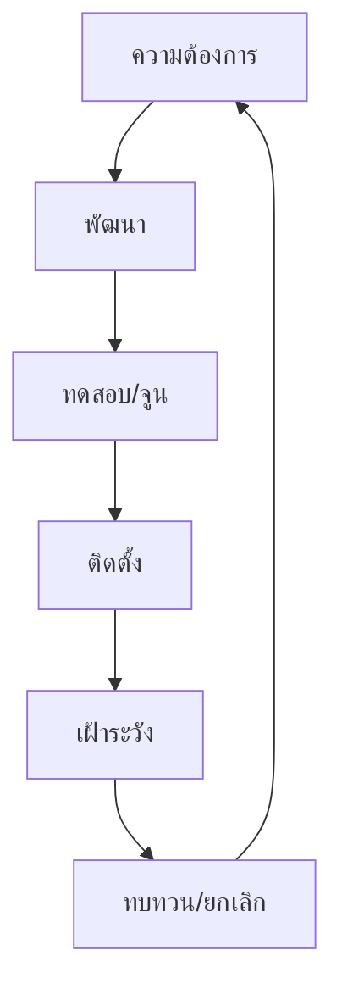

# วงจรชีวิตวิศวกรรมการตรวจจับ (Detection Engineering Lifecycle)

เอกสารนี้กำหนดวงจรชีวิตสำหรับการสร้าง ดูแลรักษา และยกเลิกกฎการตรวจจับภายใน SOC

## 1. ความต้องการและการวิจัย (Requirement & Research)

-   **Threat Intelligence**: วิเคราะห์รายงานภัยคุกคามล่าสุด, CVE, และข้อมูลจากผู้โจมตี
-   **Gap Analysis**: ระบุจุดที่ยังขาดการป้องกันใน MITRE ATT&CK Dashboard
-   **บริบททางธุรกิจ**: ทำความเข้าใจสินทรัพย์สำคัญและความเสี่ยงเฉพาะขององค์กร

## 2. การพัฒนา (Development - Sigma/YARA/Snort)
-   **รูปแบบมาตรฐาน**: ใช้ **Sigma** สำหรับสร้างกฎที่สามารถแปลงไปใช้กับ SIEM ใดก็ได้
-   **Metadata**: กฎทุกข้อต้องระบุ:
    -   ชื่อและคำอธิบาย
    -   ผู้เขียน
    -   ระดับความรุนแรง (Severity)
    -   MITRE Mapping (Tactic/Technique)
    -   สถานะ (Experimental, Stable, Deprecated)

## 3. การทดสอบและปรับแต่ง (Testing & Tuning)
-   **ตรวจสอบ**: ทดสอบกฎกับข้อมูลย้อนหลัง หรือจำลองการโจมตี (เช่น Atomic Red Team)
-   **Whitelisting**: ระบุและกรอง False Positive ที่เป็นกิจกรรมปกติออก
-   **เลื่อนขั้น**: ปรับสถานะจาก "Experimental" เป็น "Stable" เมื่อยืนยันว่าอัตรา False Positive (FPR) ยอมรับได้

## 4. การติดตั้งและเฝ้าระวัง (Deployment & Monitoring)
-   ติดตั้งผ่าน CI/CD pipeline ตามที่ระบุใน [Change Management](../02_Platform_Operations/Deployment_Procedures.th.md)
-   เฝ้าระวังประสิทธิภาพของกฎ (ปริมาณ Alert, ผลตอบรับจาก Analyst)

## 5. การทบทวนและยกเลิก (Review & Deprecation)
-   **ตรวจสอบรายไตรมาส**: ทบทวนความเกี่ยวข้องของกฎ เทคนิคการโจมตีเปลี่ยนไป กฎอาจล้าสมัย
-   **การยกเลิก (Deprecation)**: ยกเลิกกฎที่มีเสียงรบกวนมากเกินไป (Noisy), ไม่มีประสิทธิภาพ, หรือซ้ำซ้อน

## เอกสารที่เกี่ยวข้อง (Related Documents)
-   [ศูนย์รวมการเชื่อมต่อ](Integration_Hub.th.md)
-   [กรอบ Incident Response](../05_Incident_Response/Framework.th.md)
-   [ดัชนี Detection Rules](../07_Detection_Rules/README.th.md)

## References
-   [Detection Engineering Weekly](https://detectionengineering.net/)
-   [MITRE ATT&CK](https://attack.mitre.org/)
