# Tool Integration Strategy

This document outlines the strategy for integrating security tools and log sources into the SOC architecture. A well-integrated tool stack reduces blind spots, accelerates detection, and enables automated response.

---

## Integration Architecture

```mermaid
graph LR
    Source["🔌 Log Sources"] -->|Transport| Collect["📥 Collection Layer"]
    Collect -->|Normalize| Normalize["⚙️ Normalization"]
    Normalize -->|Enrich| Enrich["🧠 Enrichment"]
    Enrich -->|Store| SIEM["💾 SIEM / Data Lake"]
    SIEM -->|Detect| Rules["🔍 Detection Rules"]
    Rules -->|Alert| Alert["🚨 Alert Queue"]
    Alert -->|Respond| SOAR["🤖 SOAR / Automation"]
    SOAR -->|Act| Response["🛡️ Response Actions"]
```



---

## 1. Log Source Integration

### 1.1 Transport Mechanisms

| Transport | Best For | Protocol | Agents |
|:---|:---|:---|:---|
| **API Polling** | Cloud services (AWS, M365, SaaS) | REST/GraphQL | Native collectors |
| **Agent-based** | Servers, endpoints | Syslog, custom | Filebeat, Winlogbeat, OSQuery, Fluent Bit |
| **Syslog** | Network devices, firewalls, legacy | UDP/TCP 514, TLS 6514 | rsyslog, syslog-ng |
| **Webhook** | SaaS alerts, custom apps | HTTPS | N/A (push-based) |
| **SNMP Trap** | Network monitoring, UPS, printers | UDP 162 | SNMP manager |
| **Database Query** | Internal apps, CMDB | JDBC/ODBC | Custom scripts |

### 1.2 Normalization Standards

All logs must be normalized to a common schema before ingestion:

| Field | Description | Format | Example |
|:---|:---|:---|:---|
| `@timestamp` | Event time | ISO 8601 UTC | `2026-02-16T07:00:00Z` |
| `source.ip` | Source IP | IPv4/IPv6 | `10.0.1.50` |
| `destination.ip` | Destination IP | IPv4/IPv6 | `203.0.113.1` |
| `user.name` | Username | String | `john.doe` |
| `host.hostname` | Host name | String | `WS-FINANCE-042` |
| `event.action` | What happened | String | `login_failed` |
| `event.outcome` | Result | success/failure | `failure` |
| `event.severity` | Severity level | Integer 0-10 | `7` |
| `event.category` | Category | Array | `["authentication"]` |

**Supported schemas**: ECS (Elastic Common Schema), CIM (Splunk Common Information Model), OCSF (Open Cybersecurity Schema Framework)

### 1.3 Log Source Priority

| Priority | Source Type | Examples | SLA (Onboarding) |
|:---:|:---|:---|:---|
| **P1** | Identity & Access | AD, Azure AD, Okta, VPN | ≤ 1 week |
| **P2** | Endpoint | EDR, AV, OS logs | ≤ 2 weeks |
| **P3** | Network | Firewall, IDS/IPS, Proxy, DNS | ≤ 2 weeks |
| **P4** | Cloud | AWS CloudTrail, Azure Activity, GCP | ≤ 3 weeks |
| **P5** | Application | Web servers, databases, SaaS | ≤ 4 weeks |
| **P6** | Physical | Badge access, CCTV | ≤ 4 weeks |

---

## 2. Enrichment Integrations

### 2.1 Threat Intelligence

| Feed | Type | Data | Refresh |
|:---|:---|:---|:---|
| **MISP** | Open-source TIP | IoCs, Galaxy clusters | Real-time |
| **ThreatFox** | Open feed | Malware IoCs | Hourly |
| **URLhaus** | Open feed | Malicious URLs | 5 min |
| **AbuseIPDB** | Community | IP reputation | On-demand |
| **Commercial** | Paid (e.g., Recorded Future) | Comprehensive TI | Real-time |

**Enrichment process**: Automate lookup of IPs, domains, hashes, and URLs extracted from alerts against TI feeds.

### 2.2 Asset & Identity Context

| Source | Data | Purpose |
|:---|:---|:---|
| **CMDB** | Asset inventory, criticality, owner | Prioritize alerts by asset value |
| **AD/LDAP** | User roles, groups, department | Identify privileged users |
| **Identity Provider** | SSO sessions, MFA status | Context for auth anomalies |
| **Vulnerability Scanner** | CVE status per host | Correlate exploit attempts |

### 2.3 GeoIP & DNS

| Service | Data | Use Case |
|:---|:---|:---|
| **MaxMind GeoIP** | Country, city, ASN | Impossible travel, geo-blocking |
| **Passive DNS** | Domain history, resolutions | Identify fast-flux, DGA |
| **WHOIS** | Domain registration | Phishing domain age check |

---

## 3. SOAR / Automation Integration

| Automation | Trigger | Action | Tool |
|:---|:---|:---|:---|
| **IoC Enrichment** | New alert | Lookup hash/IP/domain in TI | SOAR playbook |
| **Host Isolation** | Confirmed malware | Isolate via EDR API | CrowdStrike/SentinelOne |
| **Account Disable** | Account compromise | Disable in AD/IdP | SOAR → AD API |
| **Ticket Creation** | Alert above threshold | Create case in ITSM | ServiceNow/Jira integration |
| **Email Quarantine** | Phishing confirmed | Remove from all mailboxes | M365/Google API |
| **Block IP/Domain** | Confirmed C2 | Update firewall/proxy rules | Firewall API |

---

## 4. Health Monitoring

### Integration Health Dashboard

| Check | Method | Alert Threshold | Resolution |
|:---|:---|:---|:---|
| **Heartbeat** | Periodic status ping | No signal > 15 min | Check agent/service |
| **Data Freshness** | Last event timestamp | No events > 1 hour | Check source/network |
| **Event Rate** | Baseline comparison | Drop > 50% or spike > 200% | Investigate source |
| **API Errors** | HTTP status monitoring | > 5% error rate (401/403/429) | Check credentials/quota |
| **Parser Errors** | Parse failure rate | > 1% of events | Update parser |
| **Storage** | Disk/index utilization | > 80% capacity | Scale or archive |

### Automated Health Checks

```bash
# Example: check log freshness for critical sources
for source in firewall edr ad_auth dns proxy; do
  last_event=$(get_last_event_time "$source")
  age_minutes=$(calculate_age_minutes "$last_event")
  if [ "$age_minutes" -gt 60 ]; then
    send_alert "STALE_DATA" "$source" "$age_minutes"
  fi
done
```

---

## 5. Integration Onboarding Checklist

| # | Step | Owner | Done |
|:---:|:---|:---|:---:|
| 1 | Identify log source and data type | Detection Engineer | ☐ |
| 2 | Determine transport mechanism | SOC + IT Ops | ☐ |
| 3 | Configure collection (agent/API/syslog) | IT Ops | ☐ |
| 4 | Create normalization rules/parser | Detection Engineer | ☐ |
| 5 | Validate sample events in SIEM | SOC Analyst | ☐ |
| 6 | Configure enrichment (TI/CMDB) | Detection Engineer | ☐ |
| 7 | Create/assign detection rules | Detection Engineer | ☐ |
| 8 | Set up health monitoring | SOC Ops | ☐ |
| 9 | Document in Log Source Matrix | SOC Lead | ☐ |
| 10 | Sign-off and go-live | SOC Manager | ☐ |

---

## Related Documents

- [Detection Engineering Lifecycle](Content_Management.en.md)
- [Log Source Matrix](../06_Operations_Management/Log_Source_Matrix.en.md)
- [Log Source Onboarding](../06_Operations_Management/Log_Source_Onboarding.en.md)
- [TI Feeds Integration](../06_Operations_Management/TI_Feeds_Integration.en.md)
- [Troubleshooting](../04_Troubleshooting/Common_Issues.en.md)

## References

- [Sigma: Generic Signature Format](https://github.com/SigmaHQ/sigma)
- [Elastic Common Schema (ECS)](https://www.elastic.co/guide/en/ecs/current/index.html)
- [OCSF — Open Cybersecurity Schema Framework](https://schema.ocsf.io/)
- [Splunk CIM](https://docs.splunk.com/Documentation/CIM/latest)
