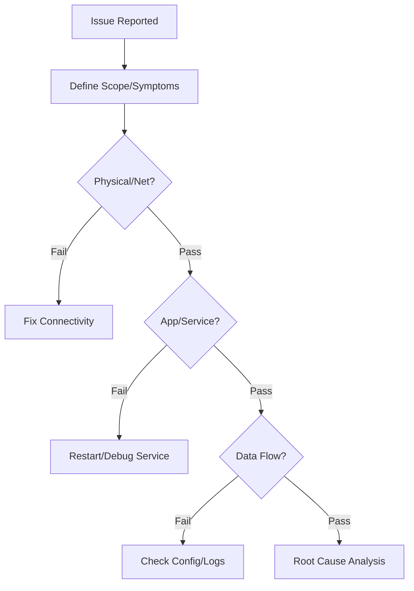

# Standard Troubleshooting Methodology

This document outlines a systematic approach to troubleshooting complex issues within the SOC infrastructure.

## 1. Defining the Problem

-   **Symptoms**: What is exactly failing? (e.g., "Alerts not showing", "Login failed").
-   **Symptoms**: What is exactly failing? (e.g., "Alerts not showing", "Login failed").
-   **Scope**: Is it affecting one user, one sensor, or the whole platform?
-   **Timeline**: When did it start? Was there a recent change (Deployment/RFC)?

## 2. The Troubleshooting Workflow

### 2.1 Physical/Network Layer
-   **Connectivity**: Can you Ping/Telnet/Netcat to the target service?
-   **Firewall**: Are ports blocked? (Check Firewall/Security Group logs).
-   **DNS**: Is the hostname resolving correctly? (`nslookup`, `dig`).

### 2.2 Application/Service Layer
-   **Service Status**: Is the service process running? (`systemctl status`, `docker ps`).
-   **Resource Usage**: Check CPU/RAM/Disk usage (`top`, `df -h`). High load can cause timeouts.
-   **Logs**: **ALWAYS** check the logs.
    -   `/var/log/syslog`
    -   Application specific logs (STDERR/STDOUT).

### 2.3 Data Flow Verification
-   **Source**: Check if the agent is reading the file.
-   **Transport**: Check status on Log Forwarder/Broker (Kafka/RabbitMQ).
-   **Destination**: Check indexing errors in SIEM.

## 3. Common Failure Scenarios

### 3.1 Log Source Stopped Reporting
1.  Check Network/VPN status between Source and SOC.
2.  Verify Agent service status on the source.
3.  Check for disk space exhaustion on the source (Agent stops if disk full).

### 3.2 False Positives Spikes
1.  Identify the specific rule triggering.
2.  Analyze the pattern triggering the alert.
3.  Adjust the rule logic or add a suppression (whitelist) entry.

## 4. Documentation
-   Document the Root Cause Analysis (RCA).
-   Update Knowledge Base (KB) and SOPs to prevent recurrence.

## References
-   [USE Method (Brendan Gregg)](https://www.brendangregg.com/usemethod.html)
-   [Google SRE Handbook](https://sre.google/sre-book/table-of-contents/)
