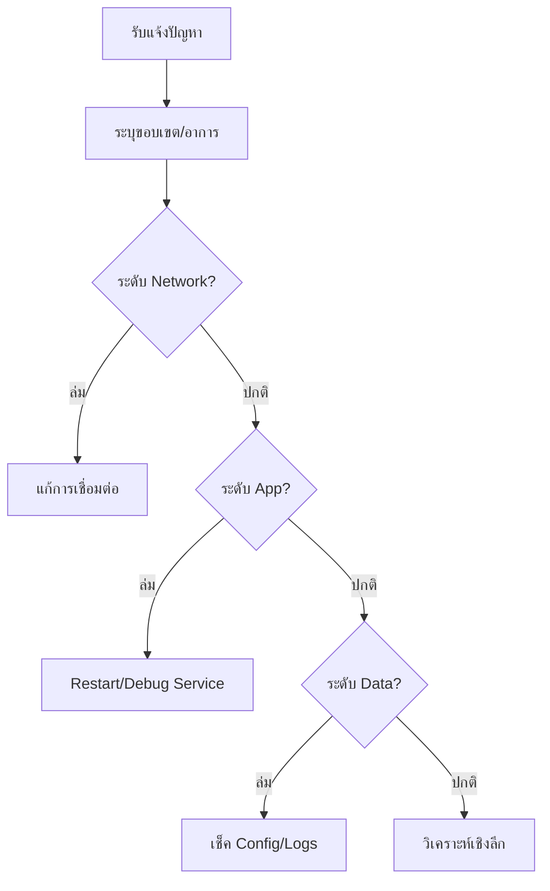

# วิธีการแก้ปัญหามาตรฐาน (Standard Troubleshooting Methodology)

เอกสารนี้ระบุแนวทางที่เป็นระบบในการแก้ปัญหาระบบโครงสร้างพื้นฐาน SOC

## 1. นิยามปัญหา (Defining the Problem)

-   **อาการ**: อะไรล้มเหลว? (เช่น "Alert ไม่ขึ้น", "Login ไม่ได้")
-   **ขอบเขต**: กระทบผู้ใช้คนเดียว, Sensor ตัวเดียว, หรือทั้งระบบ?
-   **เวลา**: เริ่มเป็นเมื่อไหร่? มีการเปลี่ยนแปลงระบบเร็วๆ นี้หรือไม่ (Deployment/RFC)?

## 2. ขั้นตอนการแก้ปัญหา (The Troubleshooting Workflow)

### 2.1 ระดับเครือข่าย (Physical/Network Layer)
-   **การเชื่อมต่อ**: Ping/Telnet/Netcat หาปลายทางเจอหรือไม่?
-   **Firewall**: พอร์ตถูกบล็อกหรือไม่? (เช็ค Log Firewall)
-   **DNS**: ชื่อ Hostname แปลงเป็น IP ถูกต้องหรือไม่? (`nslookup`, `dig`)

### 2.2 ระดับแอปพลิเคชัน (Application/Service Layer)
-   **สถานะบริการ**: Process ทำงานอยู่หรือไม่? (`systemctl status`, `docker ps`)
-   **ทรัพยากร**: เช็ค CPU/RAM/Disk (`top`, `df -h`) โหลดสูงอาจทำให้ Timeout
-   **Logs**: **ต้อง** ตรวจสอบ Log เสมอ
    -   `/var/log/syslog`
    -   Application specific logs

### 2.3 ตรวจสอบการไหลของข้อมูล (Data Flow Verification)
-   **ต้นทาง**: Agent อ่านไฟล์เจอหรือไม่?
-   **ระหว่างทาง**: สถานะบน Log Forwarder/Broker (Kafka/RabbitMQ) เป็นอย่างไร?
-   **ปลายทาง**: มี Error ในการ Index เข้า SIEM หรือไม่?

## 3. สถานการณ์ที่พบบ่อย (Common Failure Scenarios)

### 3.1 Log Source หยุดส่งข้อมูล
1.  เช็ค Network/VPN ระหว่างต้นทางและ SOC
2.  เช็คสถานะ Agent service บนเครื่องต้นทาง
3.  เช็คพื้นที่ว่าง Disk บนเครื่องต้นทาง (Agent มักหยุดทำงานถ้า Disk เต็ม)

### 3.2 แจ้งเตือนผิดพลาดพุ่งสูง (False Positives Spikes)
1.  ระบุกฎที่เป็นปัญหา
2.  วิเคราะห์ Pattern ที่ทำให้เกิด Alert
3.  ปรับ Logic ของกฎ หรือเพิ่ม Whitelist

## 4. การทำเอกสาร (Documentation)
-   บันทึกการวิเคราะห์สาเหตุที่แท้จริง (RCA)
-   อัปเดต Knowledge Base (KB) และ SOP เพื่อป้องกันการเกิดซ้ำ

## References
-   [USE Method (Brendan Gregg)](https://www.brendangregg.com/usemethod.html)
-   [Google SRE Handbook](https://sre.google/sre-book/table-of-contents/)
