# Forensic Investigation SOP

**Document ID**: IR-SOP-017
**Version**: 1.0
**Classification**: Confidential
**Last Updated**: 2026-02-15

> Digital forensics preserves **legally admissible evidence** and enables thorough **root cause analysis**. This SOP covers when to engage forensics, how to collect evidence properly, and the end-to-end investigation workflow.

---

## When to Engage Forensics

| Trigger | Forensic Level | Who Initiates |
|:---|:---:|:---|
| P1 incident (confirmed breach) | **Full** | IR Manager |
| P2 incident (suspected compromise) | **Targeted** | SOC Lead |
| Data breach with regulatory implications (PDPA/GDPR) | **Full** + Legal hold | DPO / Legal |
| Insider threat investigation | **Full** + HR involvement | SOC Manager / HR |
| Law enforcement request | **Full** + Chain of custody | Legal |
| Post-incident deep dive (after containment) | **Targeted** | IR Lead |
| Malware requiring reverse engineering | **Targeted** (malware only) | Tier 3 Analyst |

---

## Evidence Types & Priority

| Priority | Evidence Type | Volatility | Collection Method | Tool Examples |
|:---:|:---|:---:|:---|:---|
| 🔴 1 | **Memory (RAM)** | Very High | Live memory dump BEFORE shutdown | WinPmem, LiME, Velociraptor |
| 🔴 2 | **Running Processes** | Very High | Process list + network connections | Velociraptor, GRR, EDR |
| 🔴 3 | **Network Connections** | Very High | Active connections + DNS cache | netstat, Velociraptor |
| 🟠 4 | **Temporary / Swap Files** | High | Pagefile, hibernation file | FTK Imager, dd |
| 🟠 5 | **Event Logs** | Medium | Windows Event, syslog, auth logs | Velociraptor, wevtutil, rsyslog |
| 🟡 6 | **Disk Image** | Low | Full bit-for-bit disk copy | FTK Imager, dd, ewfacquire |
| 🟡 7 | **Registry / Config** | Low | Registry hives, crontab, scheduled tasks | RegRipper, Autopsy |
| 🔵 8 | **Network Logs** | Low | PCAP, NetFlow, firewall logs | Wireshark, tcpdump, SIEM |
| 🔵 9 | **Application Logs** | Low | Web server, database, custom app logs | SIEM, log server |

> ⚠️ **Always collect in order of volatility** — most volatile first.

---

## Investigation Workflow

```mermaid
graph TD
    A[🔔 Incident Declared] --> B[1. Forensic Triage]
    B --> C[2. Evidence Preservation]
    C --> D[3. Collection & Imaging]
    D --> E[4. Analysis]
    E --> F[5. Findings & Timeline]
    F --> G[6. Reporting]
    G --> H[7. Evidence Archiving]

    B --> B1[Determine scope]
    B --> B2[Legal hold decision]
    C --> C1[Isolate system]
    C --> C2[Document state]
    D --> D1[Memory dump]
    D --> D2[Disk imaging]
    D --> D3[Log collection]
    E --> E1[Timeline analysis]
    E --> E2[Artifact analysis]
    E --> E3[Malware analysis]

    style A fill:#3b82f6,color:#fff
    style H fill:#22c55e,color:#fff
```



---

### Step 1: Forensic Triage (15–30 min)

- [ ] Receive incident details from IR team
- [ ] Review available evidence (alerts, logs, EDR timeline)
- [ ] Determine **scope**: Which systems are involved?
- [ ] Determine **forensic level**: Full or targeted?
- [ ] Contact Legal if potential data breach or regulatory impact
- [ ] Initiate **legal hold** if needed (preserve all relevant data)
- [ ] Document initial assessment in forensic case file

### Step 2: Evidence Preservation (Immediate)

> ⚠️ **Do NOT power off the system** until memory has been captured.

- [ ] **Do NOT** run antivirus scans (may destroy artifacts)
- [ ] **Do NOT** install tools on the suspect system if possible
- [ ] **Do NOT** browse files on the suspect system
- [ ] Photograph the screen and physical setup
- [ ] Document running processes, logged-in users, open files
- [ ] Network-isolate the system (but keep powered on)
- [ ] Note the exact date/time and timezone

### Step 3: Collection & Imaging (1–4 hours)

#### Memory Acquisition

```bash
# Windows (run from USB / network share, NOT from suspect disk)
winpmem_mini_x64.exe output_memory.raw

# Linux
sudo ./LiME/src/lime-$(uname -r).ko "path=/mnt/usb/memory.lime format=lime"

# Via Velociraptor (remote)
velociraptor collect -artifact Windows.Memory.Acquisition
```

#### Disk Imaging

```bash
# Linux forensic workstation (bit-for-bit copy)
sudo dc3dd if=/dev/sda of=/mnt/evidence/disk_image.dd hash=sha256 log=/mnt/evidence/imaging.log

# FTK Imager (Windows GUI) — preferred for E01 format
# File → Create Disk Image → Select Source → E01 format → Verify after
```

#### Log Collection

```bash
# Windows Event Logs (all)
wevtutil epl Security C:\evidence\security.evtx
wevtutil epl System C:\evidence\system.evtx
wevtutil epl "Microsoft-Windows-Sysmon/Operational" C:\evidence\sysmon.evtx
wevtutil epl "Microsoft-Windows-PowerShell/Operational" C:\evidence\powershell.evtx

# Linux logs
tar czf /mnt/usb/linux_logs.tar.gz /var/log/

# Cloud (AWS CloudTrail last 90 days)
aws cloudtrail lookup-events --start-time 2026-01-01 --end-time 2026-02-15 > events.json
```

#### Hash Verification

```bash
# Always hash evidence immediately after collection
sha256sum /mnt/evidence/disk_image.dd > /mnt/evidence/disk_image.dd.sha256
sha256sum /mnt/evidence/memory.raw > /mnt/evidence/memory.raw.sha256
```

### Step 4: Analysis (4–48 hours)

#### 4a. Timeline Analysis

Build a unified timeline from all evidence sources:

| Source | Tool | What to Extract |
|:---|:---|:---|
| Windows Events | EvtxECmd, Hayabusa | Logons, process creation, service install |
| MFT (NTFS) | MFTECmd | File creation/modification/access times |
| Prefetch | PECmd | Program execution history |
| Registry | RegRipper | User activity, USB history, recent files |
| Browser History | Hindsight, BrowsingHistoryView | URLs, downloads, searches |
| Memory | Volatility 3 | Running processes, network, injected code |

```bash
# Example: Volatility 3 process listing
vol -f memory.raw windows.pslist
vol -f memory.raw windows.netscan
vol -f memory.raw windows.malfind
```

#### 4b. Key Artifacts to Examine

| OS | Artifact | Location | What It Reveals |
|:---|:---|:---|:---|
| Windows | Prefetch | `C:\Windows\Prefetch\` | Programs that ran, when, how many times |
| Windows | Amcache | `C:\Windows\appcompat\Programs\Amcache.hve` | Installed/executed programs |
| Windows | ShimCache | `SYSTEM\CurrentControlSet\Control\Session Manager\AppCompatCache` | Program execution evidence |
| Windows | UserAssist | `NTUSER.DAT\Software\Microsoft\Windows\CurrentVersion\Explorer\UserAssist` | GUI programs executed |
| Windows | $MFT | Root of NTFS volume | All file metadata, timestamps |
| Windows | Jump Lists | `%AppData%\Microsoft\Windows\Recent\AutomaticDestinations` | Recent files per application |
| Linux | auth.log | `/var/log/auth.log` | Authentication events |
| Linux | .bash_history | `~/.bash_history` | Command history |
| Linux | wtmp/btmp | `/var/log/wtmp`, `/var/log/btmp` | Login success/failure |
| Linux | crontab | `/var/spool/cron/` | Scheduled tasks (persistence) |

#### 4c. Malware Analysis (if applicable)

| Level | Activity | Tool |
|:---|:---|:---|
| **Static** | Hash lookup, strings, PE header, imports | VirusTotal, PEStudio, strings |
| **Dynamic** | Execute in sandbox, observe behavior | ANY.RUN, Cuckoo Sandbox |
| **Code** | Decompile, reverse engineer | Ghidra, IDA Pro, dnSpy |

### Step 5: Findings & Timeline (2–4 hours)

- [ ] Build chronological timeline of attacker activity
- [ ] Identify **initial access vector** (how they got in)
- [ ] Map activity to **MITRE ATT&CK techniques**
- [ ] Identify all **compromised accounts, systems, and data**
- [ ] Determine **dwell time** (first access → detection)
- [ ] Identify **data accessed or exfiltrated**
- [ ] Determine if attacker still has access

### Step 6: Reporting (4–8 hours)

Forensic report should include:

1. **Executive Summary** — Non-technical overview for management
2. **Incident Timeline** — Chronological sequence of events
3. **Scope of Compromise** — Systems, accounts, data affected
4. **Root Cause** — How the incident occurred
5. **MITRE ATT&CK Mapping** — Techniques used
6. **Evidence Inventory** — All evidence collected with hashes
7. **Findings** — Detailed technical analysis
8. **Indicators of Compromise** — IOCs for detection
9. **Recommendations** — Remediation and prevention steps
10. **Chain of Custody Log** — Evidence handling record

### Step 7: Evidence Archiving

| Item | Retention | Storage | Access |
|:---|:---:|:---|:---|
| Forensic images (disk, memory) | 2 years | Encrypted offline storage | Forensic team + Legal |
| Case files and reports | 5 years | Secure file server | SOC Lead + Legal |
| IOCs extracted | Indefinite | TI Platform | SOC team |
| Chain of custody logs | 7 years | Legal archives | Legal only |

---

## Chain of Custody Template

| # | Date/Time | Action | Item | From | To | Signature |
|:---:|:---|:---|:---|:---|:---|:---|
| 1 | [datetime] | Collected | Memory dump (sha256: abc...) | System X | Analyst A | [sign] |
| 2 | [datetime] | Collected | Disk image (sha256: def...) | System X | Analyst A | [sign] |
| 3 | [datetime] | Transferred | Disk image | Analyst A | Evidence Locker | [sign] |
| 4 | [datetime] | Analyzed | Disk image (working copy) | Evidence Locker | Analyst B | [sign] |

> Every transfer of evidence MUST be documented. Unbroken chain of custody is required for legal proceedings.

---

## Forensic Toolkit

### Essential Tools (Free / Open Source)

| Tool | Purpose | OS |
|:---|:---|:---|
| **Velociraptor** | Remote evidence collection, hunting | Cross-platform |
| **Volatility 3** | Memory forensics | Cross-platform |
| **Autopsy** | Disk forensics (GUI) | Windows/Linux |
| **Hayabusa** | Windows event log analysis (fast) | Cross-platform |
| **KAPE** | Automated artifact collection | Windows |
| **FTK Imager** | Disk imaging, evidence preview | Windows |
| **Plaso / log2timeline** | Super timeline creation | Cross-platform |
| **RegRipper** | Registry analysis | Windows |
| **Ghidra** | Reverse engineering | Cross-platform |
| **Wireshark** | Network forensics | Cross-platform |
| **CyberChef** | Data decoding/transformation | Web |

---

## Related Documents

-   [Evidence Collection](Evidence_Collection.en.md) — Basic evidence collection procedures
-   [IR Framework](Framework.en.md) — Incident response lifecycle
-   [Incident Classification](Incident_Classification.en.md) — How to classify incidents
-   [Escalation Matrix](Escalation_Matrix.en.md) — Escalation procedures
-   [Communication Templates](Communication_Templates.en.md) — Notification templates
-   [Lessons Learned Template](Lessons_Learned_Template.en.md) — Post-incident review
