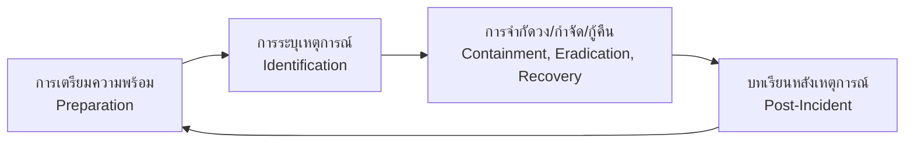

# กรอบการตอบสนองต่อเหตุการณ์ (Incident Response Framework)

เอกสารนี้ระบุขั้นตอนมาตรฐานในการตอบสนองต่อเหตุการณ์ความปลอดภัย (IR) ของ zcrAI โดยอ้างอิงตามมาตรฐาน NIST SP 800-61

## 1. การเตรียมความพร้อม (Preparation)
-   **เครื่องมือ**: ตรวจสอบการเชื่อมต่อ EDR (SentinelOne/CrowdStrike), SIEM, และ Ticketing system ผ่าน Integration Hub
-   **การเข้าถึง**: ตรวจสอบสิทธิ์ Analyst ในการเข้าถึง zcrAI portal และ Console ของ Third-party
-   **การฝึกอบรม**: ทบทวน Playbook อย่างสม่ำเสมอ

## 2. การระบุเหตุการณ์ (Identification)
-   **การคัดกรอง (Triage)**: วิเคราะห์แจ้งเตือนเบื้องต้นในคิว `Alerts`
-   **การตรวจสอบ (Verification)**:
    -   ตรวจสอบ `affectedUser` และ `sourceIp`
    -   หาความสัมพันธ์กับ Threat Intelligence (VirusTotal/URLScan)
-   **การจำแนกประเภท**: กำหนดความรุนแรง (Severity) และประเภท (Type)

## 3. การจำกัดความเสียหาย (Containment)
-   **ระยะสั้น**: ตัดการเชื่อมต่อเครื่อง (Isolate Host) ผ่าน EDR, บล็อก Traffic บน Firewall/WAF
-   **ระยะยาว**: อุดช่องโหว่, รีเซ็ตรหัสผ่านที่หลุดรั่ว (บังคับ Logout ผ่าน Identity Provider)

## 4. การกำจัดภัยคุกคาม (Eradication)
-   ลบไฟล์หรือ Registry key ที่เป็นอันตราย
-   ติดตั้งระบบปฏิบัติการใหม่ (Re-image) หากจำเป็น
-   ตรวจสอบซ้ำด้วยการสแกน

## 5. การกู้คืนระบบ (Recovery)
-   นำระบบกลับเข้าสู่สถานะ Production
-   เฝ้าระวังการติดเชื้อซ้ำ (24-48 ชั่วโมง)

## 6. บทเรียนที่ได้รับ (Lessons Learned)
-   ทำ Post-Incident Review (PIR) ภายใน 72 ชั่วโมง
-   อัปเดต Detection Rules และ Playbook ตามสิ่งที่ได้เรียนรู้

## เอกสารที่เกี่ยวข้อง (Related Documents)
-   [แบบฟอร์ม Incident Report](../templates/incident_report.th.md)
-   [PB-01 Phishing](Playbooks/Phishing.th.md) | [PB-02 Ransomware](Playbooks/Ransomware.th.md) | [PB-03 Malware](Playbooks/Malware_Infection.th.md)
-   [มาตรฐานการส่งมอบกะ](../06_Operations_Management/Shift_Handoff.th.md)
-   [ตัวชี้วัด SOC](../06_Operations_Management/SOC_Metrics.th.md)

## References
-   [NIST SP 800-61r2 (Computer Security Incident Handling Guide)](https://csrc.nist.gov/publications/detail/sp/800-61/rev-2/final)
-   [MITRE ATT&CK](https://attack.mitre.org/)

-   [ISO/IEC 27035 (Information Security Incident Management)](https://www.iso.org/standard/60803.html)
