# Incident Classification Taxonomy

**Document ID**: IR-SOP-016
**Version**: 1.0
**Classification**: Internal
**Last Updated**: 2026-02-15

> Consistent classification is critical for **accurate metrics**, **proper escalation**, and **compliance reporting**. This taxonomy ensures every analyst classifies incidents the same way.

---

## Classification Hierarchy

```mermaid
graph TD
    INC[🔔 New Incident] --> CAT[1. Category]
    CAT --> SUB[2. Sub-Category]
    SUB --> SEV[3. Severity P1-P4]
    SEV --> SCOPE[4. Scope]
    SCOPE --> TTP[5. MITRE ATT&CK TTP]
    TTP --> CLASSIFIED[✅ Fully Classified]

    style INC fill:#3b82f6,color:#fff
    style CLASSIFIED fill:#22c55e,color:#fff
```



Every incident MUST be classified along **5 dimensions** before triage is complete.

---

## 1. Incident Categories

| Code | Category | Description | Example |
|:---:|:---|:---|:---|
| **MAL** | Malware | Malicious software detected or executed | Ransomware, trojan, worm, cryptominer |
| **PHI** | Phishing / Social Engineering | Deception targeting people | Email phishing, vishing, smishing, BEC |
| **UNA** | Unauthorized Access | Illegitimate access to systems or data | Brute force, credential stuffing, stolen creds |
| **PRV** | Privilege Escalation | Gaining higher privileges than authorized | Local privilege escalation, admin abuse |
| **LAT** | Lateral Movement | Attacker moving between systems | Pass-the-hash, RDP abuse, WMI execution |
| **EXF** | Data Exfiltration / Leakage | Unauthorized data leaving the organization | DNS tunneling, cloud upload, USB copy |
| **DOS** | Denial of Service | Disrupting availability | DDoS, application-layer flood, resource exhaustion |
| **WEB** | Web Application Attack | Targeting web services | SQLi, XSS, SSRF, path traversal |
| **INS** | Insider Threat | Threats from within the organization | Data theft by employee, sabotage, policy violation |
| **CLD** | Cloud / SaaS Incident | Cloud-specific security events | IAM misconfiguration, exposed bucket, token theft |
| **SUP** | Supply Chain | Compromise through trusted third party | Compromised update, dependency hijack |
| **VUL** | Vulnerability Exploitation | Exploiting known or zero-day vulnerabilities | CVE exploitation, zero-day, misconfiguration |
| **POL** | Policy Violation | Violation of security policies | Shadow IT, unapproved software, data mishandling |
| **PHY** | Physical Security | Physical security breaches | Lost device, tailgating, unauthorized facility access |
| **OTH** | Other / Unclassified | Does not fit any category above | — |

---

## 2. Sub-Categories (by Parent Category)

<details>
<summary><b>MAL — Malware Sub-Categories</b></summary>

| Code | Sub-Category | Description |
|:---:|:---|:---|
| MAL-RAN | Ransomware | Encryption + ransom demand |
| MAL-TRO | Trojan / RAT | Remote access backdoor |
| MAL-WRM | Worm | Self-propagating malware |
| MAL-CRY | Cryptominer | Unauthorized mining activity |
| MAL-BOT | Botnet | Part of command & control network |
| MAL-WIP | Wiper | Destructive malware (data destruction) |
| MAL-DRP | Dropper / Loader | Downloads and installs additional malware |
| MAL-PUP | PUP / Adware | Potentially unwanted program |

</details>

<details>
<summary><b>PHI — Phishing / Social Engineering Sub-Categories</b></summary>

| Code | Sub-Category | Description |
|:---:|:---|:---|
| PHI-EML | Email Phishing | Malicious email with link or attachment |
| PHI-SPR | Spear Phishing | Targeted phishing against specific individuals |
| PHI-BEC | Business Email Compromise | Impersonation for financial fraud |
| PHI-VSH | Vishing | Voice-based social engineering |
| PHI-SMI | Smishing | SMS-based phishing |
| PHI-QRS | QR Phishing (Quishing) | Malicious QR codes |

</details>

<details>
<summary><b>UNA — Unauthorized Access Sub-Categories</b></summary>

| Code | Sub-Category | Description |
|:---:|:---|:---|
| UNA-BRU | Brute Force | Password guessing attack |
| UNA-CRD | Credential Theft | Stolen or compromised credentials |
| UNA-IMP | Impossible Travel | Login from geographically impossible location |
| UNA-MFA | MFA Bypass / Fatigue | Circumventing multi-factor authentication |
| UNA-DEF | Default Credentials | Using unchanged default passwords |
| UNA-SSO | SSO / Token Abuse | OAuth token theft or replay |

</details>

<details>
<summary><b>CLD — Cloud / SaaS Sub-Categories</b></summary>

| Code | Sub-Category | Description |
|:---:|:---|:---|
| CLD-IAM | IAM Misconfiguration | Overly permissive roles or policies |
| CLD-EXP | Public Exposure | Publicly accessible storage/service |
| CLD-TOK | Token / Key Leak | API keys or tokens exposed |
| CLD-CFG | Infrastructure Misconfiguration | Security group, network, or config issue |
| CLD-BIL | Billing Anomaly | Unexpected cost increase (possible compromise) |

</details>

<details>
<summary><b>EXF — Data Exfiltration Sub-Categories</b></summary>

| Code | Sub-Category | Description |
|:---:|:---|:---|
| EXF-DNS | DNS Tunneling | Data exfiltration via DNS |
| EXF-WEB | Web Upload | Upload to cloud storage / paste site |
| EXF-USB | Removable Media | Data copy to USB/external drive |
| EXF-EML | Email | Bulk data sent via email |
| EXF-ENC | Encrypted Channel | Exfiltration over encrypted tunnel |

</details>

---

## 3. Severity Classification

> Reference: [Severity Matrix](Severity_Matrix.en.md) for full definitions.

| Severity | Impact Criteria | Examples |
|:---:|:---|:---|
| **P1** 🔴 Critical | Immediate business impact, data breach, multiple systems compromised | Active ransomware, confirmed data breach, compromise of critical infrastructure |
| **P2** 🟠 High | Significant impact, single system compromised, potential for spread | Confirmed malware, account takeover, lateral movement detected |
| **P3** 🟡 Medium | Limited impact, contained or potential threat | Phishing (no click), policy violation, suspicious but unconfirmed |
| **P4** 🔵 Low | Minimal/no impact, informational | False positive, vulnerability scan finding, known acceptable risk |

### Severity Scoring Formula

Use this formula when severity is not immediately obvious:

| Factor | Weight | Score 1 (Low) | Score 2 (Med) | Score 3 (High) | Score 4 (Critical) |
|:---|:---:|:---|:---|:---|:---|
| **Confidentiality Impact** | 3× | No data | Internal data | Customer PII | Financial/health data |
| **Number of Systems** | 2× | 1 system | 2–10 systems | 11–100 systems | 100+ / critical infra |
| **Active Threat** | 3× | Historical/FP | Possible | Likely | Confirmed active |
| **Containment** | 2× | Already contained | Partially contained | Not contained | Spreading |

**Score Thresholds:**
- 10–15 → P4, 16–25 → P3, 26–35 → P2, 36–40 → P1

---

## 4. Scope Classification

| Scope | Definition | Example |
|:---:|:---|:---|
| **Individual** | Single user or endpoint affected | One laptop with malware |
| **Departmental** | Multiple users/systems in one department | Finance team phishing campaign |
| **Organizational** | Affects multiple departments or sites | Ransomware spreading across network |
| **External** | Involves third parties, customers, or public | Customer data breach, public exposure |
| **Industry** | Part of a wider campaign targeting the sector | APT targeting financial sector |

---

## 5. MITRE ATT&CK Mapping

Every incident MUST be mapped to at least one ATT&CK technique.

| Tactic | Common Techniques | Example Incident |
|:---|:---|:---|
| **Initial Access** | T1566 (Phishing), T1190 (Exploit), T1133 (External Remote Services) | Phishing email with macro |
| **Execution** | T1059 (Command/Scripting), T1204 (User Execution) | PowerShell download cradle |
| **Persistence** | T1053 (Scheduled Task), T1547 (Boot/Logon Autostart) | New scheduled task for backdoor |
| **Privilege Escalation** | T1548 (Abuse Elevation), T1068 (Exploitation for PE) | Local admin exploit |
| **Defense Evasion** | T1027 (Obfuscation), T1070 (Indicator Removal) | Log clearing after compromise |
| **Credential Access** | T1003 (OS Credential Dumping), T1110 (Brute Force) | LSASS memory dump |
| **Discovery** | T1087 (Account Discovery), T1018 (Remote System Discovery) | AD enumeration |
| **Lateral Movement** | T1021 (Remote Services), T1570 (Lateral Tool Transfer) | PsExec to domain controller |
| **Collection** | T1560 (Archive Collected Data), T1114 (Email Collection) | Zip file staging |
| **C2** | T1071 (Application Layer Protocol), T1572 (Protocol Tunneling) | HTTPS beacon to C2 server |
| **Exfiltration** | T1048 (Exfiltration Over Alternative Protocol), T1567 (Exfil Over Web Service) | DNS tunneling data out |
| **Impact** | T1486 (Data Encrypted for Impact), T1489 (Service Stop) | Ransomware encryption |

---

## Classification Workflow

```mermaid
flowchart TD
    A[Alert Received] --> B[Assign Category Code]
    B --> C[Assign Sub-Category]
    C --> D[Determine Severity P1-P4]
    D --> E[Determine Scope]
    E --> F[Map to MITRE TTP]
    F --> G{All 5 fields filled?}
    G -->|Yes| H[✅ Classification Complete]
    G -->|No| I[🔄 Gather more info]
    I --> B
    H --> J[Proceed to Investigation]

    style A fill:#3b82f6,color:#fff
    style H fill:#22c55e,color:#fff
    style I fill:#f59e0b,color:#fff
```



### Ticket Classification Template

```
Category:      [MAL/PHI/UNA/PRV/LAT/EXF/DOS/WEB/INS/CLD/SUP/VUL/POL/PHY/OTH]
Sub-Category:  [e.g., MAL-RAN]
Severity:      [P1/P2/P3/P4]
Scope:         [Individual/Departmental/Organizational/External/Industry]
MITRE TTP:     [T-code(s), e.g., T1486, T1059.001]
```

---

## Reclassification Rules

| Trigger | Action |
|:---|:---|
| New evidence changes impact assessment | Reclassify severity, document reason |
| Additional systems found compromised | Upgrade scope, consider severity upgrade |
| Root cause changes category | Update category & sub-category |
| False positive confirmed | Downgrade to P4 or close |
| Escalation timeline exceeded | Auto-upgrade by one severity level |

> ⚠️ **All reclassifications must be documented** with timestamp and reason in the ticket.

---

## Classification Metrics

Track these metrics to ensure consistent classification:

| Metric | Target | Why It Matters |
|:---|:---:|:---|
| % of incidents fully classified | ≥ 95% | Ensures taxonomy adoption |
| Reclassification rate | < 15% | Indicates initial accuracy |
| Time to classify | < 10 min | Ensures triage speed |
| MITRE coverage (unique techniques seen) | Track trend | Measures threat landscape visibility |
| Category distribution | Track monthly | Identifies trends and emerging threats |

---

## Related Documents

-   [Severity Matrix](Severity_Matrix.en.md) — Full severity definitions
-   [Escalation Matrix](Escalation_Matrix.en.md) — Who to escalate to by severity
-   [IR Framework](Framework.en.md) — Incident response lifecycle
-   [Tier 1 Runbook](Runbooks/Tier1_Runbook.en.md) — Analyst triage procedures
-   [SOAR Playbooks](SOAR_Playbooks.en.md) — Automated response playbooks
-   [Threat Hunting Playbook](Threat_Hunting_Playbook.en.md) — Proactive hunting
