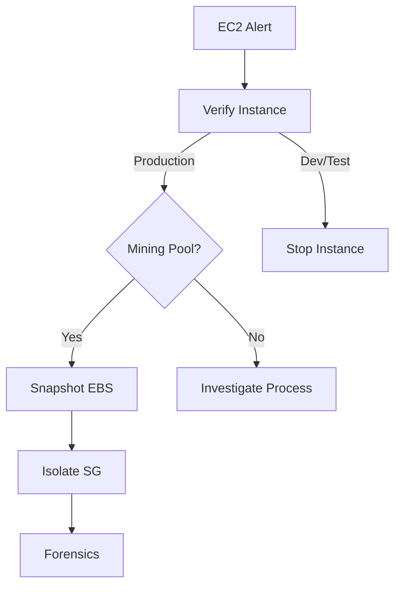

# Incident Response Playbook: AWS EC2 Compromise

**ID**: PB-22
**Severity**: Critical
**TLP**: AMBER

## 1. Detection
-   **Trigger**: GuardDuty finding `CryptoCurrency:EC2/BitcoinTool`.
-   **Trigger**: Abnormal CPU Usage (100% flatline).
-   **Trigger**: Outbound connection to known C2 IP.

## 2. Analysis

-   [ ] **Verify Instance**: Identify Instance ID, Region, and Owner tag.
-   [ ] **Isolate Logic**: Is this a production web server or a dev box?
-   [ ] **Inspect Netflow**: Check VPC Flow Logs. Is it talking to a mining pool?

## 3. Containment
-   [ ] **Snapshot**: Create an EBS Snapshot for forensics.
-   [ ] **Isolate**: Attach a restrictive Security Group (Deny All Inbound/Outbound, allow only Forensics IP).
-   [ ] **Deregister**: Remove from Auto Scaling Group (ASG) and Load Balancer (ELB).

## 4. Eradication
-   [ ] **Terminate**: If stateless, terminate the instance.
-   [ ] **Rebuild**: Redeploy from a clean, patched AMI (Golden Image).
-   [ ] **Patch**: Fix the vulnerability that allowed entry (e.g., SSH open to world).

## 5. Recovery
-   [ ] **Validate**: Scan the new instance for vulnerabilities.
-   [ ] **Restore**: Add back to Load Balancer.

## References
-   [AWS Security Incident Response Guide](https://docs.aws.amazon.com/whitepapers/latest/aws-security-incident-response-guide/welcome.html)
-   [Amazon EC2 Security Best Practices](https://docs.aws.amazon.com/AWSEC2/latest/UserGuide/ec2-security-best-practices.html)

## 6. Root Cause Analysis (VERIS)
-   **Actor**: [External]
-   **Action**: [Malware / Hacking]
-   **Asset**: [EC2 Instance]
-   **Attribute**: [Integrity / Availability]
