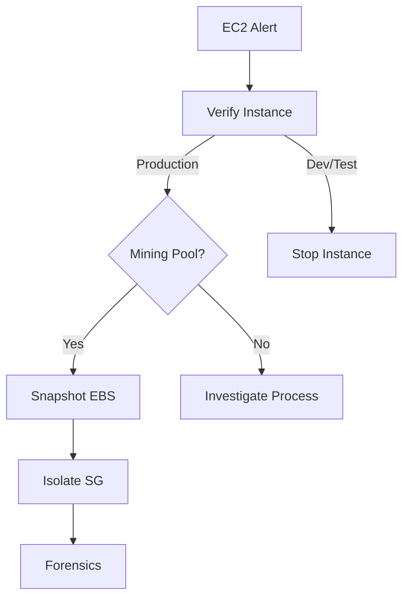

# Incident Response Playbook: เครื่อง AWS EC2 ถูกขุดเหมือง/ควบคุม (AWS EC2 Compromise)

**ID**: PB-22
**ความรุนแรง**: วิกฤต (Critical)
**TLP**: AMBER

## 1. การตรวจจับ (Detection)
-   **Trigger**: GuardDuty แจ้งเตือน `CryptoCurrency:EC2/BitcoinTool`
-   **Trigger**: CPU พุ่งสูงผิดปกติ (100% ตลอดเวลา)
-   **Trigger**: การเชื่อมต่อออกไปยัง C2 Server ที่รู้จัก

## 2. การวิเคราะห์ (Analysis)

-   [ ] **ระบุเครื่อง**: หา Instance ID, Region, และเจ้าของเครื่อง
-   [ ] **แยกแยะ**: เป็น Web Server ขายของ หรือเครื่อง Test?
-   [ ] **ดู Flow**: เช็ค VPC Flow Logs ว่ามีการคุยกับ Mining Pool หรือไม่?

## 3. การจำกัดวง (Containment)
-   [ ] **Snapshot**: สำรองข้อมูล EBS Snapshot ทันทีเพื่อเก็บหลักฐาน
-   [ ] **กักกัน**: เปลี่ยน Security Group ให้ Block All Inbound/Outbound (ยกเว้น IP ของทีม Forensics)
-   [ ] **ตัดออก**: ถอดออกจาก Auto Scaling Group (ASG) และ Load Balancer (ELB)

## 4. การกำจัดภัย (Eradication)
-   [ ] **ทำลาย**: หากเป็นเครื่อง Stateless ให้ Terminate ทิ้งทันที
-   [ ] **สร้างใหม่**: Deploy ใหม่จาก Image ต้นฉบับที่สะอาด (Golden Image)
-   [ ] **อุดช่องโหว่**: แก้ไขจุดที่แฮกเกอร์เข้า (เช่น ปิด Port SSH ที่เปิด Public)

## 5. การกู้คืน (Recovery)
-   [ ] **ตรวจสอบ**: Scan ช่องโหว่เครื่องใหม่ก่อนใช้งานจริง
-   [ ] **คืนสภาพ**: นำกลับเข้า Load Balancer

## References
-   [AWS Security Incident Response Guide](https://docs.aws.amazon.com/whitepapers/latest/aws-security-incident-response-guide/welcome.html)
-   [Amazon EC2 Security Best Practices](https://docs.aws.amazon.com/AWSEC2/latest/UserGuide/ec2-security-best-practices.html)

## 6. วิเคราะห์สาเหตุ (VERIS)
-   **ผู้กระทำ**: [External]
-   **การกระทำ**: [Malware / Hacking]
-   **สินทรัพย์**: [EC2 Instance]
-   **ผลกระทบ**: [Integrity / Availability]
