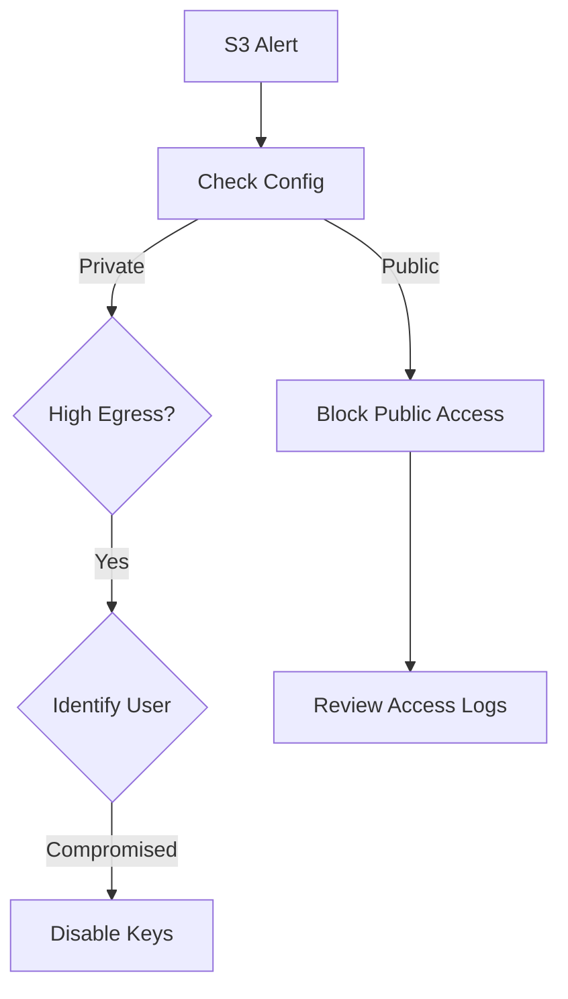

# Incident Response Playbook: AWS S3 Bucket Compromise

**ID**: PB-21
**Severity**: High
**TLP**: AMBER

## 1. Detection
-   **Trigger**: CloudTrail alerts for `PutBucketPolicy` allowing public access.
-   **Trigger**: GuardDuty finding `S3/PublicAccess`.
-   **Trigger**: Massive data egress from a specific bucket.

## 2. Analysis

-   [ ] **Verify Config**: Check bucket permissions in AWS Console > S3.
    -   Is "Block Public Access" turned off?
    -   Is there a Bucket Policy allowing `"Principal": "*"`?
-   [ ] **Review Access Logs**:
    -   Who modified the policy? (Identify IAM User/Role).
    -   What IP address made the change?
    -   Did any external IP download data? (List objects accessed).

## 3. Containment
-   [ ] **Block Access**: Immediately enable "Block Public Access" at the account or bucket level.
-   [ ] **Quarantine IAM**: Disable the IAM User/Role keys that made the change.
-   [ ] **Tag Resources**: Tag the bucket as `Compromised` for forensic review.

## 4. Eradication
-   [ ] **Revert Policy**: Restore the known-good Bucket Policy (Infrastructure as Code).
-   [ ] **Rotate Credentials**: Rotate Access Keys for the affected IAM user.

## 5. Recovery
-   [ ] **Validate**: Confirm public access is blocked via AWS Config.
-   [ ] **Notify**: Inform Data Privacy Officer if PII was accessed.
-   [ ] **Monitor**: Watch for re-attempted access for 24 hours.

## Related Documents
-   [Incident Response Framework](../Framework.en.md)
-   [Incident Report Template](../../templates/incident_report.en.md)
-   [Shift Handover Log](../../templates/shift_handover.en.md)

## References
-   [AWS S3 Security Best Practices](https://docs.aws.amazon.com/AmazonS3/latest/userguide/security-best-practices.html)
-   [Preventing Public Access to S3](https://docs.aws.amazon.com/AmazonS3/latest/userguide/access-control-block-public-access.html)

## 6. Root Cause Analysis (VERIS)
-   **Actor**: [External / Internal / Partner]
-   **Action**: [Misconfiguration / Hacking]
-   **Asset**: [S3 Bucket]
-   **Attribute**: [Confidentiality]
