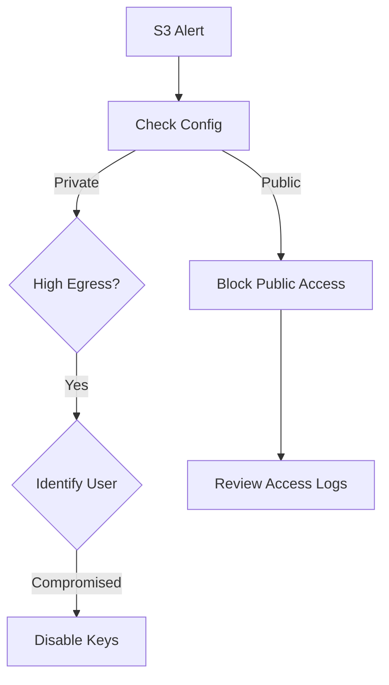

# Incident Response Playbook: เจาะระบบ AWS S3 (AWS S3 Bucket Compromise)

**ID**: PB-21
**ความรุนแรง**: สูง (High)
**TLP**: AMBER

## 1. การตรวจจับ (Detection)
-   **Trigger**: แจ้งเตือน CloudTrail พบ `PutBucketPolicy` ที่อนุญาต Public Access
-   **Trigger**: GuardDuty แจ้งเตือน `S3/PublicAccess`
-   **Trigger**: ปริมาณการดาวน์โหลดข้อมูล (Egress) สูงผิดปกติจาก Bucket

## 2. การวิเคราะห์ (Analysis)

-   [ ] **ตรวจสอบการตั้งค่า**: ดูสิทธิ์ใน AWS Console > S3
    -   "Block Public Access" ถูกปิดอยู่หรือไม่?
    -   Bucket Policy อนุญาต `"Principal": "*"` หรือไม่?
-   [ ] **ตรวจสอบ Log**:
    -   ใครเป็นคนแก้ Policy? (ระบุ IAM User/Role)
    -   IP Address ไหนเป็นคนทำ?
    -   มี IP ภายนอกเข้ามาดาวน์โหลดไฟล์หรือไม่? (ลิสต์รายการไฟล์ที่โดนดูด)

## 3. การจำกัดวง (Containment)
-   [ ] **บล็อกทันที**: เปิด "Block Public Access" ที่ระดับ Account หรือ Bucket ทันที
-   [ ] **ระงับผู้ใช้**: Disable Access Key ของ IAM User/Role ที่ก่อเหตุ
-   [ ] **ติดป้าย**: Tag Bucket ว่า `Compromised` เพื่อรอตรวจสอบ

## 4. การกำจัดภัย (Eradication)
-   [ ] **แก้คืน**: นำ Bucket Policy เดิมที่ปลอดภัยกลับมาใช้ (Revert)
-   [ ] **เปลี่ยนกุญแจ**: Rotate Access Key ของผู้ใช้ที่เกี่ยวข้อง

## 5. การกู้คืน (Recovery)
-   [ ] **ยืนยันผล**: ใช้ AWS Config ตรวจสอบว่า Public Access ถูกปิดแล้ว
-   [ ] **แจ้งเตือน**: แจ้งผูดูแลข้อมูลส่วนบุคคล (DPO) หากมีข้อมูลลูกค้าหลุด
-   [ ] **เฝ้าระวัง**: ดูแลต่อเนื่อง 24 ชม.

## เอกสารที่เกี่ยวข้อง (Related Documents)
-   [กรอบการตอบสนองเหตุการณ์](../Framework.th.md)
-   [แบบฟอร์ม Incident Report](../../templates/incident_report.th.md)
-   [แบบฟอร์มส่งมอบกะ](../../templates/shift_handover.th.md)

## References
-   [AWS S3 Security Best Practices](https://docs.aws.amazon.com/AmazonS3/latest/userguide/security-best-practices.html)
-   [Preventing Public Access to S3](https://docs.aws.amazon.com/AmazonS3/latest/userguide/access-control-block-public-access.html)

## 6. วิเคราะห์สาเหตุ (VERIS)
-   **ผู้กระทำ**: [External / Internal / Partner]
-   **การกระทำ**: [Misconfiguration / Hacking]
-   **สินทรัพย์**: [S3 Bucket]
-   **ผลกระทบ**: [Confidentiality]
