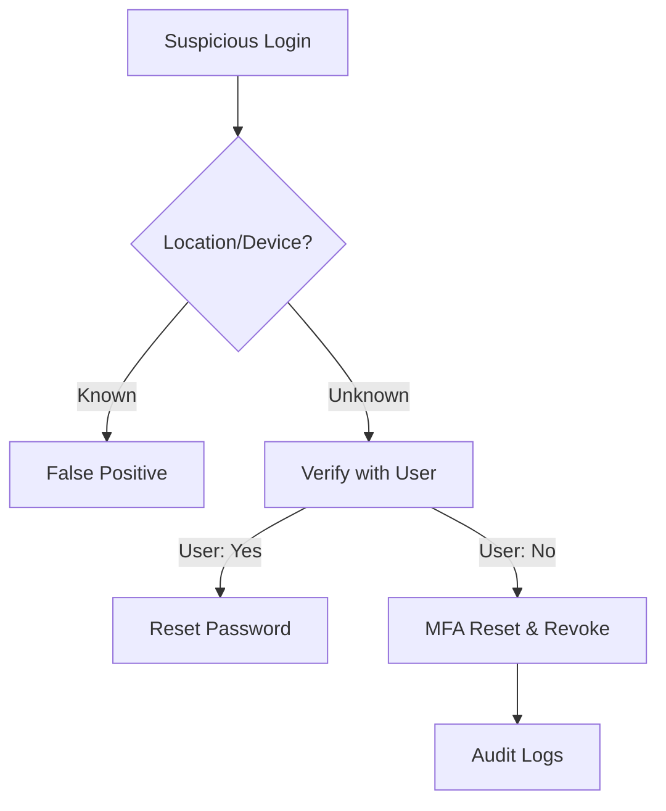

# Playbook: Account Compromise / Unauthorized Access

**ID**: PB-05
**Severity**: High/Critical
**Trigger**: User Report ("I didn't log in"), SIEM Alert ("Login from unusual location").

## 1. Analysis

-   **Verify**: Use "Impossible Travel" logic.
-   [ ] **Validate Activity**: Confirm with the user via specific channel (Phone/Slack) if they performed the action.
-   [ ] **Review Logs**: Check for subsequent actions (File Access, Email Forwarding, MFA changes).

## 2. Containment
-   [ ] **Disable Account**: Immediately disable the user account in AD/IdP.
-   [ ] **Revoke Sessions**: Kill all active web tokens/sessions (O365/Okta).
-   [ ] **Isolate Devices**: If an endpoint is involved, isolate it.

## 3. Eradication
-   [ ] **Reset Password**: Change password to a strong, new value.
-   [ ] **Rotate MFA**: Reset MFA tokens/keys.
-   [ ] **Audit Persistency**: Check for new API keys or App Regstrations created by the attacker.

## 4. Recovery
-   [ ] **Enable Account**: Restore access.
-   [ ] **Monitoring**: Add user to "High Risk" monitoring group for 48 hours.

## Related Documents
-   [Incident Response Framework](../Framework.en.md)
-   [Incident Report Template](../../templates/incident_report.en.md)
-   [PB-06 Impossible Travel](Impossible_Travel.en.md)

## References
-   [MITRE ATT&CK T1078 (Valid Accounts)](https://attack.mitre.org/techniques/T1078/)
-   [CISA Account Security](https://www.cisa.gov/secure-our-world)

