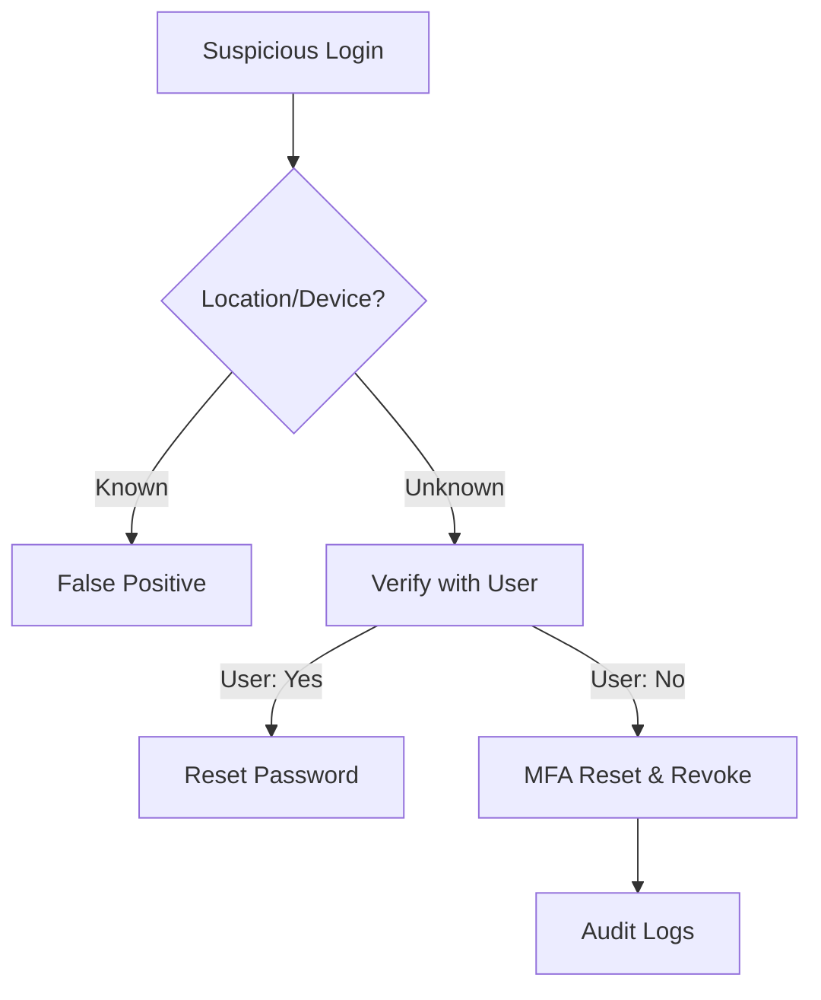

# Playbook: บัญชีถูกประนีประนอม (Account Compromise)

**ID**: PB-05
**ความรุนแรง**: สูง/วิกฤต
**ตัวกระตุ้น**: ผู้ใช้แจ้ง ("ฉันไม่ได้ล็อกอิน"), แจ้งเตือน SIEM ("ล็อกอินจากสถานที่แปลกๆ")

## 1. การวิเคราะห์ (Analysis)

-   [ ] **ยืนยันตัวตน**: ติดต่อผู้ใช้ผ่านช่องทางอื่น (โทร/Slack) ว่าได้ทำรายการนั้นจริงหรือไม่
-   [ ] **ตรวจสอบ Logs**: ดูการกระทำที่ตามมา (เข้าถึงไฟล์, ตั้งค่า Forward อีเมล, เปลี่ยน MFA)

## 2. การจำกัดวง (Containment)
-   [ ] **ปิดบัญชี (Disable)**: ปิดการใช้งานบัญชีใน AD/IdP ทันที
-   [ ] **ยกเลิก Session**: สั่ง Kill session หรือ Token ที่ค้างอยู่ทั้งหมด (O365/Okta)
-   [ ] **แยกอุปกรณ์**: หากเกี่ยวข้องกับเครื่องคอมพิวเตอร์ ให้ทำการ Isolate

## 3. การกำจัด (Eradication)
-   [ ] **เปลี่ยนรหัสผ่าน**: ตั้งรหัสผ่านใหม่ที่คาดเดายาก
-   [ ] **รีเซ็ต MFA**: ล้างค่า MFA เก่าและให้ลงทะเบียนใหม่
-   [ ] **ตรวจสอบ Persistency**: หา API Key หรือ App Registration ใหม่ที่แฮกเกอร์อาจสร้างทิ้งไว้

## 4. การกู้คืน (Recovery)
-   [ ] **เปิดใช้งานบัญชี**: คืนสิทธิ์การใช้งาน
-   [ ] **การเฝ้าระวัง**: เพิ่มชื่อผู้ใช้ในกลุ่ม "High Risk" เพื่อจับตาดูเป็นพิเศษ 48 ชั่วโมง
-   **ผลกระทบ (Attribute)**: [Confidentiality / Integrity]

## References
-   [MITRE ATT&CK T1078 (Valid Accounts)](https://attack.mitre.org/techniques/T1078/)
-   [Azure AD Identity Protection](https://learn.microsoft.com/en-us/azure/active-directory/identity-protection/overview-identity-protection)
