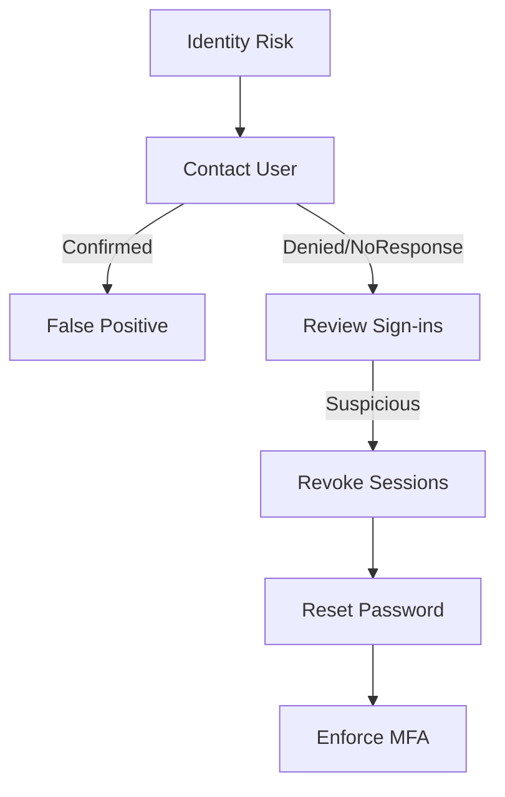

# Incident Response Playbook: Azure AD Identity Risk

**ID**: PB-23
**Severity**: High
**TLP**: AMBER

## 1. Detection
-   **Trigger**: Azure AD Identity Protection alerts ("Impossible Travel", "Unfamiliar Sign-in Properties").
-   **Trigger**: Sign-in from Tor Exit Node.
-   **Trigger**: MFA Fatigue (User denies multiple requests, then accepts one).

## 2. Analysis

-   [ ] **Contact User**: Out-of-band verification (Call/Slack). "Did you just login from Nigeria?"
-   [ ] **Review Sign-ins**: Check Azure AD Sign-in Logs. Were there failed attempts before the success?
-   [ ] **Check Device**: Was the device Compliant/Hybrid Joined?

## 3. Containment
-   [ ] **Revoke Sessions**: In Azure Portal > Users > [User] > "Revoke Sessions".
-   [ ] **Reset Password**: Force password reset.
-   [ ] **Disable Account**: If threat is confirmed and active, Block Sign-in.

## 4. Eradication
-   [ ] **Enforce MFA**: Ensure MFA is enabled and Phishing-Resistant (Number Matching).
-   [ ] **Scan Device**: Make user run a full AV scan on their endpoint.

## 5. Recovery
-   [ ] **Unblock**: Restore access after verification.
-   [ ] **Monitor**: Watch account for 48 hours.

## References
-   [Azure Active Directory Identity Protection](https://learn.microsoft.com/en-us/azure/active-directory/identity-protection/overview-identity-protection)
-   [Remediate Risks and Unblock Users](https://learn.microsoft.com/en-us/azure/active-directory/identity-protection/howto-identity-protection-remediate-unblock)

## 6. Root Cause Analysis (VERIS)
-   **Actor**: [External]
-   **Action**: [Hacking / Social]
-   **Asset**: [Person / Cloud Identity]
-   **Attribute**: [Integrity / Confidentiality]
