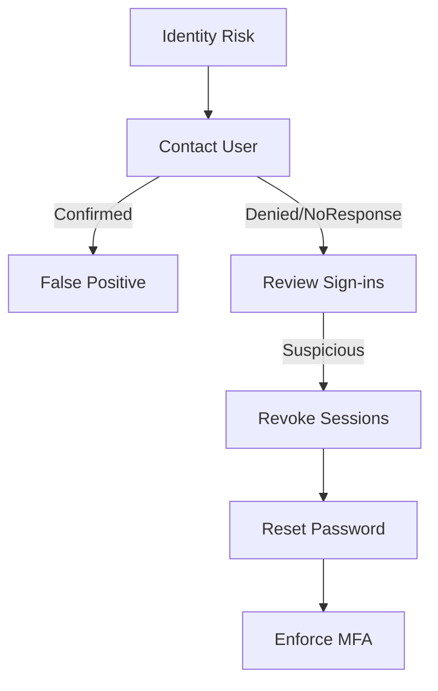

# Incident Response Playbook: บัญชี Azure AD ถูกยึด (Azure AD Identity Risk)

**ID**: PB-23
**ความรุนแรง**: สูง (High)
**TLP**: AMBER

## 1. การตรวจจับ (Detection)
-   **Trigger**: Azure AD Identity Protection แจ้งเตือน ("Impossible Travel", "Unfamiliar Sign-in")
-   **Trigger**: ล็อกอินมาจาก Tor Exit Node
-   **Trigger**: MFA Fatigue (User ปฏิเสธหลายครั้ง แล้วเผลอกดรับหนึ่งครั้ง)

## 2. การวิเคราะห์ (Analysis)

-   [ ] **ติดต่อเจ้าตัว**: โทรหาหรือแชทถาม "คุณได้ล็อกอินจากไนจีเรียหรือไม่?"
-   [ ] **ดูประวัติ**: เช็ค Sign-in Logs มีการเดารหัสผิดก่อนหน้านั้นไหม?
-   [ ] **เช็คอุปกรณ์**: อุปกรณ์ที่ใช้ล็อกอินเป็นของบริษัท (Compliant) หรือไม่?

## 3. การจำกัดวง (Containment)
-   [ ] **ตัด Session**: ไปที่ Azure Portal > Users > [User] > "Revoke Sessions"
-   [ ] **รีเซ็ตรหัส**: บังคับ Reset Password ทันที
-   [ ] **ระงับบัญชี**: ถ้ายังไม่แน่ใจ ให้กด "Block Sign-in" ไว้ก่อน

## 4. การกำจัดภัย (Eradication)
-   [ ] **บังคับ MFA**: ตรวจสอบว่า MFA เปิดอยู่ และใช้แบบ Number Matching (กันกดพลาด)
-   [ ] **สแกนเครื่อง**: ให้ User สแกนไวรัสในเครื่องตัวเอง

## 5. การกู้คืน (Recovery)
-   [ ] **ปลดบล็อก**: คืนสิทธิ์การใช้งานเมื่อปลอดภัย
-   [ ] **เฝ้าระวัง**: จับตาดูบัญชีนี้เป็นพิเศษ 48 ชม.

## References
-   [Azure Active Directory Identity Protection](https://learn.microsoft.com/en-us/azure/active-directory/identity-protection/overview-identity-protection)
-   [Remediate Risks and Unblock Users](https://learn.microsoft.com/en-us/azure/active-directory/identity-protection/howto-identity-protection-remediate-unblock)

## 6. วิเคราะห์สาเหตุ (VERIS)
-   **ผู้กระทำ**: [External]
-   **การกระทำ**: [Hacking / Social]
-   **สินทรัพย์**: [Person / Cloud Identity]
-   **ผลกระทบ**: [Integrity / Confidentiality]
