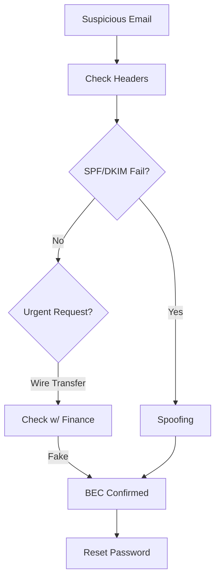

# Playbook: Business Email Compromise (BEC)

**ID**: PB-17
**Severity**: High
**Trigger**: User Report ("Suspicious Invoice"), Mail Filter ("Forwarding Rule created").

## 1. Analysis (Triage)

-   **Header Analysis**: Check `Return-Path`, `Reply-To`, and `SPF/DKIM` results.
-   **Rule Check**: Look for Inbox Rules named "." or "Move to RSS Feeds" (Common hiding tactic).
-   **Login Logs**: Check for successful logins from foreign countries prior to the email.

## 2. Containment
-   **Reset Password**: Change the compromise user's password.
-   **Revoke Tokens**: Revoke all OAuth tokens (O365).
-   **Remove Rules**: Delete malicious forwarding/inbox rules.

## 3. Eradication
-   **Search Internal**: Search all mailboxes for the same phishing subject to see spread.
-   **Block Sender**: Block the sender domain/IP at the gateway.

## 4. Recovery
-   **Notify Finance**: If the email involved payments, immediately stop wire transfers.
-   **Attribute**: [Integrity / Confidentiality]

## Related Documents
-   [Incident Response Framework](../Framework.en.md)
-   [Incident Report Template](../../templates/incident_report.en.md)
-   [Shift Handover Log](../../templates/shift_handover.en.md)

## References
-   [MITRE ATT&CK T1566 (Phishing)](https://attack.mitre.org/techniques/T1566/)
-   [FBI BEC Scams](https://www.fbi.gov/scams-and-safety/common-scams-and-crimes/business-email-compromise)
