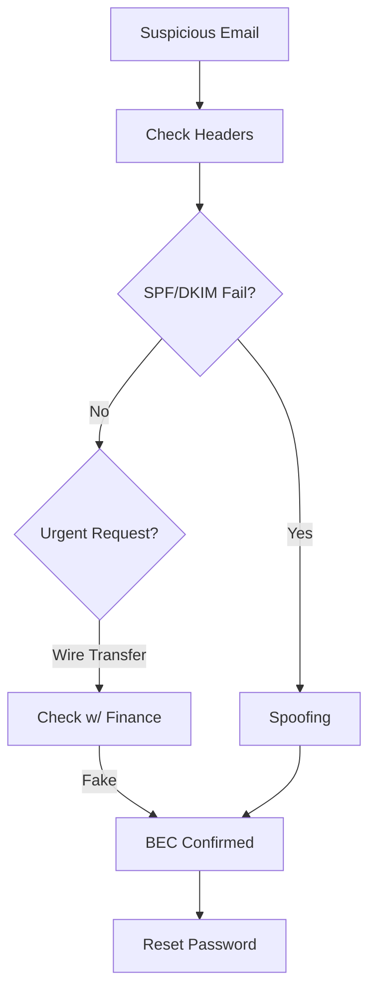

# Playbook: การหลอกลวงทางอีเมลธุรกิจ (Business Email Compromise - BEC)

**ID**: PB-17
**ความรุนแรง**: สูง
**ตัวกระตุ้น**: ผู้ใช้แจ้ง ("Invoice น่าสงสัย"), Mail Filter ("สร้างกฎ Forwarding")

## 1. การวิเคราะห์ (Analysis)

-   **วิเคราะห์ Header**: ตรวจสอบ `Return-Path`, `Reply-To`, และผล `SPF/DKIM`
-   **ตรวจสอบ Rule**: มองหากฎ Inbox ที่ชื่อแปลกๆ เช่น "." หรือ "Move to RSS Feeds" (เทคนิคซ่อนอีเมล)
-   **ประวัติการล็อกอิน**: มีการล็อกอินจากต่างประเทศก่อนส่งเมลหรือไม่?

## 2. การจำกัดวง (Containment)
-   **เปลี่ยนรหัสผ่าน**: รีเซ็ตรหัสผ่านผู้ใช้ที่โดนแฮก
-   **Revoke Tokens**: ยกเลิก OAuth token ทั้งหมด (O365)
-   **ลบกฎ**: ลบกฎ Forwarding หรือ Inbox rule ที่คนร้ายสร้างไว้

## 3. การกำจัด (Eradication)
-   **ค้นหาภายใน**: ค้นหาอีเมลในตู้จดหมายพนักงานคนอื่นที่มีหัวข้อเดียวกัน
-   **บล็อกผู้ส่ง**: บล็อก Domain/IP ผู้ส่งที่ Gateway

## 4. การกู้คืน (Recovery)
-   **แจ้งฝ่ายการเงิน**: หากอีเมลเกี่ยวข้องกับการโอนเงิน ให้ระงับธุรกรรมทันที
-   **ผลกระทบ (Attribute)**: [Integrity / Confidentiality]

## เอกสารที่เกี่ยวข้อง (Related Documents)
-   [กรอบการตอบสนองเหตุการณ์](../Framework.th.md)
-   [แบบฟอร์ม Incident Report](../../templates/incident_report.th.md)
-   [แบบฟอร์มส่งมอบกะ](../../templates/shift_handover.th.md)

## References
-   [MITRE ATT&CK T1566 (Phishing)](https://attack.mitre.org/techniques/T1566/)
-   [FBI BEC Scams](https://www.fbi.gov/scams-and-safety/common-scams-and-crimes/business-email-compromise)
