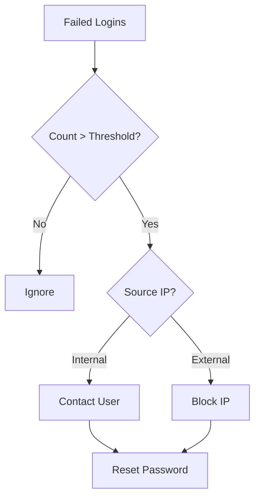

# Playbook: Brute Force / Password Spray

**ID**: PB-04
**Severity**: Low/Medium
**Trigger**: SIEM Alert ("Multiple Failed Logins"), IAM Logs.
**Attribute**: [Confidentiality]

## 1. Analysis

-   **Verify**: Is it a single user or multiple users (Password Spray)?

-   [ ] **Check Source IP**: Is the IP internal or external? Is it a known VPN?
-   [ ] **Check User**: Is the targeted account valid? Is it a VIP/Admin?
-   [ ] **Volume**: How many attempts? (e.g., > 10 failures in 1 min).
-   [ ] **Outcome**: Was there a *Success* log after the failures? (Critical Indicator).

## 2. Containment
-   [ ] **Block IP**: Add Source IP to Firewall/WAF blocklist.
-   [ ] **Lock Account**: If the attack is successfully guessing, lock the AD account temporarily.

## 3. Remediation
-   [ ] **Reset Password**: Force password reset if compromise is suspected.
-   [ ] **Enforce MFA**: Ensure Multi-Factor Authentication is enabled for the account.

## 4. Recovery
-   [ ] **Unlock Account**: Restore access to the legitimate user after verification.

## Related Documents
-   [Incident Response Framework](../Framework.en.md)
-   [Incident Report Template](../../templates/incident_report.en.md)
-   [PB-05 Account Compromise](Account_Compromise.en.md)

## References
-   [MITRE ATT&CK T1110 (Brute Force)](https://attack.mitre.org/techniques/T1110/)
-   [OWASP Brute Force Prevention](https://owasp.org/www-community/controls/Blocking_Brute_Force_Attacks)

