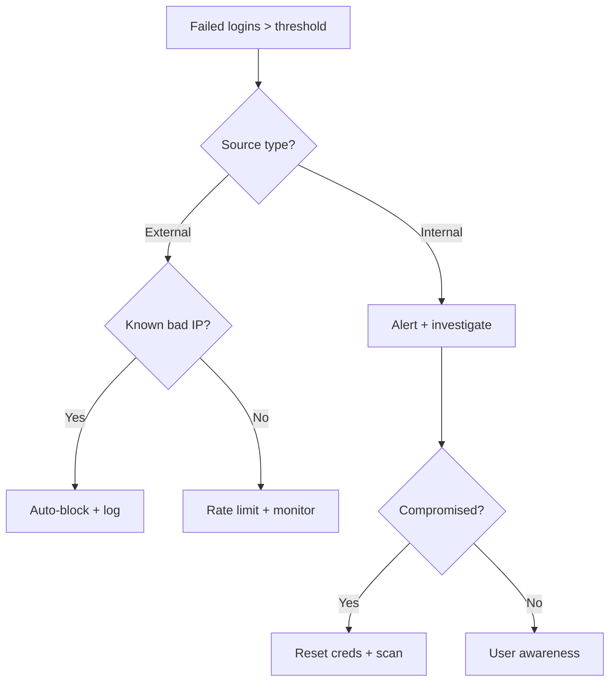

# Playbook: Brute Force / Password Spray

**ID**: PB-04
**ระดับความรุนแรง**: ต่ำ/ปานกลาง/สูง | **หมวดหมู่**: Identity & Access
**MITRE ATT&CK**: [T1110](https://attack.mitre.org/techniques/T1110/) (Brute Force)
**ทริกเกอร์**: SIEM alert (Event 4625 spike), IdP lockout, VPN failed logins, SSH fail2ban

## หลังเหตุการณ์ (Post-Incident)

- [ ] บังคับ MFA ทุกบัญชีที่ถูกโจมตี
- [ ] ทบทวน account lockout policies
- [ ] ใช้ Smart Lockout / IP-based throttling
- [ ] พิจารณาใช้ Passwordless authentication
- [ ] สร้าง detection rule สำหรับ pattern ที่พบ
- [ ] จัดทำ [Incident Report](../../templates/incident_report.en.md)

### ผังรูปแบบการโจมตี

```mermaid
graph TD
    Attacker["🔨 ผู้โจมตี"] --> Type{"📋 ประเภท?"}
    Type -->|Brute Force| BF["🔑 ลองทุก password"]
    Type -->|Password Spray| PS["🌊 1 password หลาย accounts"]
    Type -->|Credential Stuffing| CS["📦 ใช้ leaked creds"]
    BF --> Target["🎯 บัญชีเดียว"]
    PS --> Target2["🎯 หลายบัญชี"]
    CS --> Target2
    style Attacker fill:#e74c3c,color:#fff
    style BF fill:#f39c12,color:#fff
    style PS fill:#e67e22,color:#fff
    style CS fill:#8e44ad,color:#fff
```

### ผัง Smart Lockout

```mermaid
sequenceDiagram
    participant Attacker
    participant IdP
    participant SOC
    participant User as ผู้ใช้จริง
    Attacker->>IdP: ❌ Login fail x5
    IdP->>IdP: 🔒 Smart lockout (ผู้โจมตีเท่านั้น)
    User->>IdP: ✅ Login สำเร็จ (ไม่ถูกล็อก)
    IdP->>SOC: 🚨 Alert: failed attempts
    SOC->>SOC: ตรวจ IP + success/fail ratio
```

---

## ผังการตัดสินใจ

```mermaid
graph TD
    Alert["🚨 Login ล้มเหลวหลายครั้ง"] --> Type{"⚙️ ประเภท?"}
    Type -->|IP เดียว → บัญชีเดียว| BF["🔑 Brute Force"]
    Type -->|IP เดียว → หลายบัญชี| Spray["🌊 Password Spray"]
    Type -->|หลาย IP → บัญชีเดียว| Dist["📡 Distributed BF"]
    BF --> Success{"✅ มี Login สำเร็จ?"}
    Spray --> Success
    Dist --> Success
    Success -->|ใช่| Compromised["🔴 บัญชีถูกบุกรุก"]
    Success -->|ไม่| Block["🟠 บล็อก + ติดตาม"]
    Compromised --> Reset["🔐 รีเซ็ต + เพิกถอน"]
```

---

## 1. การวิเคราะห์

### 1.1 ประเภทการโจมตี

| ประเภท | ลักษณะ | ความรุนแรง |
|:---|:---|:---|
| **Brute Force** | เดารหัสผ่านหลายรอบต่อบัญชีเดียว | 🟡 ปานกลาง |
| **Password Spray** | รหัสผ่านเดียวกดต่อหลายบัญชี | 🟠 สูง |
| **Credential Stuffing** | ใช้ credentials ที่รั่วไหล | 🔴 สูง |
| **Distributed** | หลาย IP → หลีกเลี่ยง lockout | 🔴 สูง |

### 1.2 รายการตรวจสอบ

| รายการ | วิธีตรวจสอบ | เสร็จ |
|:---|:---|:---:|
| จำนวน login ล้มเหลว | SIEM (Event 4625) | ☐ |
| Source IP / ประเทศ | SIEM / GeoIP | ☐ |
| บัญชีที่ถูกโจมตี (เดียว/หลาย) | SIEM | ☐ |
| มี login สำเร็จในช่วงเดียวกัน? | Event 4624 | ☐ |
| IP อยู่ใน TI feeds? | VirusTotal, AbuseIPDB | ☐ |
| Target protocol (SSH/RDP/O365/VPN) | SIEM | ☐ |

---

## 2. การควบคุม

### 2.1 ไม่มี Login สำเร็จ

| # | การดำเนินการ | เสร็จ |
|:---:|:---|:---:|
| 1 | **บล็อก** source IP ที่ firewall/WAF | ☐ |
| 2 | **เพิ่ม** rate limiting | ☐ |
| 3 | **ติดตาม** บัญชีเป้าหมาย | ☐ |

### 2.2 มี Login สำเร็จ

| # | การดำเนินการ | เสร็จ |
|:---:|:---|:---:|
| 1 | **รีเซ็ตรหัสผ่าน** ทันที | ☐ |
| 2 | **เพิกถอน sessions** ทั้งหมด | ☐ |
| 3 | **บล็อก** source IP | ☐ |
| 4 | **ตรวจ** กิจกรรมหลัง login สำเร็จ | ☐ |
| 5 | ยกระดับไป [PB-05 Account Compromise](Account_Compromise.th.md) | ☐ |

---

## 3. การฟื้นฟู

| # | การดำเนินการ | เสร็จ |
|:---:|:---|:---:|
| 1 | บังคับ MFA ทุกบัญชี | ☐ |
| 2 | ใช้ Smart Lockout / Account lockout policies | ☐ |
| 3 | พิจารณา Passwordless authentication | ☐ |
| 4 | เปิด credential leak monitoring | ☐ |

---

## 4. เกณฑ์การยกระดับ

| เงื่อนไข | ยกระดับไปยัง |
|:---|:---|
| Login สำเร็จ — บัญชีถูกบุกรุก | [PB-05](Account_Compromise.th.md) |
| Admin account ถูกโจมตี | CISO |
| Distributed attack (>100 IPs) | SOC Lead |

---

### ผัง Password Policy Hardening

```mermaid
graph TD
    Policy["🔐 Password Policy"] --> Length["📏 Min 14 chars"]
    Policy --> Complex["🔤 Complexity required"]
    Policy --> History["📋 Remember 24"]
    Policy --> Lockout["🔒 Lockout 10 fails"]
    Lockout --> Duration["⏱️ 30 min lockout"]
    Length --> MFA["📱 MFA required"]
    Complex --> MFA
    style MFA fill:#27ae60,color:#fff
    style Lockout fill:#e74c3c,color:#fff
```

### ผังแหล่งที่มา Credential

```mermaid
graph LR
    Source{"🔑 แหล่งที่มา?"} --> Dark["🌑 Dark Web dump"]
    Source --> Phish["🎣 Phishing"]
    Source --> Reuse["♻️ Password reuse"]
    Source --> Keylog["⌨️ Keylogger"]
    Dark --> Check["✅ ตรวจ HaveIBeenPwned"]
    Phish --> Check
    Reuse --> Check
    Keylog --> EDR["🛡️ สแกน EDR"]
    style Dark fill:#2c3e50,color:#fff
    style Phish fill:#e74c3c,color:#fff
```

## กฎตรวจจับ (Sigma)

| กฎ | ไฟล์ |
|:---|:---|
| Multiple Failed Login Attempts | [win_multiple_failed_logins.yml](../../07_Detection_Rules/win_multiple_failed_logins.yml) |
| Login from Unusual Location | [cloud_unusual_login.yml](../../07_Detection_Rules/cloud_unusual_login.yml) |

## เอกสารที่เกี่ยวข้อง

- [กรอบการตอบสนองต่อเหตุการณ์](../Framework.th.md)
- [PB-05 บัญชีถูกบุกรุก](Account_Compromise.th.md)

## Account Lockout Impact Assessment

| System Type | Lockout Policy | Business Impact |
|:---|:---|:---|
| Active Directory | 5 attempts / 30 min | Medium-High |
| VPN Gateway | 3 attempts / 15 min | High |
| Web Application | 10 attempts / 60 min | Low-Medium |
| Database | 5 attempts / 30 min | High |
| Cloud Console | 3 attempts / 5 min | Critical |

### Brute Force Attack Patterns

| Pattern | Detection | Response |
|:---|:---|:---|
| Horizontal (password spray) | Multiple users, same password | Block source IP |
| Vertical (single target) | Many attempts, one user | Lock account |
| Credential stuffing | Known breach list | Rate limit + CAPTCHA |
| Reverse brute force | Common passwords, all users | Alert + block |

### Response Automation

### Password Policy Recommendations

| Setting | Recommended | Rationale |
|:---|:---|:---|
| Min length | 14 chars | Resist offline crack |
| Lockout | 5 attempts | Limit online attempts |
| MFA | Required | Prevent credential-only |
| Password history | 12 | Prevent reuse |

## อ้างอิง

- [MITRE ATT&CK T1110 — Brute Force](https://attack.mitre.org/techniques/T1110/)
