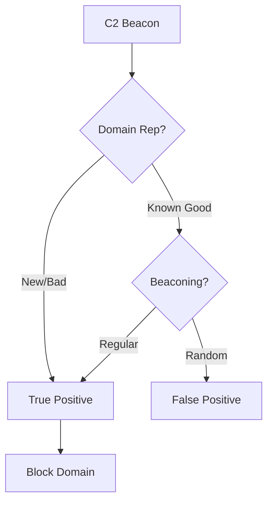

# Playbook: Command & Control (C2) Traffic

**ID**: PB-13
**Severity**: High
**Trigger**: Network/NDR Alert ("Beaconing detected", "Connection to known C2 IP").

## 1. Analysis (Triage)

-   **Frequency**: Is it beaconing? (Regular interval requests e.g., every 5 mins).
-   **Domain Reputation**: Check domain age and category (Newly Registered Domain?).
-   **Process**: Which process is making the connection? (powershell.exe vs. chrome.exe).

## 2. Containment
-   **Block IP/Domain**: Block at Perimeter Firewall/DNS Sinkhole.
-   **Isolate Host**: Isolate the machine initiating the connection.

## 3. Eradication
-   **Process Kill**: Stop the process making the call.
-   **Memory Analysis**: If process is injected (e.g., in svchost.exe), a restart might clear it, but forensics is needed first.

## 4. Recovery
-   **Threat Intel**: Submit the C2 IOC to Threat Intelligence Platform to update all tools.
-   **Attribute**: [Confidentiality / Integrity]

## References
-   [MITRE ATT&CK T1071 (Application Layer Protocol)](https://attack.mitre.org/techniques/T1071/)
-   [SANS Hunt Evil: Beaconing](https://www.sans.org/white-papers/39600/)
