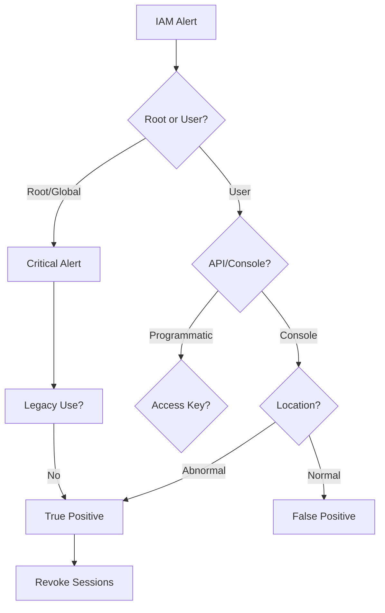

# Playbook: Cloud IAM Anomaly

**ID**: PB-16
**Severity**: High
**Trigger**: CloudTrail/Azure Monitor ("Root/GlobalAdmin Login", "New IAM User created").

## 1. Analysis (Triage)

-   **Root Usage**: Was the Root/Global Admin account used? (Should be rare).
-   **API Call**: Was it a console login or a programmatic API call?
-   **Location**: Is the IP consistent with the admin's location?

## 2. Containment
-   **Revoke Sessions**: Invalidate current Cloud sessions.
-   **Disable User**: Disable the Cloud IAM user.
-   **Rotate Keys**: Rotate Access Keys (AWS) or Client Secrets (Azure).

## 3. Eradication
-   **Review permissions**: Check if any permission was added to the user.
-   **Check Resources**: Did they spin up new VMs (Crypto mining) or create S3 buckets?

## 4. Recovery
-   **MFA**: Enforce hardware MFA for Root/Global Admins.
-   **Attribute**: [Integrity / Confidentiality]

## References
-   [MITRE ATT&CK T1098 (Cloud Account Manipulation)](https://attack.mitre.org/techniques/T1098/)
-   [AWS Security Incident Response Guide](https://docs.aws.amazon.com/whitepapers/latest/aws-security-incident-response-guide/welcome.html)
