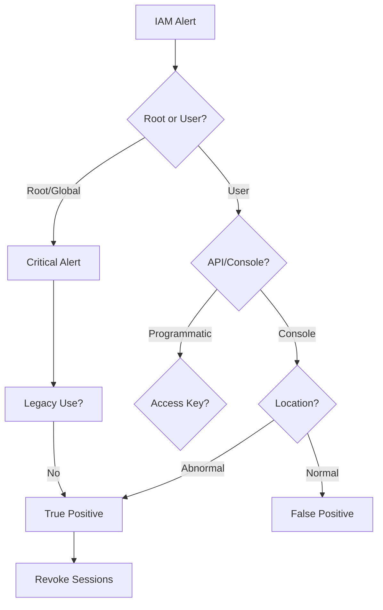

# Playbook: ความผิดปกติใน Cloud IAM (Cloud IAM Anomaly)

**ID**: PB-16
**ความรุนแรง**: สูง
**ตัวกระตุ้น**: CloudTrail/Azure Monitor ("Root/GlobalAdmin Login", "สร้าง IAM User ใหม่")

## 1. การวิเคราะห์ (Analysis)

-   **Root Usage**: มีการใช้บัญชี Root หรือ Global Admin หรือไม่? (ควรใช้น้อยมาก)
-   **API Call**: เป็นการล็อกอินผ่านหน้าเว็บ หรือยิง API?
-   **ตำแหน่ง**: IP ที่ใช้ตรงกับที่อยู่ของ Admin คนนั้นหรือไม่?

## 2. การจำกัดวง (Containment)
-   **Revoke Sessions**: ยกเลิก Session ที่ค้างอยู่ทั้งหมด
-   **ปิดบัญชี**: Disable บัญชี Cloud IAM นั้น
-   **หมุนเวียนกุญแจ**: เปลี่ยน Access Keys (AWS) หรือ Client Secrets (Azure) ใหม่

## 3. การกำจัด (Eradication)
-   **ตรวจสอบสิทธิ์**: ดูว่ามีการแอบเพิ่มสิทธิ์อะไรให้ตัวเองหรือไม่
-   **ตรวจสอบทรัพยากร**: มีการสร้าง VM ใหม่ (ขุดเหรียญ) หรือสร้าง Storage Bucket ใหม่หรือไม่?

## 4. การกู้คืน (Recovery)
-   **MFA**: บังคับใช้ Hardware MFA สำหรับบัญชีระดับ Root/Global Admin
-   **ผลกระทบ (Attribute)**: [Integrity / Confidentiality]

## เอกสารที่เกี่ยวข้อง (Related Documents)
-   [กรอบการตอบสนองเหตุการณ์](../Framework.th.md)
-   [แบบฟอร์ม Incident Report](../../templates/incident_report.th.md)
-   [แบบฟอร์มส่งมอบกะ](../../templates/shift_handover.th.md)

## References
-   [MITRE ATT&CK T1098 (Cloud Account Manipulation)](https://attack.mitre.org/techniques/T1098/)
-   [AWS Security Incident Response Guide](https://docs.aws.amazon.com/whitepapers/latest/aws-security-incident-response-guide/welcome.html)
