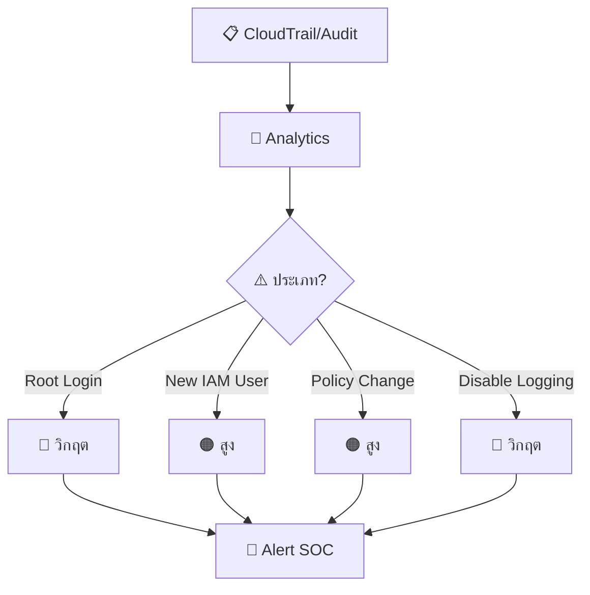
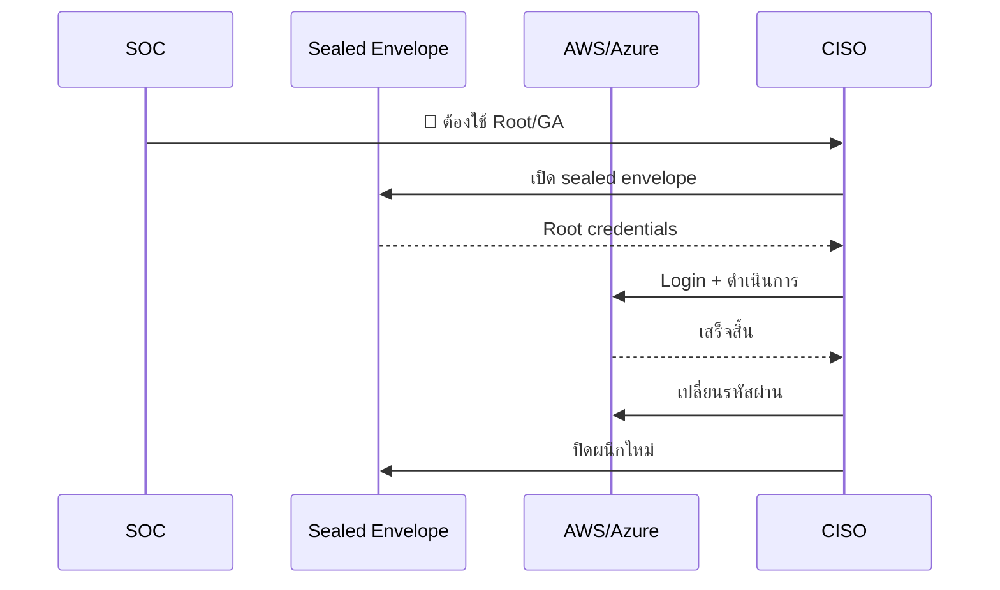
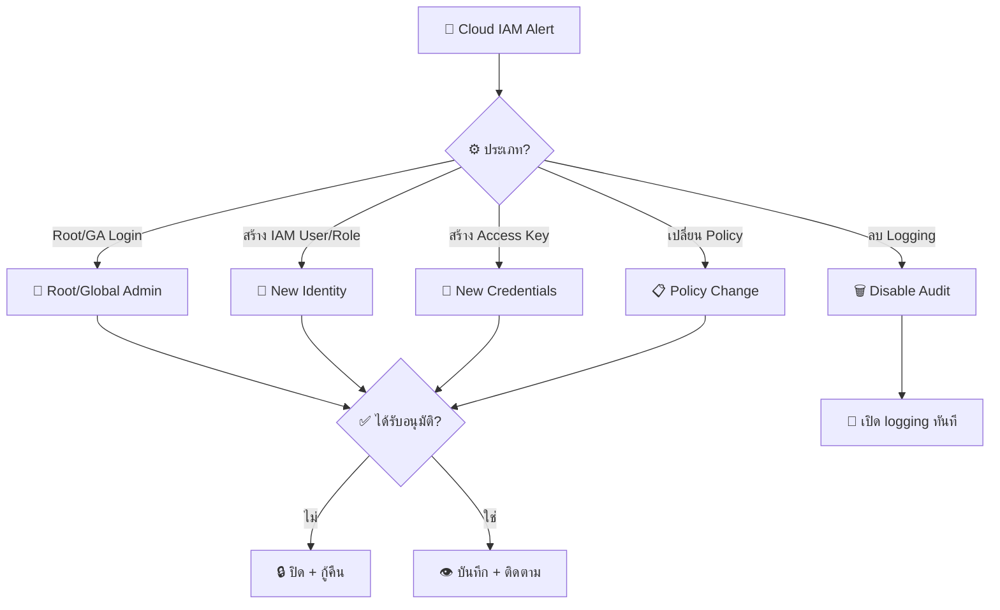
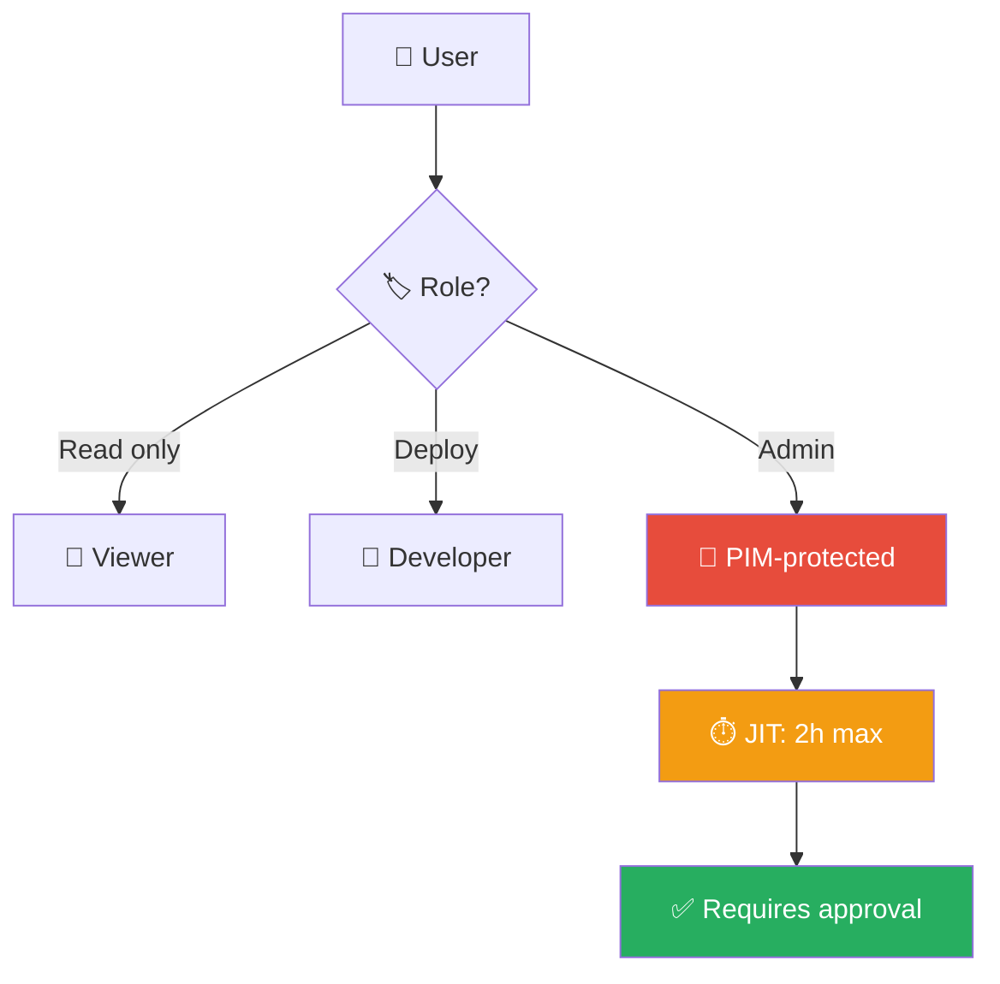
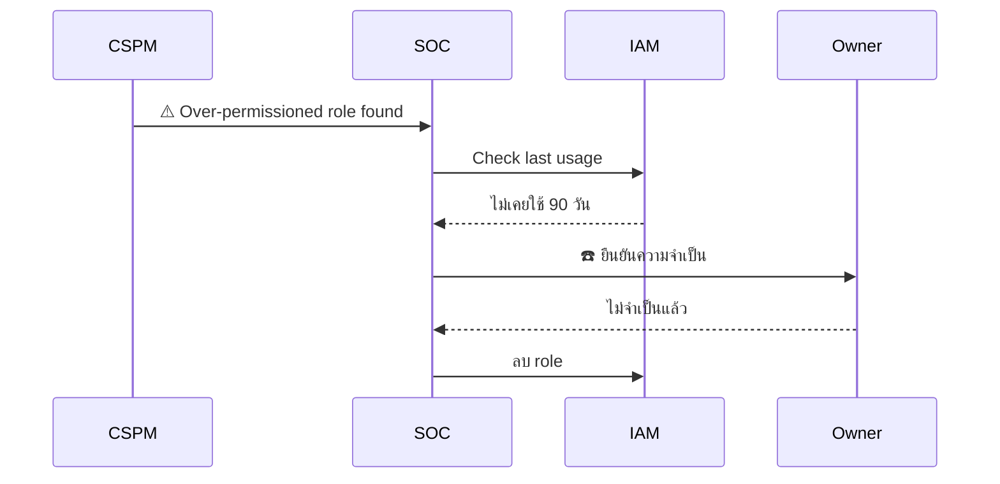

# Playbook: Cloud IAM Anomaly / ความผิดปกติ IAM คลาวด์

**ID**: PB-16
**ระดับความรุนแรง**: สูง/วิกฤต | **หมวดหมู่**: ความปลอดภัยคลาวด์
**MITRE ATT&CK**: [T1098](https://attack.mitre.org/techniques/T1098/) (Account Manipulation), [T1078.004](https://attack.mitre.org/techniques/T1078/004/) (Cloud Accounts)
**ทริกเกอร์**: CloudTrail/Azure Monitor anomaly, Root/GlobalAdmin login, GuardDuty IAM finding, Billing spike

## หลังเหตุการณ์ (Post-Incident)

- [ ] ทบทวน IAM policies ตาม least privilege
- [ ] เปิดใช้ SCPs / Permission boundaries
- [ ] ตรวจสอบ service account key rotation
- [ ] ใช้ CSPM tool เพื่อเฝ้าระวังอย่างต่อเนื่อง
- [ ] ทำ access recertification สำหรับ cloud roles
- [ ] จัดทำ [Incident Report](../../templates/incident_report.en.md)

### ผังการตรวจจับ IAM Anomaly

### ผังขั้นตอน Break-Glass

---

## ผังการตัดสินใจ

---

## 1. การวิเคราะห์

### 1.1 เหตุการณ์ที่มีความเสี่ยงสูง

| เหตุการณ์ | AWS CloudTrail | Azure Monitor | ความรุนแรง |
|:---|:---|:---|:---|
| **Root/GA login** | `ConsoleLogin` (Root) | GA sign-in | 🔴 วิกฤต |
| **สร้าง IAM user/role** | `CreateUser`, `CreateRole` | `Add member` | 🔴 สูง |
| **สร้าง Access Key** | `CreateAccessKey` | `Add app credential` | 🔴 สูง |
| **เปลี่ยน policy** | `PutUserPolicy`, `AttachPolicy` | `Add role assignment` | 🟠 สูง |
| **ลบ logging** | `DeleteTrail`, `StopLogging` | `Disable diagnostic` | 🔴 วิกฤต |
| **สร้าง federation** | `CreateSAMLProvider` | `Add federated domain` | 🔴 วิกฤต |
| **AssumeRole ผิดปกติ** | `AssumeRole` จาก IP ใหม่ | — | 🟠 สูง |

### 1.2 รายการตรวจสอบ

| รายการ | วิธีตรวจสอบ | เสร็จ |
|:---|:---|:---:|
| ใคร/อะไร ทำกิจกรรมนี้? (IAM user/role/service) | CloudTrail / Azure Audit | ☐ |
| จาก IP/location ไหน? | CloudTrail sourceIP | ☐ |
| มี Change Request ที่ได้รับอนุมัติ? | ITSM / Ticketing | ☐ |
| Root/GA มีการใช้งานปกติหรือไม่? (ควร = ไม่) | CloudTrail / Azure | ☐ |
| มีทรัพยากรใหม่ถูกสร้าง? (EC2, Lambda, etc.) | CloudTrail / Azure | ☐ |
| มี billing anomaly? | Billing dashboard | ☐ |
| Logging ยังเปิดอยู่? | CloudTrail / Config | ☐ |

### 1.3 ตรวจทรัพยากรที่สร้างใหม่

| ทรัพยากร | ตรวจสอบ | เสร็จ |
|:---|:---|:---:|
| EC2 instances (ทุก region!) | AWS Console / CLI | ☐ |
| Lambda functions | AWS Console | ☐ |
| S3 buckets | AWS Console | ☐ |
| IAM users/roles/policies | IAM Console | ☐ |
| Network (VPC, SG, NACL changes) | VPC Console | ☐ |

---

## 2. การควบคุม

| # | การดำเนินการ | เครื่องมือ | เสร็จ |
|:---:|:---|:---|:---:|
| 1 | **ปิด Access Keys** ที่น่าสงสัย | IAM Console | ☐ |
| 2 | **ลบ IAM users/roles** ที่ไม่ได้รับอนุมัติ | IAM Console | ☐ |
| 3 | **กู้คืน policies** ที่ถูกเปลี่ยน | IAM / IaC | ☐ |
| 4 | **เปิด logging** ที่ถูกปิด (CloudTrail, Config) | AWS Console | ☐ |
| 5 | **Terminate** instances/lambdas ที่ผู้โจมตีสร้าง | AWS Console | ☐ |
| 6 | **ตรวจ billing** สำหรับค่าใช้จ่ายผิดปกติ | Billing | ☐ |

---

## 3. การกำจัด

| # | การดำเนินการ | เสร็จ |
|:---:|:---|:---:|
| 1 | หมุนเวียน Root/GA credentials | ☐ |
| 2 | ลบทรัพยากรทั้งหมดที่ผู้โจมตีสร้าง (ทุก region!) | ☐ |
| 3 | ลบ federation trust ที่เพิ่ม (ถ้ามี) | ☐ |
| 4 | ตรวจ STS credentials ที่ assume แล้ว | ☐ |

---

## 4. การฟื้นฟู

| # | การดำเนินการ | เสร็จ |
|:---:|:---|:---:|
| 1 | บังคับ **MFA** สำหรับ Root/GA (hardware key) | ☐ |
| 2 | ใช้ **SCP** / **Azure Policy** ห้ามใช้ Root ในงานประจำ | ☐ |
| 3 | ใช้ **break-glass procedure** สำหรับ GA (sealed envelope) | ☐ |
| 4 | เปิด **alerts** สำหรับ Root/GA login, IAM changes | ☐ |
| 5 | ใช้ **Terraform/CloudFormation** สำหรับ IAM changes (GitOps) | ☐ |
| 6 | ตรวจสอบ IAM access ทุกไตรมาส | ☐ |

---

## 5. เกณฑ์การยกระดับ

| เงื่อนไข | ยกระดับไปยัง |
|:---|:---|
| Root/GA ถูกบุกรุก | CISO + Major Incident |
| Cryptomining instances สร้างขึ้น | Finance + [PB-31 Cryptomining](Cryptomining.th.md) |
| ข้อมูลถูกเข้าถึง (S3/DB) | Legal + DPO (PDPA 72 ชม.) |
| Billing spike > $1,000 | Finance + Cloud team |
| Logging ถูกปิด | CISO ทันที |

---

### ผัง Least Privilege Model

### ผัง Cloud Permission Audit

## กฎตรวจจับ (Sigma)

| กฎ | ไฟล์ |
|:---|:---|
| AWS Root Account Login | [cloud_root_login.yml](../../07_Detection_Rules/cloud_root_login.yml) |
| User Added to Domain Admins | [win_domain_admin_group_add.yml](../../07_Detection_Rules/win_domain_admin_group_add.yml) |

## เอกสารที่เกี่ยวข้อง

- [กรอบการตอบสนองต่อเหตุการณ์](../Framework.th.md)
- [PB-22 AWS EC2 Compromise](AWS_EC2_Compromise.th.md)
- [PB-21 AWS S3 Compromise](AWS_S3_Compromise.th.md)

## IAM Risk Indicators

| Indicator | Risk Level | Detection |
|:---|:---|:---|
| Unused admin keys > 90d | High | IAM Access Analyzer |
| MFA not enabled (admin) | Critical | IAM policy check |
| Overprivileged roles | Medium | Permission analysis |
| Cross-account access | Medium | CloudTrail review |
| Root account usage | Critical | CloudTrail alert |

### IAM Incident Containment

| Action | AWS | Azure | GCP |
|:---|:---|:---|:---|
| Disable access key | ✅ update-access-key | ✅ Portal | ✅ disable key |
| Revoke sessions | ✅ Inline deny policy | ✅ Revoke sessions | ✅ IAM |
| Reset credentials | ✅ Console/CLI | ✅ Portal/PS | ✅ Console |
| Remove permissions | ✅ Detach policy | ✅ Remove role | ✅ Remove binding |

### Cloud Credential Rotation

| Credential Type | Rotation Cycle |
|:---|:---|
| Access keys | 90 days |
| Service account keys | 60 days |
| Root/admin password | 30 days |
| API tokens | 90 days |

## อ้างอิง

- [MITRE ATT&CK T1078.004 — Cloud Accounts](https://attack.mitre.org/techniques/T1078/004/)
- [AWS Security Incident Response Guide](https://docs.aws.amazon.com/whitepapers/latest/aws-security-incident-response-guide/welcome.html)
