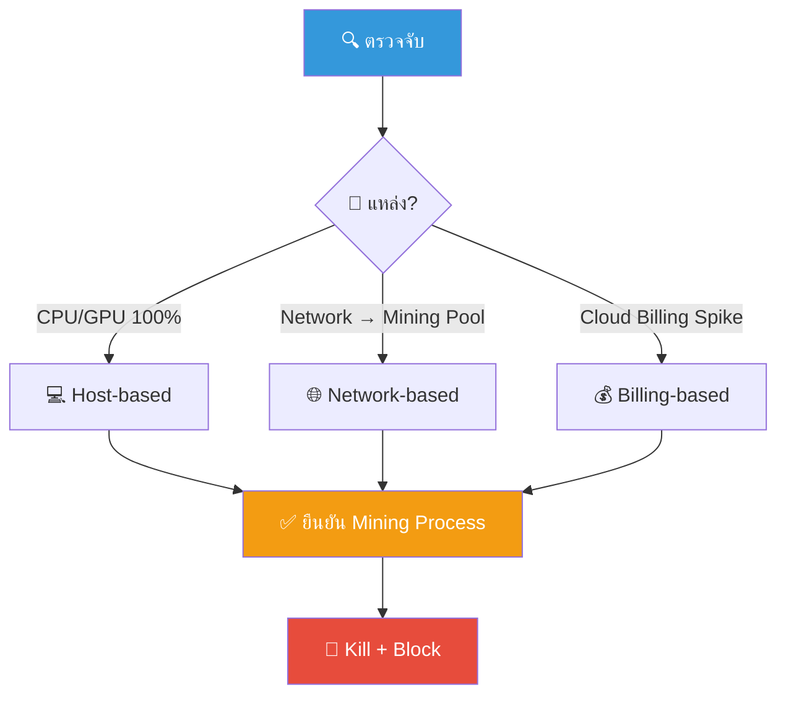
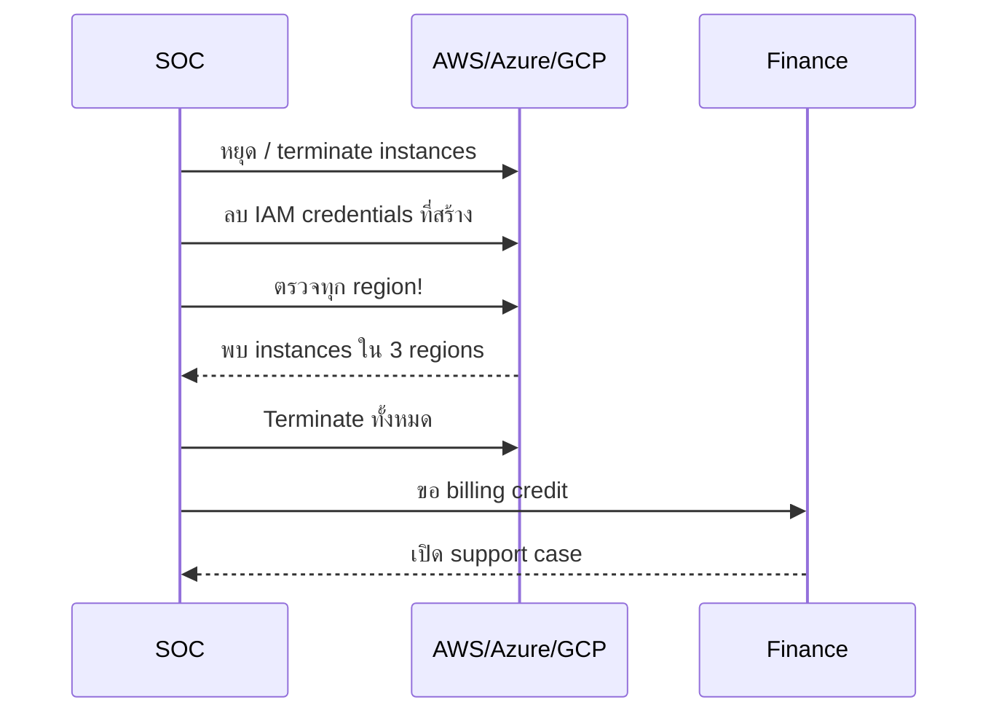
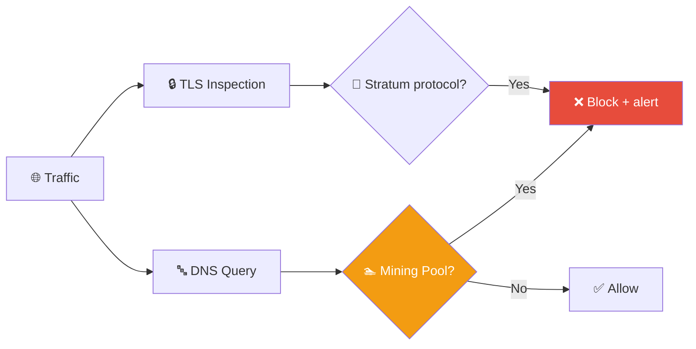
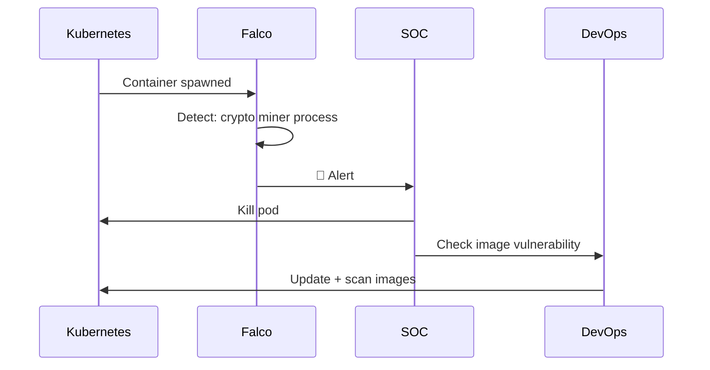

# Playbook: Cryptomining / การขุดเหรียญดิจิทัล

**ID**: PB-31
**ระดับความรุนแรง**: สูง | **หมวดหมู่**: การโจมตีทรัพยากร
**MITRE ATT&CK**: [T1496](https://attack.mitre.org/techniques/T1496/) (Resource Hijacking)
**ทริกเกอร์**: GuardDuty/Defender alert, CPU/GPU spike, billing anomaly, network connection to mining pool


## หลังเหตุการณ์ (Post-Incident)

- [ ] ตรวจสอบและ patch vulnerability ที่ใช้เข้ามา
- [ ] ใช้ resource quota / cost alerts ใน cloud
- [ ] บล็อก mining pool connections ที่ firewall
- [ ] ทบทวน container image scanning policy
- [ ] ใช้ runtime security เฝ้า abnormal CPU usage
- [ ] จัดทำ [Incident Report](../../templates/incident_report.en.md)

### ผังการตรวจจับ Cryptomining



### ผังขั้นตอนกำจัดใน Cloud



---

## ผังการตัดสินใจ

```mermaid
graph TD
    Alert["🚨 Cryptomining Alert"] --> Env{"☁️ สภาพแวดล้อม?"}
    Env -->|Cloud (AWS/Azure/GCP)| Cloud["💰 ตรวจ Billing + Regions"]
    Env -->|On-premise| OnPrem["🖥️ ตรวจ CPU/GPU Usage"]
    Cloud --> Scope{"📊 กี่ instances?"}
    OnPrem --> Scope
    Scope -->|เครื่องเดียว| Single["🟠 Kill + Investigate Entry"]
    Scope -->|หลายเครื่อง/regions| Multi["🔴 IAM Compromise"]
    Multi --> IAM["🔑 ตรวจ IAM Credentials"]
```

---

## 1. การวิเคราะห์

### 1.1 Mining Binaries ที่รู้จัก

| Binary | ลักษณะ | Coin |
|:---|:---|:---|
| **xmrig** | CPU miner | Monero (XMR) |
| **ccminer** | GPU miner | หลาย coin |
| **ethminer** | GPU miner | Ethereum |
| **t-rex** | GPU miner | หลาย coin |
| **PhoenixMiner** | GPU miner | Ethereum |
| **nbminer** | GPU miner | หลาย coin |

### 1.2 ตัวบ่งชี้ Mining Pool

| ตัวบ่งชี้ | ค่าที่น่าสงสัย |
|:---|:---|
| Destination port | 3333, 4444, 5555, 8333, 14444 |
| Protocol | Stratum (stratum+tcp://) |
| DNS queries | pool.*, mining.*, xmr.*, f2pool.*, nanopool.* |

### 1.3 รายการตรวจสอบ

| รายการ | วิธีตรวจสอบ | เสร็จ |
|:---|:---|:---:|
| Host/Instance ที่ทำ mining | EDR / GuardDuty / CloudWatch | ☐ |
| Mining binary และ hash | EDR process list | ☐ |
| Mining pool domain/IP | Proxy / DNS / Netflow | ☐ |
| Entry vector (exploit/credential/supply chain) | CloudTrail / EDR | ☐ |
| จำนวนเครื่อง (**ตรวจทุก region!**) | Cloud console / SIEM | ☐ |
| Billing impact (USD) | Cloud billing | ☐ |
| มี persistence (crontab, systemd, k8s)? | EDR / kubectl | ☐ |
| มี lateral movement? | SIEM | ☐ |

---

## 2. การควบคุม

### 2.1 การดำเนินการทันที

| # | การดำเนินการ | เครื่องมือ | เสร็จ |
|:---:|:---|:---|:---:|
| 1 | **Kill** mining process | EDR / SSH | ☐ |
| 2 | **Block** mining pool IPs/domains | Firewall / DNS | ☐ |
| 3 | **Isolate** หรือ **terminate** instances | Cloud console / EDR | ☐ |
| 4 | **ปิด IAM credentials** ที่ใช้สร้าง instances | IAM console | ☐ |
| 5 | **Block** mining ports (3333, 4444, 5555) | NACL / SG | ☐ |

### 2.2 คลาวด์ — ตรวจทุก Region

```bash
# AWS — ตรวจ EC2 instances ทุก region
for region in $(aws ec2 describe-regions --query 'Regions[].RegionName' --output text); do
  echo "=== $region ==="
  aws ec2 describe-instances --region $region \
    --query 'Reservations[].Instances[].[InstanceId,State.Name,InstanceType]' \
    --output table
done
```

---

## 3. การกำจัด

| # | การดำเนินการ | เสร็จ |
|:---:|:---|:---:|
| 1 | ลบ mining binaries + persistence (crontab, systemd, k8s CronJob) | ☐ |
| 2 | **ลบ instances ที่ผู้โจมตีสร้าง (ทุก region!)** | ☐ |
| 3 | หมุนเวียน IAM credentials ที่เกี่ยวข้อง | ☐ |
| 4 | ตรวจ container images สำหรับ embedded miners | ☐ |
| 5 | Patch entry vector | ☐ |

---

## 4. การฟื้นฟู

| # | การดำเนินการ | เสร็จ |
|:---:|:---|:---:|
| 1 | ตั้ง **billing alerts** + **budget caps** | ☐ |
| 2 | ใช้ **SCP** จำกัด instance types / regions ที่ไม่ใช้ | ☐ |
| 3 | ขอ **billing credit** จาก cloud provider | ☐ |
| 4 | เปิด GuardDuty / Defender for Cloud | ☐ |
| 5 | ตรวจ container images ก่อน deploy (image scanning) | ☐ |

---

## 5. เกณฑ์การยกระดับ

| เงื่อนไข | ยกระดับไปยัง |
|:---|:---|
| Billing > $1,000 ผิดปกติ | Finance + Cloud team |
| หลาย accounts ได้รับผลกระทบ | Major Incident |
| Supply chain (compromised image/dependency) | [PB-32 Supply Chain](Supply_Chain_Attack.th.md) |
| Insider สร้าง mining instances | CISO + HR |
| IAM credentials ถูกขโมย | [PB-16 Cloud IAM](Cloud_IAM.th.md) |

---

### ผัง Mining Pool Detection



### ผัง Container Security



## กฎตรวจจับ (Sigma)

| กฎ | ไฟล์ |
|:---|:---|
| Cryptomining Process Detection | [proc_cryptomining_indicators.yml](../../08_Detection_Engineering/sigma_rules/proc_cryptomining_indicators.yml) |
| AWS EC2 Crypto Mining Indicator | [cloud_aws_ec2_mining.yml](../../08_Detection_Engineering/sigma_rules/cloud_aws_ec2_mining.yml) |

## เอกสารที่เกี่ยวข้อง

- [กรอบการตอบสนองต่อเหตุการณ์](../Framework.th.md)
- [PB-22 AWS EC2 Compromise](AWS_EC2_Compromise.th.md)
- [PB-16 Cloud IAM](Cloud_IAM.th.md)

## Cryptomining Detection Indicators

| Indicator | Source | Threshold |
|:---|:---|:---|
| High CPU sustained | EDR/Performance | > 80% for 30 min |
| Mining pool connection | Network flow | Known pool IPs/domains |
| Stratum protocol | Network inspection | stratum+tcp:// |
| GPU utilization spike | Endpoint agent | Unexpected > 60% |

### Resource Impact Assessment

| Host Type | Business Impact | Priority |
|:---|:---|:---|
| Production server | High (performance) | P1 |
| Cloud instance | High (cost) | P1 |
| User workstation | Medium | P2 |
| Dev/test server | Low | P3 |

## อ้างอิง

- [MITRE ATT&CK T1496 — Resource Hijacking](https://attack.mitre.org/techniques/T1496/)
