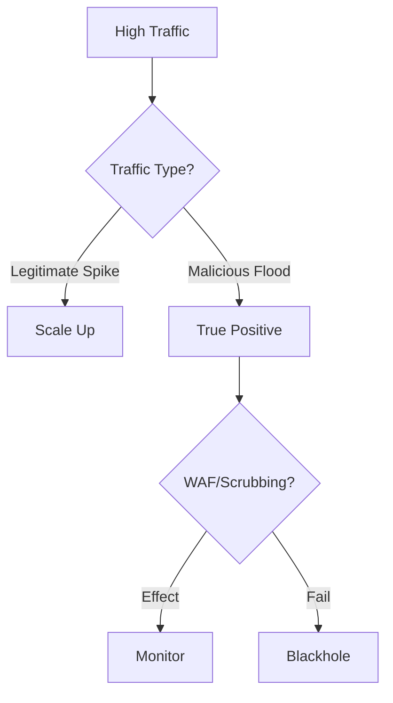

# Playbook: Denial of Service (DDoS)

**ID**: PB-09
**Severity**: High
**Trigger**: Monitoring Alert ("High CPU/Bandwidth"), WAF Logs ("Flood Detected").

## 1. Analysis (Triage)

-   **Confirm Attack**: Distinguish between legitimate traffic spike (Marketing campaign) vs. Attack.
-   **Identify Type**: Volumetric (UDP/ICMP Flood) or Application (HTTP GET/POST Flood).
-   **Target**: What specific IP or URL is being hit?

## 2. Containment
-   **Activate Mitigation**: Enable "Under Attack" mode on WAF/Cloudflare/Akamai.
-   **Rate Limiting**: Aggressively rate-limit by Geo-location or IP reputation.
-   **Blackhole**: If On-prem, contact ISP to blackhole traffic if pipe is saturated.

## 3. Recovery
-   **Monitor Stability**: Watch traffic graphs closely as mitigation rules apply.
-   **Scale Up**: Add more web server instances (Auto-scaling) if possible to handle load.
-   **Attribute**: [Availability]

## References
-   [MITRE ATT&CK T1498 (Network Denial of Service)](https://attack.mitre.org/techniques/T1498/)
-   [CISA DDoS Quick Guide](https://www.cisa.gov/sites/default/files/publications/ddos-quick-guide.pdf)
