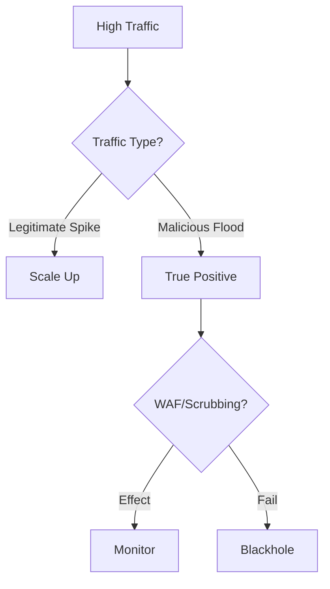

# Playbook: การโจมตีสภาพความพร้อมใช้งาน (DDoS)

**ID**: PB-09
**ความรุนแรง**: สูง
**ตัวกระตุ้น**: แจ้งเตือน Monitoring ("High CPU/Bandwidth"), WAF Logs ("พบการ Flood")

## 1. การวิเคราะห์ (Analysis)

-   **ยืนยันการโจมตี**: แยกแยะระหว่างคนเข้าใช้งานจริง (เช่น แคมเปญการตลาด) กับการโจมตี
-   **ระบุประเภท**: ปริมาณมหาศาล (UDP/ICMP Flood) หรือ โจมตีแอปพลิเคชัน (HTTP GET/POST Flood)
-   **เป้าหมาย**: IP หรือ URL ใดที่ถูกโจมตี?

## 2. การจำกัดวง (Containment)
-   **เปิดโหมดป้องกัน**: เปิด "Under Attack" mode บน WAF/Cloudflare/Akamai
-   **Rate Limiting**: จำกัดการเชื่อมต่อตามประเทศ (Geo-location) หรือความน่าเชื่อถือของ IP
-   **Blackhole**: หากเป็น On-prem และท่อเต็ม ให้ติดต่อ ISP เพื่อทำ Blackhole traffic

## 3. การกู้คืน (Recovery)
-   **เฝ้าระวัง**: ดูหน้ากราฟ Traffic อย่างใกล้ชิดเมื่อเปิดใช้งานกฎป้องกัน
-   **ขยายระบบ**: เพิ่มจำนวน Server (Auto-scaling) เพื่อรองรับโหลดถ้าทำได้
-   **ผลกระทบ (Attribute)**: [Availability]

## เอกสารที่เกี่ยวข้อง (Related Documents)
-   [กรอบการตอบสนองเหตุการณ์](../Framework.th.md)
-   [แบบฟอร์ม Incident Report](../../templates/incident_report.th.md)
-   [แบบฟอร์มส่งมอบกะ](../../templates/shift_handover.th.md)

## References
-   [MITRE ATT&CK T1498 (Network Denial of Service)](https://attack.mitre.org/techniques/T1498/)
-   [CISA DDoS Quick Guide](https://www.cisa.gov/sites/default/files/publications/ddos-quick-guide.pdf)
