# Playbook: การโจมตี DDoS

**ID**: PB-12
**ระดับความรุนแรง**: สูง/วิกฤต | **หมวดหมู่**: ความปลอดภัยเครือข่าย
**MITRE ATT&CK**: [T1498](https://attack.mitre.org/techniques/T1498/) (Network Denial of Service), [T1499](https://attack.mitre.org/techniques/T1499/) (Endpoint Denial of Service)
**ทริกเกอร์**: Network monitoring alert, WAF/CDN alert, ลูกค้ารายงาน, uptime monitor, NOC alert

## หลังเหตุการณ์ (Post-Incident)

- [ ] ทบทวนแผน DDoS mitigation และอัพเดทตามจำเป็น
- [ ] อัพเดท ISP/CDN scrubbing agreements
- [ ] ทบทวน auto-scaling และ rate-limiting configurations
- [ ] ทำ capacity planning จาก bandwidth ที่พบ
- [ ] จัด DDoS simulation exercise กับ mitigation provider
- [ ] จัดทำ [Incident Report](../../templates/incident_report.en.md)

### ผังชั้นป้องกัน DDoS

### ผังการสื่อสารระหว่างเหตุการณ์

```mermaid
sequenceDiagram
    participant NOC
    participant SOC
    participant ISP
    participant CDN
    participant Mgmt as Management
    NOC->>SOC: 🚨 Traffic spike / service down
    SOC->>CDN: เปิด DDoS mitigation
    SOC->>ISP: ขอ upstream filtering
    CDN-->>SOC: Scrubbing เปิดแล้ว
    ISP-->>SOC: Blackhole/rate limit ดำเนินการ
    SOC->>Mgmt: อัปเดตสถานะ + ETA
```

---

## ผังการตัดสินใจ

```mermaid
graph TD
    Alert["🚨 DDoS Alert / บริการล่ม"] --> Type{"⚙️ ประเภทการโจมตี?"}
    Type -->|Volumetric| Vol["🌊 ปริมาณ Traffic สูง (UDP/ICMP)"]
    Type -->|Protocol| Proto["📦 SYN Flood / Amplification"]
    Type -->|Application L7| App["🌐 HTTP Flood / Slowloris"]
    Vol --> Upstream["📞 ติดต่อ ISP / CDN"]
    Proto --> Upstream
    App --> WAF["🛡️ WAF Mitigation"]
    Upstream --> Mitigate["🔒 เปิดใช้ DDoS Protection"]
    WAF --> Mitigate
```

---

## 1. การวิเคราะห์

### 1.1 การจำแนกประเภทการโจมตี

| ประเภท | วิธีการ | ตัวบ่งชี้ | ความรุนแรง |
|:---|:---|:---|:---|
| **Volumetric** | UDP flood, DNS amplification, NTP amplification | Bandwidth สูง (>10 Gbps) | 🔴 สูง |
| **Protocol** | SYN flood, Smurf, Fraggle | Connection state หมด | 🟠 สูง |
| **Application (L7)** | HTTP flood, Slowloris, RUDY | Request rate ผิดปกติ | 🟠 สูง |
| **Ransom DDoS** | Volumetric + จดหมายเรียกค่าไถ่ | อีเมลข่มขู่ก่อน/ระหว่างโจมตี | 🔴 วิกฤต |

### 1.2 รายการตรวจสอบ

| รายการ | วิธีตรวจสอบ | เสร็จ |
|:---|:---|:---:|
| ปริมาณ traffic (Gbps/Mpps) | Netflow / CDN dashboard | ☐ |
| IP ต้นทาง — เดียวหรือกระจาย (botnet)? | Netflow analysis | ☐ |
| บริการที่ได้รับผลกระทบ | Monitoring / Users | ☐ |
| ระยะเวลาการโจมตี | Timeline analysis | ☐ |
| มีจดหมายเรียกค่าไถ่ (RDoS)? | อีเมล / Abuse contact | ☐ |
| เป็นควันบังตา (cover) สำหรับการโจมตีอื่น? | SIEM — ตรวจเหตุการณ์อื่นพร้อมกัน | ☐ |

### 1.3 การประเมินผลกระทบ

| บริการ | สถานะ | ผลกระทบทางธุรกิจ | ลำดับสำคัญ |
|:---|:---|:---|:---|
| เว็บไซต์หลัก | ☐ ปกติ ☐ ช้า ☐ ล่ม | | |
| API | ☐ ปกติ ☐ ช้า ☐ ล่ม | | |
| อีเมล | ☐ ปกติ ☐ ช้า ☐ ล่ม | | |
| VPN | ☐ ปกติ ☐ ช้า ☐ ล่ม | | |

---

## 2. การควบคุม

### 2.1 การดำเนินการทันที

| # | การดำเนินการ | เครื่องมือ | เสร็จ |
|:---:|:---|:---|:---:|
| 1 | **เปิด DDoS protection** (AWS Shield, Azure DDoS, Cloudflare) | CDN / Cloud | ☐ |
| 2 | **เพิ่ม rate limiting** | CDN / WAF | ☐ |
| 3 | **GeoIP block** ประเทศที่ไม่เกี่ยวข้อง | Firewall / CDN | ☐ |
| 4 | **Blackhole routing** สำหรับ IP ต้นทาง (volumetric) | ISP / Router | ☐ |
| 5 | **ติดต่อ ISP** เพื่อ upstream filtering | โทรศัพท์ | ☐ |

### 2.2 กรณี Application Layer (L7)

| # | การดำเนินการ | เสร็จ |
|:---:|:---|:---:|
| 1 | เปิด CAPTCHA / JavaScript challenge | ☐ |
| 2 | WAF rules สำหรับ bot detection | ☐ |
| 3 | ปรับ connection timeouts | ☐ |
| 4 | เพิ่ม Auto-scaling (cloud) | ☐ |

---

## 3. การกำจัด

| # | การดำเนินการ | เสร็จ |
|:---:|:---|:---:|
| 1 | วิเคราะห์ traffic เพื่อระบุ botnet C2 | ☐ |
| 2 | อัปเดต blocklist ด้วย IP ต้นทาง | ☐ |
| 3 | หากควันบังตา → ตรวจสอบเหตุการณ์อื่นที่เกิดพร้อมกัน | ☐ |

---

## 4. การฟื้นฟู

| # | การดำเนินการ | เสร็จ |
|:---:|:---|:---:|
| 1 | คืนสถานะบริการทีละขั้นตอน | ☐ |
| 2 | Deploy DDoS protection ถาวร (Always-on) | ☐ |
| 3 | ทดสอบ DDoS readiness | ☐ |
| 4 | จัดทำ DDoS runbook เฉพาะบริการ | ☐ |
| 5 | ติดตาม 72 ชั่วโมง | ☐ |

---

## 5. เกณฑ์การยกระดับ

| เงื่อนไข | ยกระดับไปยัง |
|:---|:---|
| บริการลูกค้าล่มเกิน 30 นาที | SOC Lead + Business |
| Ransom DDoS (จดหมายข่มขู่) | Legal + CISO + Law Enforcement |
| DDoS เป็นควันบังตาสำหรับการโจมตีอื่น | Major Incident |
| การโจมตีเกิน 24 ชม. | CISO + ISP escalation |
| ISP ไม่สามารถ mitigate ได้ | CDN vendor + Executive |

---

### ผัง DDoS Mitigation Tiers

```mermaid
graph TD
    Attack["💥 DDoS"] --> L3["🔒 L3/L4: ISP null route"]
    Attack --> L7["🛡️ L7: WAF + rate limit"]
    L3 --> CDN["☁️ CDN absorption"]
    L7 --> CDN
    CDN --> Origin["🖥️ Origin protected"]
    Origin --> Monitor["📊 Monitor recovery"]
    style Attack fill:#e74c3c,color:#fff
    style CDN fill:#27ae60,color:#fff
```

### ผัง ISP Coordination

```mermaid
sequenceDiagram
    participant SOC
    participant ISP
    participant CDN
    participant Management
    SOC->>ISP: 🚨 DDoS 50Gbps — request scrubbing
    ISP->>ISP: Activate scrubbing center
    ISP-->>SOC: ✅ Scrubbing active
    SOC->>CDN: Increase capacity
    CDN-->>SOC: ✅ Auto-scaling
    SOC->>Management: Update: mitigated
```

## กฎตรวจจับ (Sigma)

| กฎ | ไฟล์ |
|:---|:---|
| High Web Request Rate from Single IP | [web_high_rate_limit.yml](../../08_Detection_Engineering/sigma_rules/web_high_rate_limit.yml) |

## เอกสารที่เกี่ยวข้อง

- [กรอบการตอบสนองต่อเหตุการณ์](../Framework.th.md)
- [แม่แบบรายงานเหตุการณ์](../../templates/incident_report.th.md)
- [บันทึกการส่งมอบกะ](../../templates/shift_handover.th.md)

## DDoS Attack Classification

| Type | Layer | Volume | Mitigation |
|:---|:---|:---|:---|
| Volumetric | L3/L4 | > 10 Gbps | ISP scrubbing |
| Protocol | L3/L4 | SYN/UDP flood | Rate limiting |
| Application | L7 | HTTP flood | WAF + CAPTCHA |
| Amplification | L3 | DNS/NTP reflect | BCP38 filtering |

### DDoS Response Escalation

| Severity | Impact | Response | Contact |
|:---|:---|:---|:---|
| Low | < 50% capacity | Monitor | SOC |
| Medium | 50-80% capacity | Activate mitigation | SOC + NOC |
| High | > 80% capacity | ISP scrubbing | NOC + ISP |
| Critical | Service down | Full response | All + Management |

### Mitigation Activation Checklist
- [ ] Enable DDoS protection (CDN/WAF)
- [ ] Contact ISP for upstream filtering
- [ ] Activate geo-blocking if applicable
- [ ] Scale infrastructure if cloud-based
- [ ] Enable rate limiting on all edges

### Post-Attack Review

| Question | Owner |
|:---|:---|
| Attack source identified? | SOC |
| ISP response adequate? | NOC |
| Mitigation effective? | Security |
| Customer impact assessed? | Business |

## อ้างอิง

- [MITRE ATT&CK T1498 — Network Denial of Service](https://attack.mitre.org/techniques/T1498/)
- [CISA — DDoS Quick Guide](https://www.cisa.gov/sites/default/files/publications/DDoS%20Quick%20Guide.pdf)
