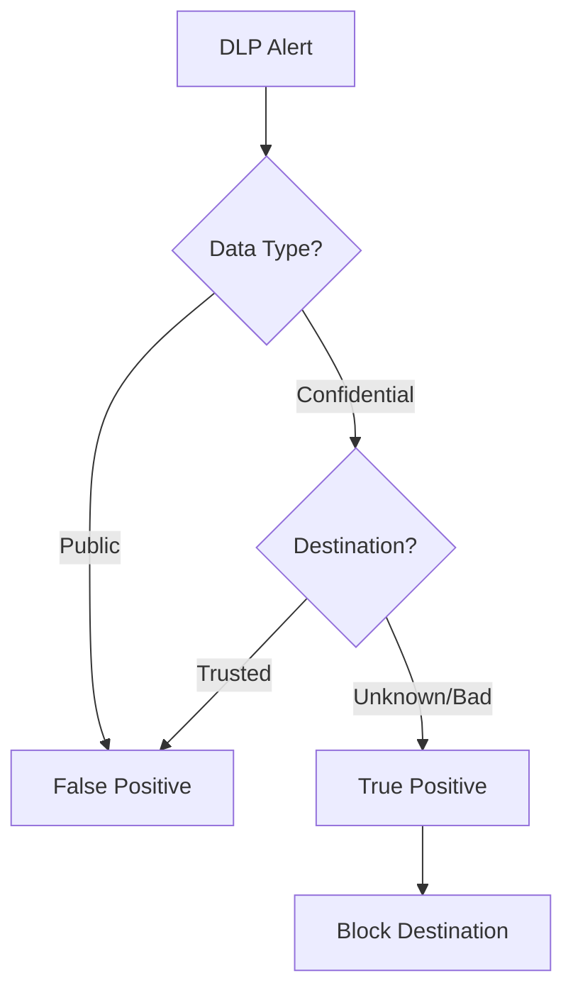

# Playbook: Data Exfiltration

**ID**: PB-08
**Severity**: Critical
**Trigger**: DLP Alert, SIEM ("Large Upload to Unknown IP").

## 1. Analysis (Triage)

-   **Verify Volume**: Is the data transfer size anomalous for this user/server?
-   **Check Destination**: Is the IP/Domain trusted (e.g., Corporate OneDrive) or unknown?
-   **Inspect Content**: If possible, check DLP logs for file names or classifications (PII/Confidential).

## 2. Containment
-   **Block Connection**: Block the destination IP/Domain at the Firewall/Proxy immediately.
-   **Isolate Source**: Disconnect the source machine to stop further upload.
-   **Disable User**: If a user account is involved, disable it.

## 3. Eradication
-   **Remove Staging**: Delete any RAR/ZIP files prepared for exfiltration.
-   **Scan for Persistence**: Ensure no backdoors remain.

## 4. Recovery
-   **Legal Review**: Consult Legal/Privacy team if PII was leaked.
-   **Damage Assessment**: List exactly what files were lost.
-   **Attribute**: [Confidentiality]

## Related Documents
-   [Incident Response Framework](../Framework.en.md)
-   [Incident Report Template](../../templates/incident_report.en.md)
-   [Shift Handover Log](../../templates/shift_handover.en.md)

## References
-   [MITRE ATT&CK T1048 (Exfiltration Over Alternative Protocol)](https://attack.mitre.org/techniques/T1048/)
-   [NIST SP 800-61r2 (Data Security)](https://csrc.nist.gov/publications/detail/sp/800-61/rev-2/final)
