# Playbook: การนำข้อมูลออก (Data Exfiltration)

**ID**: PB-08
**ระดับความรุนแรง**: สูง/วิกฤต | **หมวดหมู่**: ความปลอดภัยข้อมูล
**MITRE ATT&CK**: [T1041](https://attack.mitre.org/techniques/T1041/) (Exfiltration Over C2 Channel), [T1048](https://attack.mitre.org/techniques/T1048/) (Exfiltration Over Alternative Protocol), [T1567](https://attack.mitre.org/techniques/T1567/) (Exfiltration Over Web Service)
**ทริกเกอร์**: DLP alert, Netflow anomaly, UEBA alert, proxy/cloud alert, EDR large file copy

## หลังเหตุการณ์ (Post-Incident)

- [ ] อัพเดท DLP policies ตาม exfiltration channel ที่พบ
- [ ] ทบทวน outbound network rules (cloud, USB, email)
- [ ] แจ้ง Legal/DPO ถ้ามี PII รั่วไหล (PDPA 72h)
- [ ] สร้าง detection rule สำหรับ anomalous data transfer
- [ ] ทำ data impact assessment
- [ ] จัดทำ [Incident Report](../../templates/incident_report.en.md)

### ผังการตรวจจับตามช่องทาง

```mermaid
graph TD
    DLP["🔍 DLP Engine"] --> Ch{"📡 ช่องทาง?"}
    Ch -->|Web Upload| Proxy["🌐 Proxy / CASB"]
    Ch -->|Email| Mail["📧 Mail Gateway"]
    Ch -->|USB| Endpoint["💻 Endpoint DLP"]
    Ch -->|DNS| DNS["🔤 DNS Analytics"]
    Proxy --> Alert["🚨 Alert SOC"]
    Mail --> Alert
    Endpoint --> Alert
    DNS --> Alert
    Alert --> Investigate["🔎 Investigate"]
```

### ผังการประเมินผลกระทบข้อมูล

```mermaid
sequenceDiagram
    participant SOC
    participant DLP
    participant Legal
    participant DPO
    SOC->>DLP: ข้อมูลอะไรถูกนำออก?
    DLP-->>SOC: PII 500 records
    SOC->>Legal: 📋 รายงานเหตุการณ์
    Legal->>DPO: ต้องแจ้ง PDPA?
    DPO-->>Legal: ใช่ — ภายใน 72 ชม.
    Legal->>SOC: เตรียมรายงานแจ้งเตือน
```

---

## ผังการตัดสินใจ

```mermaid
graph TD
    Alert["🚨 Data Exfiltration Alert"] --> Channel{"📡 ช่องทาง?"}
    Channel -->|Cloud Upload| Cloud["☁️ SaaS / Cloud Storage"]
    Channel -->|Email| Email["📧 Email Attachment"]
    Channel -->|USB| USB["💾 Removable Media"]
    Channel -->|DNS/Tunnel| DNS["🌐 Covert Channel"]
    Channel -->|Physical| Phys["📸 Print / Camera"]
    Cloud --> Data{"📁 ข้อมูลอะไร?"}
    Email --> Data
    USB --> Data
    DNS --> Data
    Phys --> Data
    Data -->|PII / ลูกค้า| Critical["🔴 Legal + DPO ทันที"]
    Data -->|IP / Source Code| High["🔴 CISO ทันที"]
    Data -->|Internal non-sensitive| Medium["🟠 บล็อก + สอบสวน"]
```

---

## 1. การวิเคราะห์

### 1.1 ช่องทางนำข้อมูลออก

| ช่องทาง | ตัวบ่งชี้ | การตรวจจับ | ความรุนแรง |
|:---|:---|:---|:---|
| **HTTPS upload** (Google Drive, Dropbox, Mega) | Upload volume สูง | DLP / CASB / Proxy | 🔴 สูง |
| **อีเมล** (แนบไฟล์ / body) | ไฟล์ขนาดใหญ่, ปริมาณมาก, external recipient | DLP / Mail gateway | 🟠 สูง |
| **USB / Removable Media** | Copy ไฟล์ไป USB, CD burning | EDR / DLP endpoint | 🟠 สูง |
| **DNS tunneling** | Payload ใน DNS queries (high entropy) | DNS analytics | 🔴 สูง |
| **FTP / SCP / SFTP** | Outbound file transfer, port 21/22 | Netflow / Firewall | 🟠 สูง |
| **Airdrop / Bluetooth** | Wireless file transfer | Endpoint control | 🟡 ปานกลาง |
| **พิมพ์ / ถ่ายรูป / คัดลอก** | Physical exfiltration | DLP / กล้อง / policy | 🟡 ปานกลาง |
| **Steganography** | ซ่อนข้อมูลในรูปภาพ/ไฟล์ | Advanced DLP | 🔴 สูง |

### 1.2 การจำแนกประเภทข้อมูล

| ประเภท | ตัวอย่าง | ความรุนแรง | การแจ้งเตือน |
|:---|:---|:---|:---|
| **PII / ข้อมูลส่วนบุคคล** | ชื่อ, เลขบัตร, ที่อยู่ | 🔴 วิกฤต | PDPA 72 ชม. |
| **ข้อมูลทางการเงิน** | บัญชีธนาคาร, credit card | 🔴 วิกฤต | PCI-DSS + Legal |
| **IP / Source Code** | Design documents, code repos | 🔴 วิกฤต | CISO + Legal |
| **ข้อมูลธุรกิจ** | สัญญา, pricing, strategy | 🟠 สูง | CISO + Management |
| **ข้อมูลภายในทั่วไป** | Internal docs, policies | 🟡 ปานกลาง | SOC Lead |

### 1.3 รายการตรวจสอบ

| รายการ | วิธีตรวจสอบ | เสร็จ |
|:---|:---|:---:|
| ข้อมูลอะไรถูกนำออก? จำแนกประเภท | DLP / data classification | ☐ |
| ปริมาณเท่าไหร่? (MB/GB?) | Proxy / Netflow / DLP | ☐ |
| ช่องทางอะไร? | DLP / EDR / SIEM | ☐ |
| ใคร / process ใด? | UEBA / EDR | ☐ |
| ปลายทาง (destination IP/domain)? | Proxy / DNS / Netflow | ☐ |
| เจตนาร้ายหรือไม่ตั้งใจ? | Context + interview | ☐ |
| ระยะเวลา (ครั้งเดียว vs ต่อเนื่อง)? | DLP timeline | ☐ |
| มี access ข้อมูลเพิ่มเติมก่อน exfil? | File audit / UEBA | ☐ |

---

## 2. การควบคุม

| # | การดำเนินการ | เครื่องมือ | เสร็จ |
|:---:|:---|:---|:---:|
| 1 | **บล็อก** destination IP/domain | Firewall / Proxy | ☐ |
| 2 | **Isolate** host ต้นทาง | EDR | ☐ |
| 3 | **ล็อกบัญชี** ผู้ใช้ (ถ้าเจตนาร้าย) | IAM | ☐ |
| 4 | **บล็อก** USB ports (หาก USB exfil) | EDR / GPO | ☐ |
| 5 | **เพิ่ม DLP monitoring** บนบัญชี/host อื่น | DLP | ☐ |
| 6 | **ยึด USB/อุปกรณ์** ที่ใช้ exfil | Physical | ☐ |

---

## 3. การกำจัด

| # | การดำเนินการ | เสร็จ |
|:---:|:---|:---:|
| 1 | ลบ malware/tools ที่ใช้ exfiltrate | ☐ |
| 2 | ลบ persistence (staging directories, scripts) | ☐ |
| 3 | หมุนเวียน credentials ที่เกี่ยวข้อง | ☐ |
| 4 | ตรวจว่ามีข้อมูลถูก stage แต่ยังไม่ exfil | ☐ |

---

## 4. การฟื้นฟู

| # | การดำเนินการ | เสร็จ |
|:---:|:---|:---:|
| 1 | เพิ่ม **DLP rules** สำหรับข้อมูลสำคัญ (PII, IP, financial) | ☐ |
| 2 | จำกัด **USB / removable media** (GPO/EDR) | ☐ |
| 3 | เปิด **egress filtering** (block unauthorized uploads) | ☐ |
| 4 | จำแนกและติดแท็กข้อมูลสำคัญ (**data classification**) | ☐ |
| 5 | เปิด **CASB** สำหรับ cloud upload monitoring | ☐ |
| 6 | ทบทวน **DLP policy** ทุกไตรมาส | ☐ |

---

## 5. เกณฑ์การยกระดับ

| เงื่อนไข | ยกระดับไปยัง |
|:---|:---|
| PII / ข้อมูลลูกค้ารั่วไหล | Legal + DPO (**PDPA 72 ชม.**) |
| ทรัพย์สินทางปัญญา / source code | Legal + CISO |
| เจตนาร้าย (insider threat) | [PB-14 Insider Threat](Insider_Threat.th.md) + HR |
| ปริมาณมาก (>100 MB) | SOC Lead |
| DNS tunneling / covert channel | [PB-25 DNS Tunneling](DNS_Tunneling.th.md) |
| ข้อมูลถูกขายบน dark web | Legal + Law Enforcement |

---

### ผัง Exfiltration Channels

```mermaid
graph TD
    Exfil["📤 Exfiltration"] --> Web["🌐 Web upload"]
    Exfil --> Email["📧 Email attach"]
    Exfil --> Cloud["☁️ Cloud sync"]
    Exfil --> USB["💾 USB"]
    Exfil --> DNS["🔤 DNS tunnel"]
    Web --> DLP["🛡️ DLP inspect"]
    Email --> DLP
    Cloud --> DLP
    USB --> EDR["🔍 EDR block"]
    DNS --> NDR["📡 NDR detect"]
    style Exfil fill:#e74c3c,color:#fff
    style DLP fill:#27ae60,color:#fff
```

### ผัง Data Loss Prevention Pipeline

```mermaid
sequenceDiagram
    participant User
    participant DLP
    participant SOC
    participant Manager
    User->>DLP: Upload 500MB to Google Drive
    DLP->>DLP: Scan: PII detected!
    DLP-->>User: ❌ Blocked
    DLP->>SOC: 🚨 Alert: PII exfiltration attempt
    SOC->>Manager: แจ้งหัวหน้าทีม
```

## กฎตรวจจับ (Sigma)

| กฎ | ไฟล์ |
|:---|:---|
| Large Upload to External IP | [net_large_upload.yml](../../08_Detection_Engineering/sigma_rules/net_large_upload.yml) |
| Bulk File Copy to USB | [file_bulk_usb_copy.yml](../../08_Detection_Engineering/sigma_rules/file_bulk_usb_copy.yml) |
| Data Collection and Staging | [sigma/win_data_collection_staging.yml](../../08_Detection_Engineering/sigma_rules/sigma/win_data_collection_staging.yml) |

## เอกสารที่เกี่ยวข้อง

- [กรอบการตอบสนองต่อเหตุการณ์](../Framework.th.md)
- [PB-14 ภัยคุกคามจากภายใน](Insider_Threat.th.md)
- [PB-25 DNS Tunneling](DNS_Tunneling.th.md)

## Exfiltration Channel Detection

| Channel | Detection Method | Difficulty |
|:---|:---|:---|
| Email attachment | DLP content scan | Easy |
| Cloud upload | CASB + proxy logs | Medium |
| USB copy | Endpoint agent | Easy |
| DNS tunneling | DNS analytics | Hard |
| Encrypted channel | TLS inspection | Hard |
| Physical (camera/print) | DLP + physical security | Very Hard |

### Volume-based Alert Thresholds

| Data Type | Threshold | Time Window | Action |
|:---|:---|:---|:---|
| Any upload | > 500 MB | 1 hour | Alert SOC |
| PII/PHI | > 1 record | Any | Alert immediately |
| Source code | > 10 files | 1 day | Alert + block |
| Database export | > 1,000 rows | Single query | Alert + block |

### Data Loss Quantification

| Metric | Method |
|:---|:---|
| Volume (GB) | Network logs |
| Record count | DLP + DB audit |
| Duration | Timeline analysis |
| Data sensitivity | Classification review |

## อ้างอิง

- [MITRE ATT&CK — Exfiltration](https://attack.mitre.org/tactics/TA0010/)
