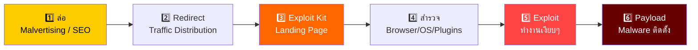
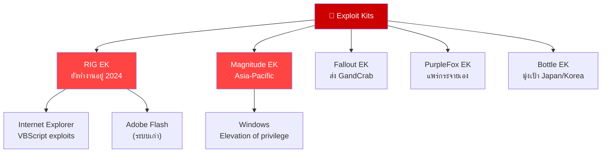
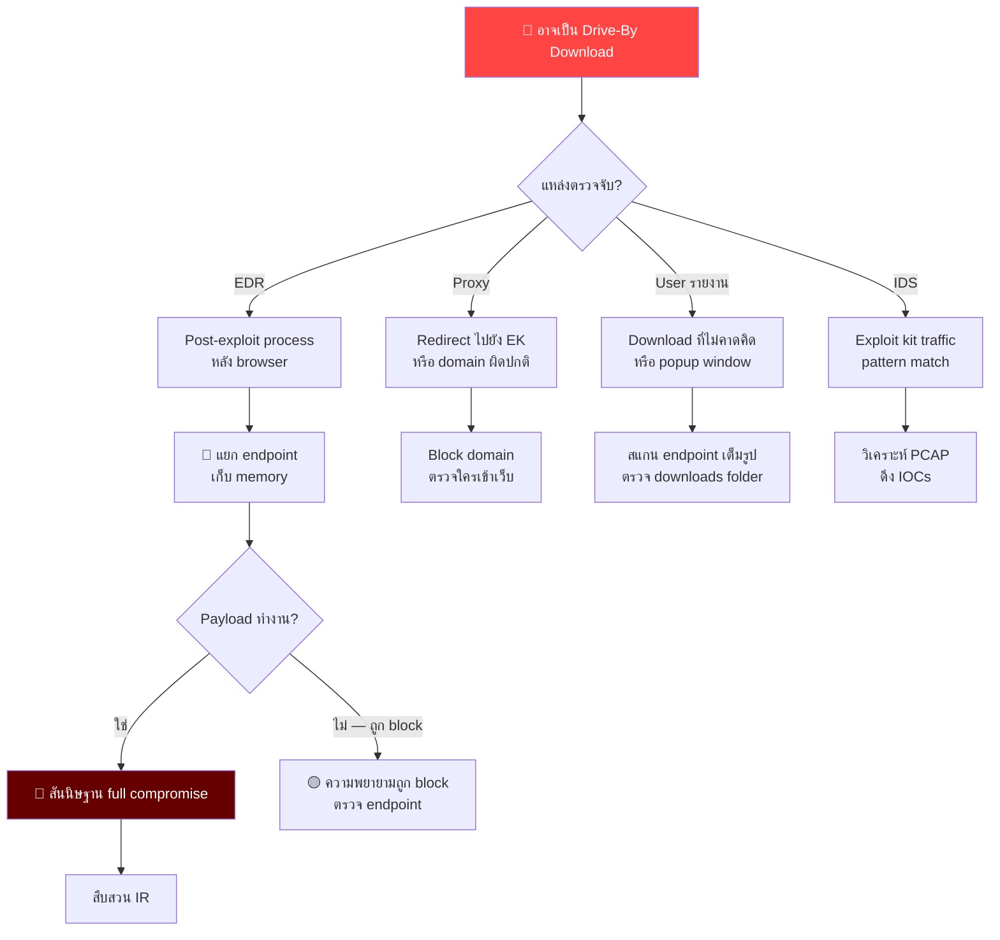
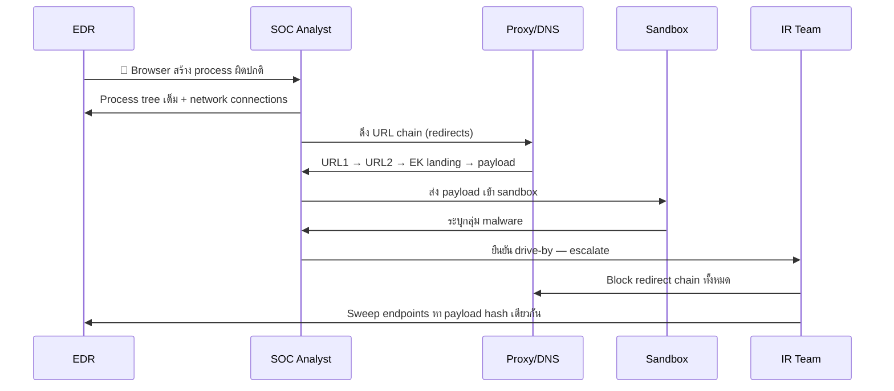
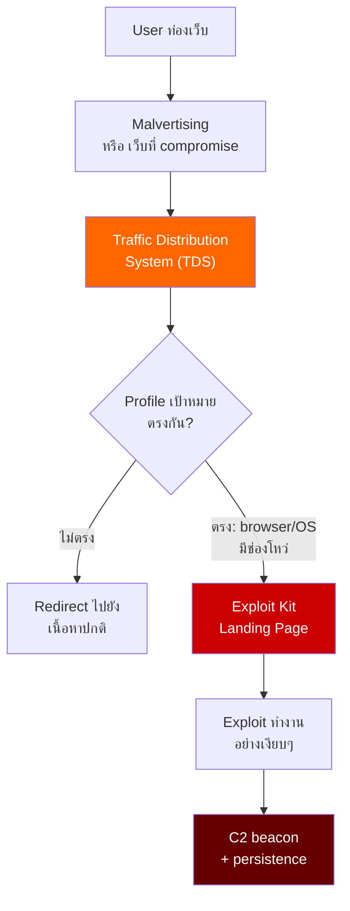
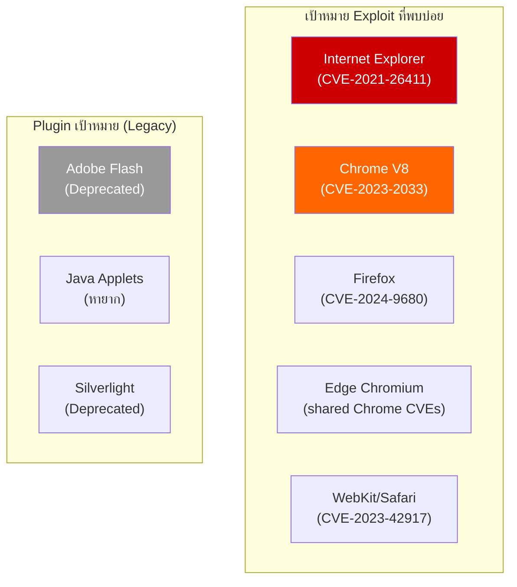

# Playbook: การตอบสนอง Drive-By Download

**ID**: PB-44
**ความรุนแรง**: สูง | **ประเภท**: Initial Access / Execution
**MITRE ATT&CK**: [T1189](https://attack.mitre.org/techniques/T1189/) (Drive-by Compromise), [T1204.001](https://attack.mitre.org/techniques/T1204/001/) (Malicious Link)
**Trigger**: EDR (exploit execution หลังเข้าเว็บ), proxy/DNS (redirect ไปยัง domain อันตราย), IDS (exploit kit traffic), user รายงาน (download/popup ผิดปกติ)

> ⚠️ **คำเตือน**: Drive-by downloads ไม่ต้องอาศัยการมีส่วนร่วมของ user — แค่เข้าเว็บที่ถูก compromise ก็เพียงพอ Exploit kits สำรวจ browser และส่ง malware อย่างเงียบๆ

### Drive-By Download Attack Flow



### ระบบนิเวศ Exploit Kit



---

## Decision Flow



### ขั้นตอนการสืบสวน



### Traffic Distribution System (TDS)



### เป้าหมายช่องโหว่ Browser



### Timeline การตอบสนอง

```mermaid
gantt
    title Drive-By Download Response Timeline
    dateFormat HH:mm
    axisFormat %H:%M
    section Detection
        Alert triggered         :a1, 00:00, 5min
        ยืนยัน exploitation     :a2, after a1, 10min
    section Containment
        แยก endpoint            :a3, after a2, 5min
        Block redirect chain    :a4, after a3, 15min
    section Investigation
        วิเคราะห์ process tree  :a5, after a4, 30min
        Sandbox payload         :a6, after a5, 30min
        Sweep endpoints         :a7, after a6, 60min
    section Recovery
        Reimage ถ้าจำเป็น       :a8, after a7, 120min
        อัปเดต browser/patches  :a9, after a8, 60min
```



---

## 1. การดำเนินการทันที (15 นาทีแรก)

| # | การดำเนินการ | ผู้รับผิดชอบ |
|:---|:---|:---|
| 1 | แยก endpoint ผ่าน EDR | SOC T1 |
| 2 | เก็บ browser process tree และ network connections | SOC T1 |
| 3 | Block redirect chain ทั้งหมด (ทุก domains/IPs) | SOC T2 |
| 4 | ตรวจ proxy logs: users อื่นที่เข้า URL เดียวกัน | SOC T2 |
| 5 | ส่ง payload ที่ download ไป sandbox | SOC T2 |
| 6 | ตรวจ browser และ plugin patch level | IT Team |

## 2. รายการตรวจสอบ

### วิเคราะห์ Browser/Endpoint
- [ ] Process tree: browser → child processes
- [ ] ไฟล์ที่ download ใน temp/downloads folders
- [ ] Browser history: URL chain ที่นำไปยัง exploit
- [ ] Network connections หลัง exploitation
- [ ] Scheduled tasks, services, หรือ registry ใหม่
- [ ] Memory dump สำหรับวิเคราะห์ exploit shellcode

### วิเคราะห์ Network/Proxy
- [ ] URL redirect chain เต็มจาก proxy logs
- [ ] DNS queries ไปยัง domains ผิดปกติ
- [ ] ข้อมูล certificate สำหรับ HTTPS connections
- [ ] ตรวจว่า URL อยู่ใน threat intel blocklists
- [ ] วิเคราะห์ JavaScript จาก exploit kit landing page

### ประเมินขอบเขต
- [ ] มี users กี่คนที่เข้า URL อันตรายเดียวกัน?
- [ ] มี endpoints อื่นที่ถูก exploit ด้วยหรือไม่?
- [ ] แหล่งที่มาเป็นเว็บปกติที่ถูก compromise หรือสร้างขึ้นมา?
- [ ] เป็นส่วนหนึ่งของ malvertising campaign หรือไม่?

## 3. การควบคุม (Containment)

| ขอบเขต | การดำเนินการ |
|:---|:---|
| **Endpoint** | EDR isolation, เก็บสำหรับ forensics |
| **เครือข่าย** | Block domains/IPs ทั้งหมดใน redirect chain |
| **DNS** | Sinkhole exploit kit domains |
| **Proxy** | เพิ่ม URL category block สำหรับ exploit kits |
| **Browser** | บังคับอัปเดตเวอร์ชันล่าสุด |

## 4. การกำจัดและกู้คืน

1. Reimage endpoint ถ้ายืนยัน post-exploitation activity
2. บังคับอัปเดต browser ทั้งองค์กร
3. ปิด legacy plugins (Flash, Java, Silverlight)
4. Deploy browser isolation สำหรับการ browse ที่มีความเสี่ยง
5. อัปเดต proxy/DNS blocklists ด้วย IOCs ใหม่

## 5. หลังเหตุการณ์ (Post-Incident)

| คำถาม | คำตอบ |
|:---|:---|
| Exploit อะไรถูกใช้ (CVE)? | [CVE number] |
| Browser patch เต็มหรือไม่? | [ใช่/ไม่] |
| Legacy plugins เปิดอยู่หรือไม่? | [รายการ] |
| User ถูกพาไปยังเว็บอันตรายอย่างไร? | [Malvertising/link/redirect] |

## 6. Detection Rules (Sigma)

```yaml
title: Browser Spawning Suspicious Child Process
logsource:
    product: windows
    category: process_creation
detection:
    selection_parent:
        ParentImage|endswith:
            - '\chrome.exe'
            - '\msedge.exe'
            - '\firefox.exe'
            - '\iexplore.exe'
    selection_child:
        Image|endswith:
            - '\cmd.exe'
            - '\powershell.exe'
            - '\wscript.exe'
            - '\mshta.exe'
    condition: selection_parent and selection_child
    level: high
```

## เอกสารที่เกี่ยวข้อง
- [Watering Hole Playbook](Watering_Hole.th.md)
- [Malware Infection Playbook](Malware_Infection.th.md)
- [Exploit Playbook](Exploit.th.md)

## References
- [MITRE T1189 — Drive-by Compromise](https://attack.mitre.org/techniques/T1189/)
- [Trend Micro — Exploit Kit Overview](https://www.trendmicro.com/vinfo/us/security/definition/exploit-kit)
