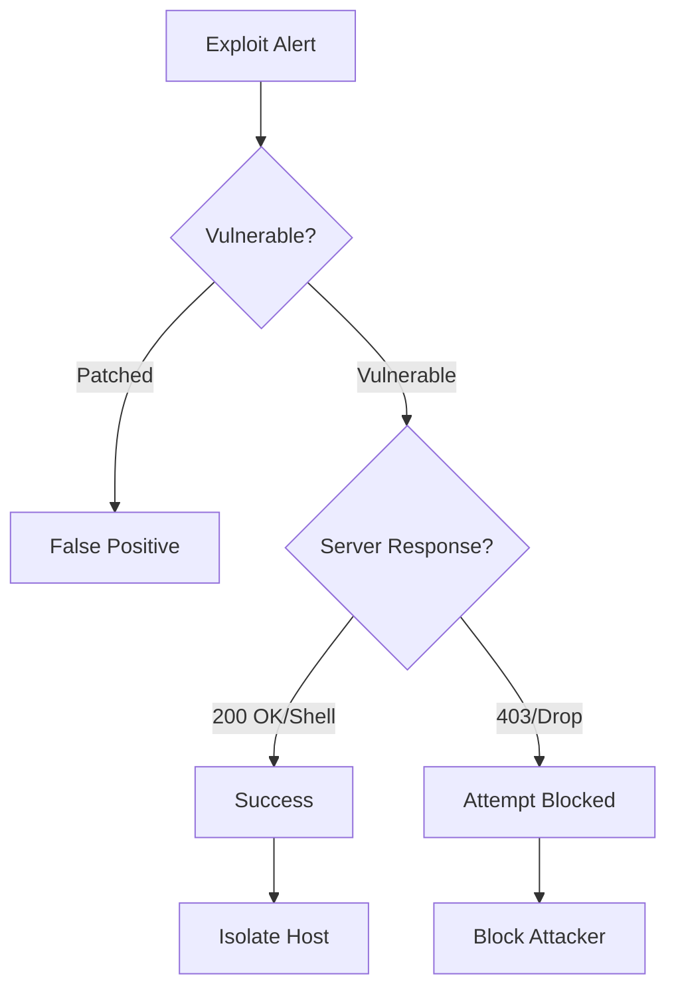

# Playbook: Vulnerability Exploitation

**ID**: PB-18
**Severity**: High/Critical
**Trigger**: IPS Alert ("Exploit Attempt"), WAF Log ("CVE-XXXX detected").

## 1. Analysis (Triage)

-   **Confirm CVE**: Which vulnerability is being targeted? (e.g., Log4Shell, BlueKeep).
-   **Check Asset**: Is the destination Vulnerable? (Check CMDB/Vuln Scan results).
-   **Response**: Did the server respond heavily? (Reverse Shell connection?).

## 2. Containment
-   **Block IP**: Block the attacker's IP.
-   **Isolate Asset**: If exploitation was successful, isolate the server.
-   **Virtual Patch**: Apply WAF/IPS signature to block the exploit payload.

## 3. Eradication
-   **Patch**: Apply the official security patch from the vendor.
-   **Configuration**: Disable the vulnerable service/port if patching is not possible immediately.

## 4. Recovery
-   **Verify Patch**: Run a vulnerability scan to confirm the hole is closed.
-   **Attribute**: [Integrity]

## Related Documents
-   [Incident Response Framework](../Framework.en.md)
-   [Incident Report Template](../../templates/incident_report.en.md)
-   [Shift Handover Log](../../templates/shift_handover.en.md)

## References
-   [MITRE ATT&CK T1190 (Exploit Public-Facing Application)](https://attack.mitre.org/techniques/T1190/)
-   [CISA Known Exploited Vulnerabilities Catalog](https://www.cisa.gov/known-exploited-vulnerabilities-catalog)
