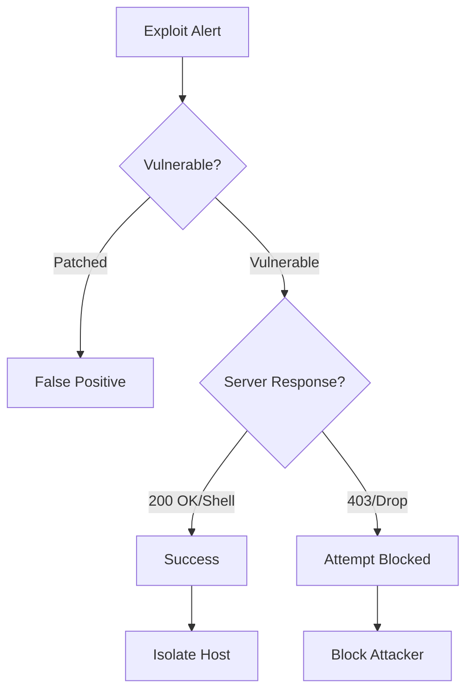

# Playbook: การโจมตีผ่านช่องโหว่ (Vulnerability Exploitation)

**ID**: PB-18
**ความรุนแรง**: สูง/วิกฤต
**ตัวกระตุ้น**: IPS Alert ("Exploit Attempt"), WAF Log ("พบ CVE-XXXX")

## 1. การวิเคราะห์ (Analysis)

-   **ยืนยัน CVE**: ช่องโหว่ไหนที่กำลังถูกโจมตี? (เช่น Log4Shell, BlueKeep)
-   **ตรวจสอบเครื่อง**: เครื่องเป้าหมายมีช่องโหว่นั้นหรือไม่? (เช็คผล Vuln Scan)
-   **ผลลัพธ์**: Server มีการตอบสนองผิดปกติหรือไม่? (Reverse Shell?)

## 2. การจำกัดวง (Containment)
-   **บล็อก IP**: บล็อก IP ผู้โจมตี
-   **แยกเครื่อง**: หากถูกเจาะสำเร็จ ให้ทำการ Isolate เครื่องทันที
-   **Virtual Patch**: ใช้ WAF/IPS บล็อก Payload ของช่องโหว่นั้น

## 3. การกำจัด (Eradication)
-   **Patch**: ติดตั้ง Patch ความปลอดภัยจากผู้ผลิต
-   **Config**: ปิด Service/Port ที่มีปัญหาหากยัง Patch ไม่ได้ทันที

## 4. การกู้คืน (Recovery)
-   **ยืนยัน Patch**: สแกนช่องโหว่ซ้ำเพื่อตรวจสอบว่าได้รับการแก้ไขแล้ว
-   **ผลกระทบ (Attribute)**: [Integrity]

## เอกสารที่เกี่ยวข้อง (Related Documents)
-   [กรอบการตอบสนองเหตุการณ์](../Framework.th.md)
-   [แบบฟอร์ม Incident Report](../../templates/incident_report.th.md)
-   [แบบฟอร์มส่งมอบกะ](../../templates/shift_handover.th.md)

## References
-   [MITRE ATT&CK T1190 (Exploit Public-Facing Application)](https://attack.mitre.org/techniques/T1190/)
-   [CISA Known Exploited Vulnerabilities Catalog](https://www.cisa.gov/known-exploited-vulnerabilities-catalog)
