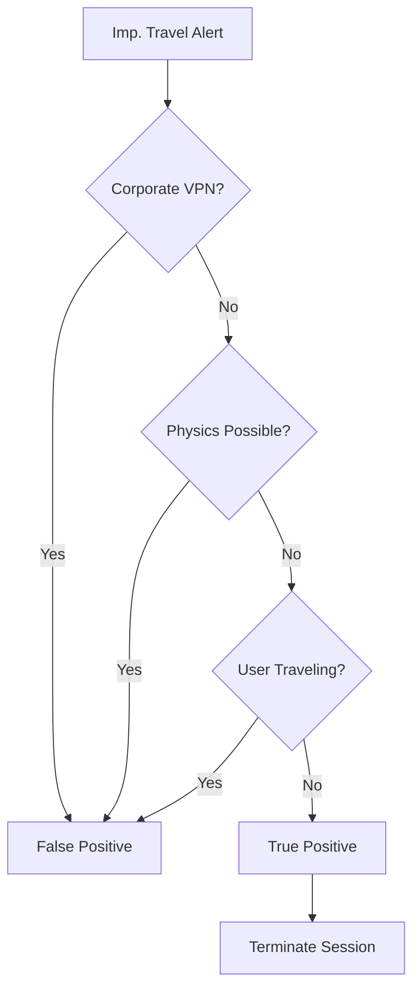

# Playbook: Impossible Travel

**ID**: PB-06
**Severity**: Medium
**Trigger**: SIEM Alert ("Login from two distant locations within short time").

## 1. Analysis (Triage)

-   [ ] **Check Locations**: Are the countries/cities logical? (e.g., US -> China in 10 mins).
-   [ ] **Check VPN**: Is the user on a corporate VPN that routes traffic?
-   [ ] **Check User Context**: Is the user traveling? Did they report this?

## 2. Containment
-   [ ] **Terminate Sessions**: Kill active sessions for the user.
-   [ ] **Reset Password**: Force a password reset.
-   [ ] **Enforce MFA**: Require MFA for re-authentication.

## 3. Remediation
-   [ ] **Block IP**: If one of the IPs is known malicious, block it.
-   [ ] **User Education**: Remind user about safe remote access.

## 4. Recovery
-   [ ] **Monitor Account**: Watch for further anomalies for 24 hours.
-   **Attribute**: [Confidentiality]

## References
-   [MITRE ATT&CK T1078 (Valid Accounts)](https://attack.mitre.org/techniques/T1078/)
-   [Microsoft Identity Protection](https://learn.microsoft.com/en-us/entra/id-protection/concept-identity-protection-risks)
