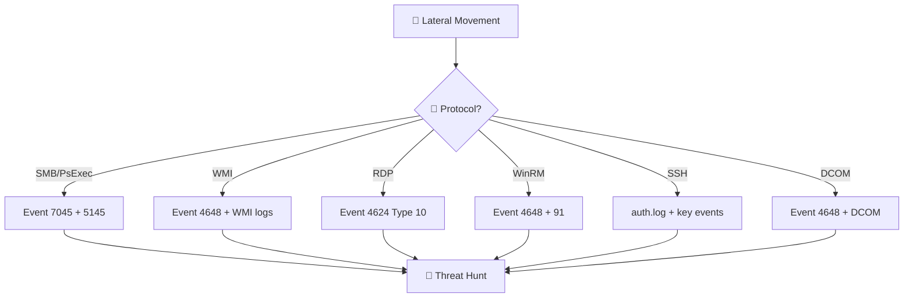
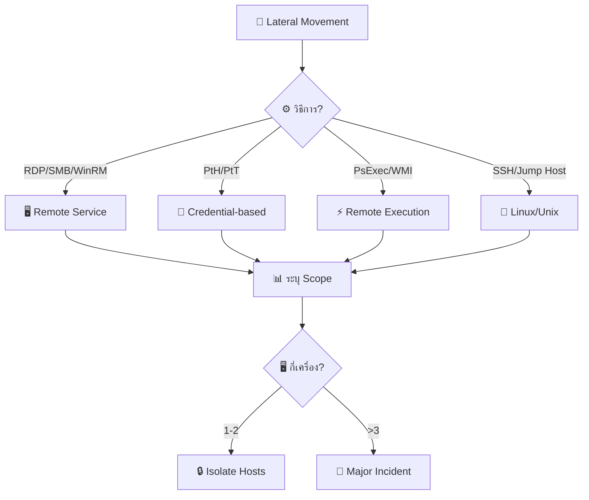
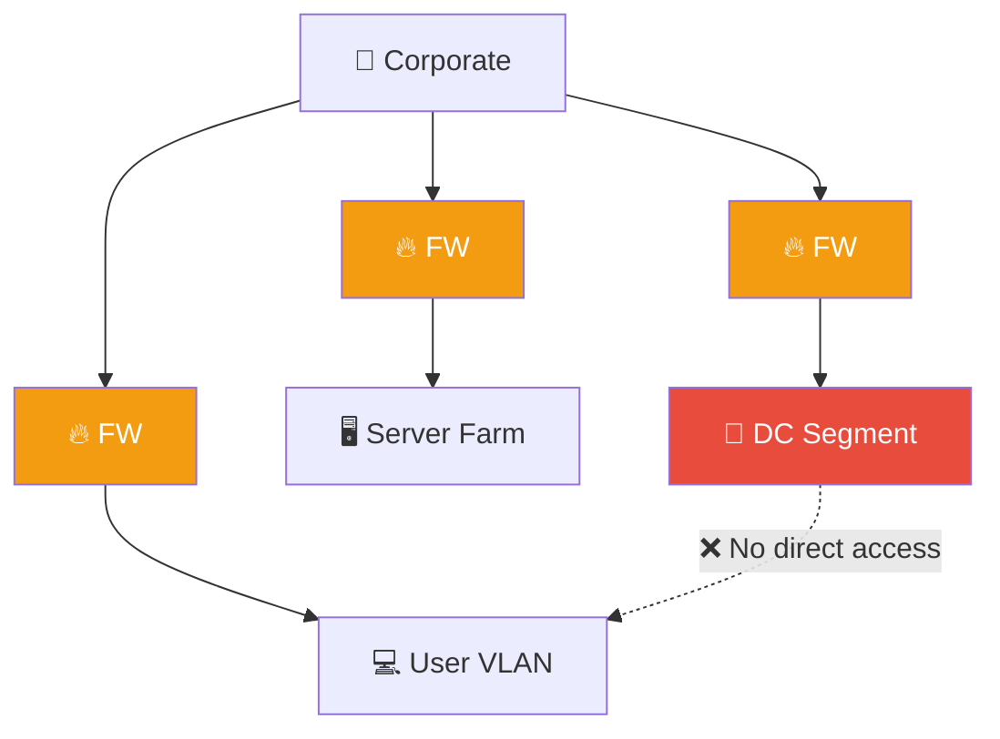
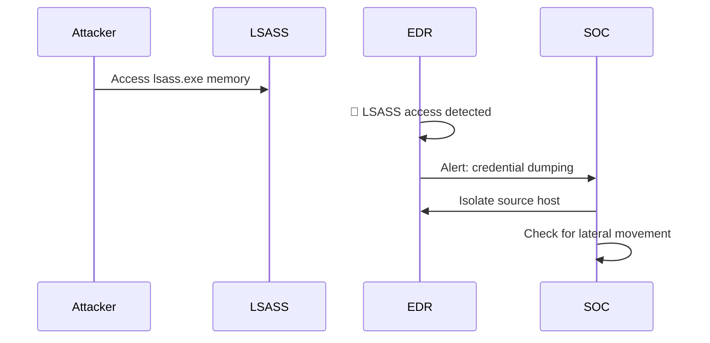

# Playbook: การเคลื่อนไหว ด้านข้าง (Lateral Movement)

**ID**: PB-09
**ระดับความรุนแรง**: สูง/วิกฤต | **หมวดหมู่**: การโจมตี / Post-Exploitation
**MITRE ATT&CK**: [T1021](https://attack.mitre.org/techniques/T1021/) (Remote Services), [T1550](https://attack.mitre.org/techniques/T1550/) (Use Alternate Authentication Material)
**ทริกเกอร์**: EDR alert (PsExec, WMI, RDP), SIEM (Event 4648/4624 Type 3), Honey token triggered


## หลังเหตุการณ์ (Post-Incident)

- [ ] ทบทวน network segmentation
- [ ] ใช้ credential guard / LSA protection
- [ ] Disable NTLM ที่เป็นไปได้
- [ ] ทบทวน admin account tiering (Tier 0/1/2)
- [ ] สร้าง detection rule สำหรับ technique ที่พบ
- [ ] จัดทำ [Incident Report](../../11_Reporting_Templates/incident_report.en.md)

### ผังเส้นทางการโจมตี


### ผังการตรวจจับตาม Protocol



---

## ผังการตัดสินใจ



---

## 1. การวิเคราะห์

### 1.1 วิธี Lateral Movement

| วิธี | Windows Event ID | ตัวบ่งชี้ |
|:---|:---|:---|
| **RDP** | 4624 (Type 10) | RDP จาก server-to-server |
| **SMB/Admin Share** | 5140, 5145 | Access \\C$ \\ADMIN$ |
| **PsExec** | 7045 (service install) | PSEXESVC service |
| **WMI** | 4648 + WMI provider | WmiPrvSE.exe child |
| **Pass-the-Hash** | 4624 (NTLM, Type 3) | NTLM จาก workstation |
| **Pass-the-Ticket** | 4768/4769 anomaly | TGT/TGS ผิดปกติ |
| **SSH** | sshd auth.log | Key-based ผิดปกติ |

### 1.2 รายการตรวจสอบ

| รายการ | วิธีตรวจสอบ | เสร็จ |
|:---|:---|:---:|
| Source host (patient zero) | EDR / SIEM | ☐ |
| Destination hosts ทั้งหมด | SIEM lateral search | ☐ |
| บัญชีที่ใช้ (user / service / admin) | AD logs | ☐ |
| วิธีการ (RDP/PsExec/WMI/PtH) | EDR / Event ID | ☐ |
| เวลาและ pattern | SIEM timeline | ☐ |
| Tools ที่ใช้ (Mimikatz, Impacket, etc.) | EDR | ☐ |
| ข้อมูลที่เข้าถึงบน destination hosts | EDR / file audit | ☐ |

---

## 2. การควบคุม

| # | การดำเนินการ | เสร็จ |
|:---:|:---|:---:|
| 1 | **Isolate** ทุก host ที่ได้รับผลกระทบ | ☐ |
| 2 | **รีเซ็ตรหัสผ่าน** บัญชีที่ถูกใช้ | ☐ |
| 3 | **ปิดบัญชี** service accounts ที่ถูกใช้ | ☐ |
| 4 | **Block** lateral movement tools ที่ EDR | ☐ |
| 5 | **จำกัด RDP / SMB** ระหว่าง workstations | ☐ |
| 6 | **เพิ่ม monitoring** บน AD (Event 4624, 4648) | ☐ |

---

## 3. การกำจัด

| # | การดำเนินการ | เสร็จ |
|:---:|:---|:---:|
| 1 | ลบ malware/implant จากทุก host | ☐ |
| 2 | ลบ persistence ทั้งหมด | ☐ |
| 3 | รีเซ็ต KRBTGT 2 ครั้ง (หาก Golden Ticket) | ☐ |
| 4 | หมุนเวียน service account credentials | ☐ |

---

## 4. การฟื้นฟู

| # | การดำเนินการ | เสร็จ |
|:---:|:---|:---:|
| 1 | ใช้ LAPS สำหรับ local admin passwords | ☐ |
| 2 | บังคับ network segmentation | ☐ |
| 3 | ปิด RDP/SMB ระหว่าง workstations (peer-to-peer) | ☐ |
| 4 | ใช้ Credential Guard / Protected Users group | ☐ |
| 5 | ติดตาม 30 วัน | ☐ |

---

## 5. เกณฑ์การยกระดับ

| เงื่อนไข | ยกระดับไปยัง |
|:---|:---|
| Domain Admin credentials ถูกขโมย | CISO + Major Incident |
| >3 hosts ถูกบุกรุก | Major Incident |
| Golden Ticket / DCSync | [PB-07 Priv Escalation](Privilege_Escalation.th.md) |
| ข้อมูลถูก staging/exfiltrate | [PB-08 Data Exfiltration](Data_Exfiltration.th.md) |

---

### ผัง Network Segmentation



### ผัง Credential Theft Detection



## กฎตรวจจับ (Sigma)

| กฎ | ไฟล์ |
|:---|:---|
| Access to Admin Shares (C$) | [win_admin_share_access.yml](../../08_Detection_Engineering/sigma_rules/win_admin_share_access.yml) |
| User Added to Domain Admins | [win_domain_admin_group_add.yml](../../08_Detection_Engineering/sigma_rules/win_domain_admin_group_add.yml) |
| Network Discovery Activity | [sigma/win_network_discovery.yml](../../08_Detection_Engineering/sigma_rules/sigma/win_network_discovery.yml) |

## เอกสารที่เกี่ยวข้อง

- [กรอบการตอบสนองต่อเหตุการณ์](../Framework.th.md)
- [PB-07 การยกระดับสิทธิ์](Privilege_Escalation.th.md)
- [PB-13 C2](C2_Communication.th.md)

## Detection Correlation Matrix

| Technique | Data Source | Detection Logic |
|:---|:---|:---|
| PsExec | Windows Event 7045 | New service + remote IP |
| WMI | Sysmon Event 1 | wmiprvse.exe spawn |
| RDP | Event 4624 Type 10 | Unusual src→dst pair |
| SMB | Zeek smb_files.log | Admin share access |
| WinRM | Event 4656 | Remote PowerShell |

### Lateral Movement Timeline Reconstruction

```
Time    Source        Destination    Method     Evidence
━━━━━━━━━━━━━━━━━━━━━━━━━━━━━━━━━━━━━━━━━━━━━━━━━━━
T+0     Workstation1  Server-A      PsExec     Event 7045
T+5min  Server-A      Server-B      WMI        Sysmon 1
T+12min Server-B      DC-01         RDP        Event 4624
T+15min DC-01         File-Server   SMB        smb_files
━━━━━━━━━━━━━━━━━━━━━━━━━━━━━━━━━━━━━━━━━━━━━━━━━━━
```

### Containment Priority

| Target | Action | Priority |
|:---|:---|:---|
| Source host | Isolate | P1 |
| Compromised creds | Disable | P1 |
| Accessed servers | Monitor | P2 |
| Network segment | Restrict | P2 |

### Credential Reset Matrix

| Compromised Level | Reset Scope |
|:---|:---|
| User account | Single user |
| Local admin | All hosts with same pwd |
| Domain admin | Entire domain |
| Service account | Application + dependencies |

## อ้างอิง

- [MITRE ATT&CK — Lateral Movement](https://attack.mitre.org/tactics/TA0008/)
