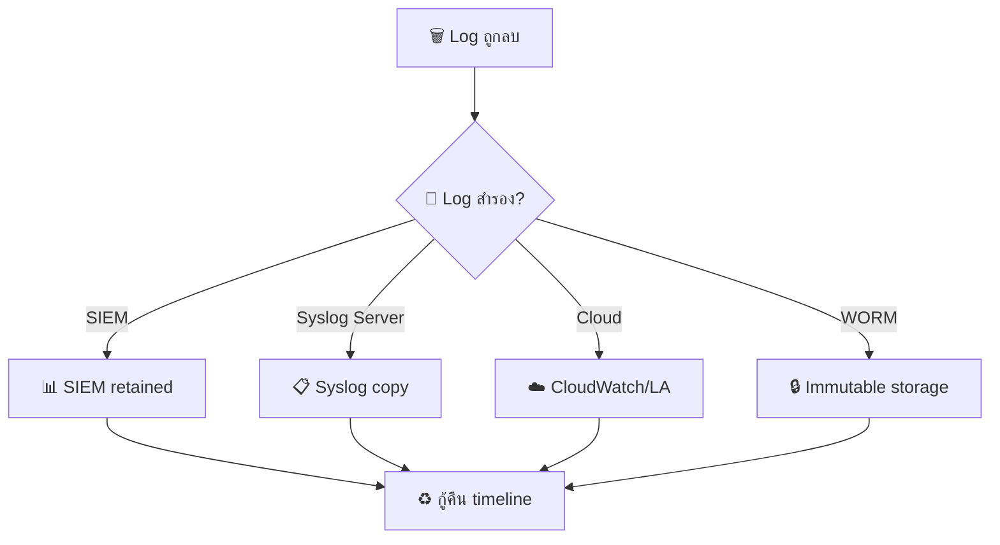
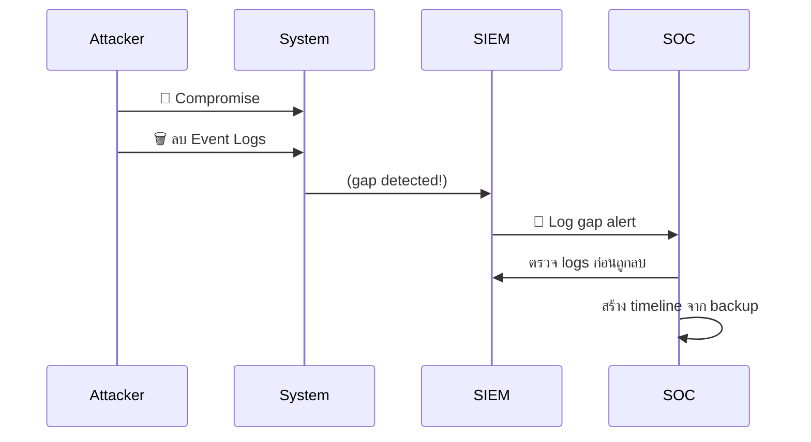
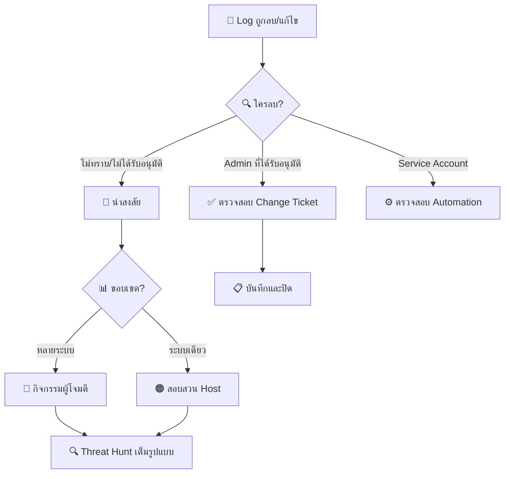
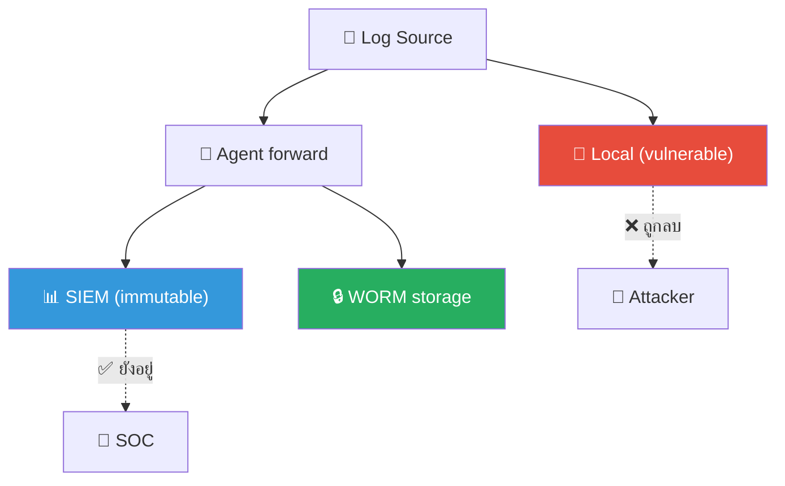
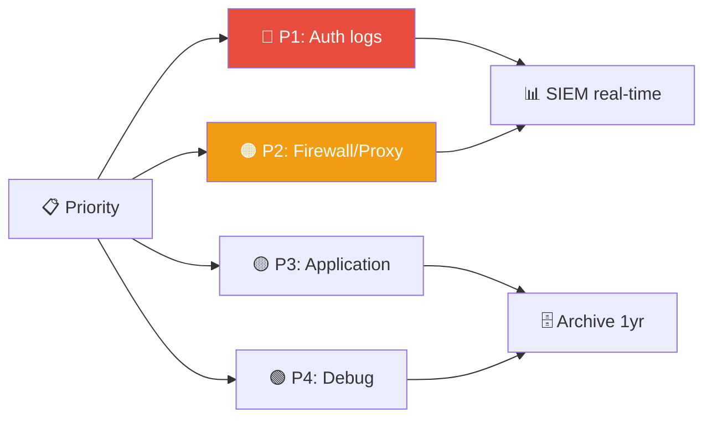

# Playbook: การลบ/แก้ไข Log

**ID**: PB-15
**ระดับความรุนแรง**: สูง/วิกฤต | **หมวดหมู่**: การป้องกันตัว (Defense Evasion)
**MITRE ATT&CK**: [T1070.001](https://attack.mitre.org/techniques/T1070/001/) (Clear Windows Event Logs), [T1070.002](https://attack.mitre.org/techniques/T1070/002/) (Clear Linux/Mac Logs)
**ทริกเกอร์**: SIEM gap detection, Event ID 1102/104, file integrity alert, log integrity failure

## หลังเหตุการณ์ (Post-Incident)

- [ ] ใช้ immutable logging (WORM storage)
- [ ] ตรวจสอบ log forwarding ว่าสมบูรณ์
- [ ] ทบทวน log retention policies
- [ ] ใช้ tamper protection สำหรับ EDR logs
- [ ] สร้าง alert สำหรับ log deletion events
- [ ] จัดทำ [Incident Report](../../templates/incident_report.en.md)

### ผังแหล่ง Log สำรอง

### ผังลำดับเวลา

---

## ผังการตัดสินใจ

---

## 1. การวิเคราะห์

### 1.1 รูปแบบการลบ Log

| วิธี | Windows Event ID | Linux | การตรวจจับ |
|:---|:---|:---|:---|
| **ล้าง Event Log** | **1102** (Security), **104** (System) | — | SIEM alert |
| **ลบไฟล์ Log** | Sysmon Event 23 | `rm /var/log/*` | FIM |
| **หยุด Service** | 7036 (eventlog service) | `systemctl stop rsyslog` | SIEM |
| **แก้ไข timestamp** | — | `touch`, `timestomp` | SIEM timestamp gap |
| **ปิด Audit Policy** | 4719 | `auditctl -D` | GPO / SIEM |
| **ลบ Syslog Forward** | — | แก้ไข rsyslog.conf | Config monitoring |

### 1.2 รายการตรวจสอบ

| รายการ | วิธีตรวจสอบ | เสร็จ |
|:---|:---|:---:|
| Log ใดถูกลบ? (Security, System, Application) | SIEM / Event ID 1102, 104 | ☐ |
| เมื่อใด? | SIEM timestamp | ☐ |
| ใครลบ? (username, process) | SIEM / EventLog | ☐ |
| มี change request ที่ได้รับอนุมัติหรือไม่? | ITSM | ☐ |
| มีกิจกรรมอันตรายอื่นก่อนหน้าหรือไม่? | SIEM timeline | ☐ |
| มีระบบอื่นที่ log ถูกลบด้วยหรือไม่? | SIEM search | ☐ |
| มี backup log อยู่หรือไม่? | SIEM / Log archive | ☐ |
| Audit policy ถูกเปลี่ยนหรือไม่? | GPO / Event 4719 | ☐ |

> ⚠️ **สำคัญ**: การลบ log มักเป็นขั้นตอน **หลังการโจมตี** — มีโอกาสสูงว่ามีเหตุการณ์อื่นที่ร้ายแรงกว่าเกิดขึ้นด้วย

---

## 2. การควบคุม

### 2.1 การดำเนินการทันที

| # | การดำเนินการ | เสร็จ |
|:---:|:---|:---:|
| 1 | **Isolate** host ที่ log ถูกลบ | ☐ |
| 2 | **ล็อกบัญชี** ที่ลบ log (ถ้าไม่ใช่ authorized admin) | ☐ |
| 3 | **สำรอง** log ที่เหลือและ memory dump ทันที | ☐ |
| 4 | **ตรวจ SIEM** — ข้อมูลที่ส่งไป SIEM ก่อนถูกลบยังอยู่ | ☐ |
| 5 | **เปิด enhanced logging** | ☐ |

### 2.2 ค้นหากิจกรรมก่อนหน้า

ค้นหาเหตุการณ์ที่เกิดขึ้น **ก่อน** log ถูกลบ:

| ค้นหา | วิธีตรวจสอบ | เสร็จ |
|:---|:---|:---:|
| Lateral movement | AD logs, network | ☐ |
| Privilege escalation | Event 4672, 4728 | ☐ |
| Malware execution | EDR telemetry | ☐ |
| Data exfiltration | DLP / Netflow | ☐ |
| Account creation | Event 4720 | ☐ |

---

## 3. การกำจัด

| # | การดำเนินการ | เสร็จ |
|:---:|:---|:---:|
| 1 | จัดการเหตุการณ์หลัก (malware/intrusion ที่ทำให้ต้องลบ log) | ☐ |
| 2 | คืนค่า audit policies ที่ถูกเปลี่ยน | ☐ |
| 3 | ลบ tools ที่ใช้ลบ log | ☐ |
| 4 | หมุนเวียน credentials | ☐ |

---

## 4. การฟื้นฟู

| # | การดำเนินการ | เสร็จ |
|:---:|:---|:---:|
| 1 | กู้คืน log จาก backup / SIEM ที่ยังมีอยู่ | ☐ |
| 2 | บังคับ centralized logging — WORM storage | ☐ |
| 3 | ใช้ Sysmon ร่วมกับ Event Forwarding | ☐ |
| 4 | บังคับ GPO ปิดกั้นการลบ log | ☐ |
| 5 | เปิด log integrity monitoring (FIM) | ☐ |
| 6 | ติดตาม 30 วัน | ☐ |

---

## 5. เกณฑ์การยกระดับ

| เงื่อนไข | ยกระดับไปยัง |
|:---|:---|
| Log ถูกลบหลังการโจมตี (ปกปิดร่องรอย) | Major Incident |
| Admin ลบ log โดยไม่ได้รับอนุมัติ | CISO + HR ([PB-20 Rogue Admin](Rogue_Admin.th.md)) |
| หลายระบบถูกลบ log พร้อมกัน | Tier 2 + Threat Hunt |
| Audit policy ถูกปิด | CISO ทันที |
| ไม่สามารถกู้คืน log ได้ | Legal (หลักฐานไม่สมบูรณ์) |

---

### ผัง Log Protection Architecture

### ผัง Log Source Priority

## กฎตรวจจับ (Sigma)

| กฎ | ไฟล์ |
|:---|:---|
| Windows Security Log Cleared | [win_security_log_cleared.yml](../../07_Detection_Rules/win_security_log_cleared.yml) |

## เอกสารที่เกี่ยวข้อง

- [กรอบการตอบสนองต่อเหตุการณ์](../Framework.th.md)
- [แม่แบบรายงานเหตุการณ์](../../templates/incident_report.th.md)
- [PB-14 ภัยคุกคามจากภายใน](Insider_Threat.th.md)
- [PB-20 แอดมินกระทำผิด](Rogue_Admin.th.md)

## Log Tampering Detection Matrix

| Log Type | Expected Volume | Clearing Indicator | Detection |
|:---|:---|:---|:---|
| Windows Security | > 100 events/hr | Event 1102 | Immediate |
| Linux syslog | > 50 lines/hr | Sudden gap | 5 min check |
| Application | Varies | Zero events | Baseline compare |
| Firewall | > 200 events/hr | Counter reset | Continuous |

### Anti-Tampering Controls

| Control | Implementation | Priority |
|:---|:---|:---|
| Log forwarding | Real-time to SIEM | P1 |
| Immutable storage | WORM/append-only | P1 |
| Integrity monitoring | File hash checking | P2 |
| Admin audit trail | Privileged action logging | P1 |

## อ้างอิง

- [MITRE ATT&CK T1070 — Indicator Removal](https://attack.mitre.org/techniques/T1070/)
