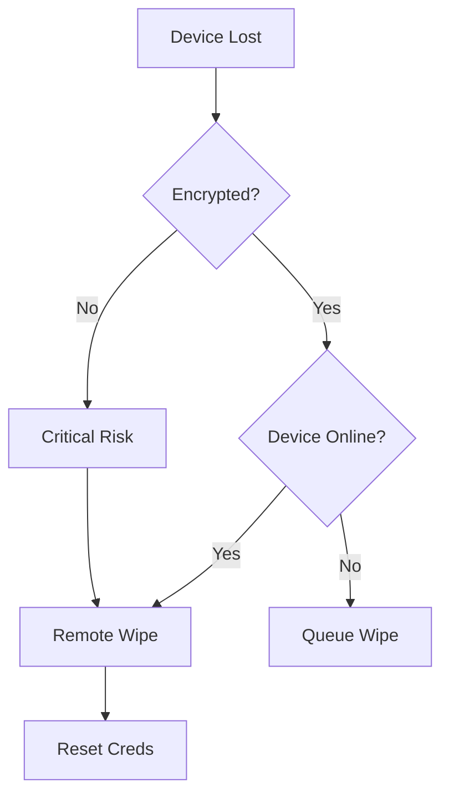

# Playbook: Lost/Stolen Device

**ID**: PB-19
**Severity**: Medium/High
**Trigger**: User Report ("I left my laptop at the airport"), MDM Alert ("Device Offline > 30 Days").

## 1. Analysis (Triage)

-   **Device Type**: Laptop (Full Disk Encryption?) or Mobile (Passcode?)
-   **Data Sensitivity**: What data was on the device? (Source code, customer lists).
-   **Last Online**: When did it last check in with MDM?

## 2. Containment
-   **Remote Wipe**: Send a "Wipe" command via MDM (Intune/Jamf).
-   **Revoke Certificates**: Revoke VPN/Wifi certificates issued to that device.
-   **Reset Password**: Reset the user's domain password immediately to prevent access from cached credentials.

## 3. Recovery
-   **Replacement**: IT to provision a new device for the user.
-   **Monitoring**: Watch for login attempts from the old device's serial number.
-   **Attribute**: [Confidentiality / Availability]

## References
-   [NIST SP 800-46 (Telework and Remote Access Security)](https://csrc.nist.gov/publications/detail/sp/800-46/rev-2/final)
-   [MITRE ATT&CK T1025 (Data from Removable Media)](https://attack.mitre.org/techniques/T1025/)
