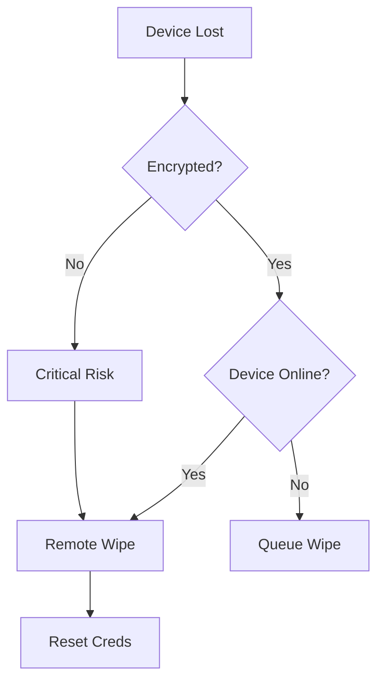

# Playbook: อุปกรณ์สูญหายหรือถูกขโมย (Lost/Stolen Device)

**ID**: PB-19
**ความรุนแรง**: ปานกลาง/สูง
**ตัวกระตุ้น**: ผู้ใช้แจ้ง ("ลืมโน้ตบุ๊กไว้ที่สนามบิน"), แจ้งเตือน MDM ("อุปกรณ์ Offline นานกว่า 30 วัน")

## 1. การวิเคราะห์ (Analysis)

-   **ประเภทอุปกรณ์**: โน้ตบุ๊ก (เข้ารหัสทั้งลูก?) หรือ มือถือ (มีรหัสผ่าน?)
-   **ข้อมูลภายใน**: มีข้อมูลสำคัญอะไรบ้าง? (Source code, รายชื่อลูกค้า)
-   **ออนไลน์ล่าสุด**: เชื่อมต่อ MDM ครั้งสุดท้ายเมื่อไหร่?

## 2. การจำกัดวง (Containment)
-   **ล้างเครื่องระยะไกล**: ส่งคำสั่ง "Wipe" ผ่านระบบ MDM (Intune/Jamf)
-   **ยกเลิกใบรับรอง**: เพิกถอน Certificate ของ VPN/Wi-Fi ประจำเครื่องนั้น
-   **เปลี่ยนรหัสผ่าน**: รีเซ็ตรหัสผ่านผู้ใช้ทันที เพื่อป้องกันการเข้าถึงจาก Credential ที่ค้างในเครื่อง

## 3. การกู้คืน (Recovery)
-   **จัดหาเครื่องใหม่**: IT เบิกเครื่องใหม่ให้ผู้ใช้งาน
-   **เฝ้าระวัง**: จับตาดูการพยายามล็อกอินจาก Serial number ของเครื่องเก่า
-   **ผลกระทบ (Attribute)**: [Confidentiality / Availability]

## เอกสารที่เกี่ยวข้อง (Related Documents)
-   [กรอบการตอบสนองเหตุการณ์](../Framework.th.md)
-   [แบบฟอร์ม Incident Report](../../templates/incident_report.th.md)
-   [แบบฟอร์มส่งมอบกะ](../../templates/shift_handover.th.md)

## References
-   [NIST SP 800-46 (Telework and Remote Access Security)](https://csrc.nist.gov/publications/detail/sp/800-46/rev-2/final)
-   [MITRE ATT&CK T1025 (Data from Removable Media)](https://attack.mitre.org/techniques/T1025/)
