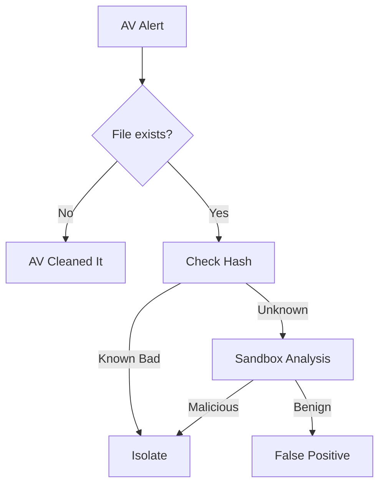

# Playbook: Malware Infection

**ID**: PB-03
**Severity**: Medium/High
**Trigger**: EDR alert ("Malicious File Detected"), AV logs, User Report.
**Attribute**: [Integrity]

## 1. Analysis (Triage)

-   **Verify**: Check full disk path. Check hash on VirusTotal/ThreatFox.
-   [ ] **Check Path**: Is it in a temp folder (`%TEMP%`, `Downloads`) or System32?
-   [ ] **Identify User**: Who executed the file?

## 2. Containment
-   [ ] **Isolate Host**: Use EDR to isolate the machine from the network.
-   [ ] **Kill Process**: Terminate the malicious process ID.
-   [ ] **Block Hash**: Add file hash to EDR blacklist.

## 3. Eradication
-   [ ] **Delete File**: Remove the artifact and persistence mechanisms (Registry Run keys, Scheduled Tasks).
-   [ ] **Full Scan**: Run a full system scan.

## References
-   [MITRE ATT&CK T1204 (User Execution)](https://attack.mitre.org/techniques/T1204/)
-   [NIST SP 800-83 (Guide to Malware Incident Prevention and Handling)](https://csrc.nist.gov/publications/detail/sp/800-83/rev-1/final)

## 4. Recovery
-   [ ] **Un-isolate**: Reconnect host after verifying clean status.
-   [ ] **Password Reset**: If malware was an Infostealer, reset user credentials.
