# Playbook: Mobile Device Compromise

**ID**: PB-28
**Severity**: High | **Category**: Endpoint Security
**MITRE ATT&CK**: [T1456](https://attack.mitre.org/techniques/T1456/) (Drive-By Compromise — Mobile), [T1474](https://attack.mitre.org/techniques/T1474/) (Supply Chain Compromise — Mobile)
**Trigger**: MTD alert (malicious app), MDM compliance violation, User reports SIM swap, Phishing on mobile

### Mobile Threat Detection

```mermaid
graph TD
    MTD["🔍 MTD"] --> Type{"📱 Type?"}
    Type -->|Malicious App| App["🦠 Remove App"]
    Type -->|Jailbreak/Root| JB["⚠️ Block Access"]
    Type -->|Network Attack| Net["🌐 Force VPN"]
    Type -->|SIM Swap| SIM["📞 Contact Carrier"]
    App --> MDM["📲 MDM Action"]
    JB --> MDM
    Net --> MDM
```



### BYOD Containment

```mermaid
sequenceDiagram
    participant User
    participant MDM
    participant SOC
    participant IT
    MDM->>SOC: 🚨 Compliance violation
    SOC->>MDM: Block corporate access
    SOC->>User: Notify + guidance
    User->>IT: Bring device for check
    IT->>MDM: Remediate / Re-enroll
    MDM-->>SOC: ✅ Compliant
``` 



---

## Decision Flow

```mermaid
graph TD
    Alert["🚨 Mobile Device Anomaly"] --> Type{"📱 Compromise Type?"}
    Type -->|Spyware / Stalkerware| Spy["🕵️ Rogue Profile / App"]
    Type -->|Jailbreak / Root| JB["🔓 Device Integrity Broken"]
    Type -->|Malicious App| App["📦 Untrusted App Detected"]
    Type -->|SIM Swap| SIM["📞 Number Hijacked"]
    Type -->|Phishing (Smishing)| Smish["📩 SMS/Link Clicked"]
    Spy --> Scope["📊 Assess Data Exposure"]
    JB --> Scope
    App --> Scope
    SIM --> Urgent["🔴 Urgent — MFA/Auth at Risk"]
    Smish --> Scope
    Scope --> Corp{"💼 Corporate Data Access?"}
    Corp -->|Yes, Email/VPN/Cloud| Contain["🔒 Full Containment"]
    Corp -->|No, Personal Only| Monitor["👁️ Monitor + Educate"]
    Urgent --> Contain
```

---

## 1. Analysis

### 1.1 Compromise Type Identification

| Type | Indicators | Detection |
|:---|:---|:---|
| **Spyware/Stalkerware** | Rogue MDM profiles, unknown device admin apps, battery drain | MDM, MTD |
| **Jailbreak/Root** | Cydia, Magisk, SuperSU, integrity check failures | MDM jailbreak detection |
| **Malicious App** | Sideloaded APK/IPA, unknown app with permissions | MTD, MDM app inventory |
| **SIM Swap** | Loss of cellular signal, MFA codes not received | User report, carrier |
| **Smishing/Phishing** | Suspicious SMS link clicked, credential entered | User report, MTD |
| **Network attack** | Rogue Wi-Fi, man-in-the-middle on public network | MTD, certificate errors |

### 1.2 Investigation Checklist

| Check | How | Done |
|:---|:---|:---:|
| MDM compliance status | Intune / Jamf / WS1 | ☐ |
| App inventory — any sideloaded or unknown apps? | MDM | ☐ |
| Configuration profiles — any rogue profiles? | MDM | ☐ |
| Network connections — suspicious IPs? | MTD / Network logs | ☐ |
| Corporate email access from device | Exchange / M365 logs | ☐ |
| VPN connections from device | VPN logs | ☐ |
| Cloud storage access from device | CASB / Cloud audit | ☐ |
| Was OS up to date? | MDM | ☐ |

### 1.3 Data Exposure Assessment

| Data Type | Accessible from Device? | Exposed? |
|:---|:---|:---|
| Corporate email & attachments | ☐ Yes ☐ No | ☐ |
| Calendar & contacts | ☐ Yes ☐ No | ☐ |
| Cloud storage (OneDrive/GDrive) | ☐ Yes ☐ No | ☐ |
| VPN access to internal network | ☐ Yes ☐ No | ☐ |
| Authenticator/MFA tokens | ☐ Yes ☐ No | ☐ |
| Messaging (Teams/Slack) | ☐ Yes ☐ No | ☐ |
| Banking/Financial apps | ☐ Yes ☐ No | ☐ |

---

## 2. Containment

### 2.1 Immediate Actions

| # | Action | Tool | Done |
|:---:|:---|:---|:---:|
| 1 | **Remote lock** the device | MDM | ☐ |
| 2 | **Selective wipe** corporate data (App Protection) | MDM (Intune) | ☐ |
| 3 | **Remove device** from Conditional Access / compliance | IdP | ☐ |
| 4 | **Block network access** (Wi-Fi, VPN) | Wi-Fi controller / VPN | ☐ |
| 5 | **Reset user password** | AD / IdP | ☐ |
| 6 | **Revoke OAuth tokens** from the device | IdP | ☐ |

### 2.2 SIM Swap Specific

| # | Action | Done |
|:---:|:---|:---:|
| 1 | Contact carrier immediately to restore number and lock SIM | ☐ |
| 2 | Change MFA from SMS to authenticator app / FIDO2 | ☐ |
| 3 | Reset passwords for ALL accounts using SMS MFA | ☐ |
| 4 | Check for unauthorized access during SIM swap window | ☐ |
| 5 | File report with carrier and law enforcement | ☐ |

---

## 3. Eradication

| # | Action | Done |
|:---:|:---|:---:|
| 1 | **Factory reset** the device (if spyware/rootkit confirmed) | ☐ |
| 2 | Remove rogue profiles and device admin apps | ☐ |
| 3 | Uninstall malicious applications | ☐ |
| 4 | Update OS to the latest version | ☐ |
| 5 | Re-enroll device in MDM with security policies | ☐ |

---

## 4. Recovery

| # | Action | Done |
|:---:|:---|:---:|
| 1 | Restore user data from known-clean backup (**not apps**) | ☐ |
| 2 | Re-register MFA from clean device | ☐ |
| 3 | Re-enroll corporate apps (email, VPN, cloud) | ☐ |
| 4 | Enforce MDM policies: app allowlisting, block sideloading, OS updates | ☐ |
| 5 | Enable MTD (Mobile Threat Defense) if not already deployed | ☐ |
| 6 | Monitor device for 30 days | ☐ |

---

## 5. IoC Collection

| Type | Value | Source |
|:---|:---|:---|
| Malicious app name / package | | MDM / MTD |
| Rogue MDM profile | | MDM |
| Suspicious IP connections | | MTD / Network |
| Compromised accounts accessed | | SIEM / IdP |
| SIM swap timeline | | Carrier records |

---

## 6. Escalation Criteria

| Condition | Escalate To |
|:---|:---|
| Executive device compromised | CISO immediately |
| SIM swap targeting admin / VIP | CISO + Identity team |
| Corporate data exfiltrated from device | Legal + DPO (PDPA 72h) |
| Spyware with remote access capability | Tier 2 + External forensics |
| Multiple devices compromised (campaign) | Major Incident |
| Jailbroken device accessed sensitive systems | SOC Lead + IT |

---

## 7. Post-Incident

- [ ] Review MDM enrollment compliance across organization
- [ ] Update mobile security policy (jailbreak/root detection)
- [ ] Enforce OS version minimum requirements via MDM
- [ ] Review app sideloading / third-party app store policies
- [ ] Implement mobile threat defense (MTD) solution
- [ ] Conduct awareness training on mobile security best practices
- [ ] Review VPN requirements for mobile corporate access
- [ ] Document findings in [Incident Report](../../templates/incident_report.en.md)

---

### Mobile Threat Classification

```mermaid
graph TD
    Threat["📱 Mobile Threat"] --> App["📦 Malicious App"]
    Threat --> Network["🌐 Network attack"]
    Threat --> OS["⚙️ OS exploit"]
    Threat --> Phish["🎣 Mobile phishing"]
    App --> MDM["🛡️ MDM block"]
    Network --> VPN["🔒 VPN enforce"]
    OS --> Update["🔄 Force update"]
    Phish --> Training["📚 Training"]
    style Threat fill:#e74c3c,color:#fff
```



### BYOD Security Architecture

```mermaid
graph LR
    Personal["📱 BYOD"] --> Enroll["📲 MDM enroll"]
    Enroll --> Container["🔒 Work container"]
    Container --> Access["📁 Corporate data"]
    Container --> Policy["📋 DLP policy"]
    Access --> Encrypt["🔐 Encrypted"]
    Policy --> Wipe["🗑️ Selective wipe"]
    style Container fill:#27ae60,color:#fff
    style Wipe fill:#e74c3c,color:#fff
```



## Detection Rules (Sigma)

| Rule | File |
|:---|:---|
| Mobile Device Compromise Indicators | [cloud_mobile_compromise.yml](../../08_Detection_Engineering/sigma_rules/cloud_mobile_compromise.yml) |
| Device Offline for Extended Period | [mdm_device_offline.yml](../../08_Detection_Engineering/sigma_rules/mdm_device_offline.yml) |

## Related Documents

- [IR Framework](../Framework.en.md)
- [Incident Report](../../templates/incident_report.en.md)
- [PB-05 Account Compromise](Account_Compromise.en.md)
- [PB-19 Lost/Stolen Device](Lost_Device.en.md)

## References

- [MITRE ATT&CK Mobile — T1456](https://attack.mitre.org/techniques/T1456/)
- [NIST SP 800-124r2 — Guidelines for Managing Mobile Devices](https://csrc.nist.gov/publications/detail/sp/800-124/rev-2/final)
