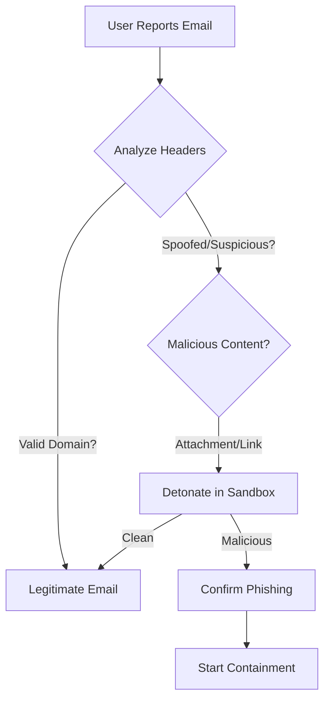

# Playbook: Phishing Response

**Severity**: High | **Category**: Email Security

## 1. Analysis (Triage)

-   **Header Analysis**: Check `Return-Path`, `Received-SPF`, `DKIM-Signature`.
-   **Sender Reputation**: Search sender domain in VirusTotal/AbuseIPDB.
-   **URL/Attachment**: Submit to sandbox (Hybrid Analysis/Joe Sandbox). **DO NOT** open on local machine.

## 2. Containment
-   **Block Sender**: Add sender email/domain to Blocklist in Email Gateway (M365/Google Workspace).
-   **Purge Mail**: Use "Search and Purge" features to remove the email from all mailboxes.
-   **Block URL**: Add malicious URL to Web Proxy/Firewall Blocklist.

## 3. Remediation
-   **User Reset**: Force password reset for the recipient if they clicked a link or entered credentials.
-   **MFA**: Verify MFA is enabled and check for suspicious MFA prompts.

## 4. Recovery
-   Unblock user account after password reset and verification.

## References
-   [MITRE ATT&CK T1566 (Phishing)](https://attack.mitre.org/techniques/T1566/)
-   [CISA Phishing Guidance](https://www.cisa.gov/shields-up/phishing-preventing-email-attacks)
