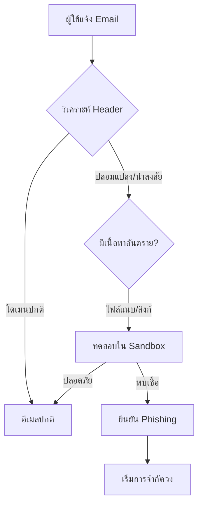

# Playbook: การรับมือ Phishing

**ความรุนแรง**: สูง (High) | **หมวดหมู่**: ความปลอดภัยอีเมล (Email Security)

## 1. การวิเคราะห์ (Analysis/Triage)

-   **ตรวจสอบ Header**: เช็ค `Return-Path`, `Received-SPF`, `DKIM-Signature`
-   **ชื่อเสียงผู้ส่ง**: นำโดเมนผู้ส่งไปเช็คใน VirusTotal/AbuseIPDB
-   **URL/ไฟล์แนบ**: ส่งไฟล์เข้า Sandbox (Hybrid Analysis/Joe Sandbox) **ห้าม** เปิดบนเครื่องตัวเองเด็ดขาด

## 2. การจำกัดความเสียหาย (Containment)
-   **บล็อกผู้ส่ง**: เพิ่มอีเมลหรือโดเมนผู้ส่งใน Blocklist ของ Email Gateway (M365/Google Workspace)
-   **ลบอีเมล**: ใช้ฟีเจอร์ "Search and Purge" เพื่อลบอีเมลดังกล่าวออกจากทุกกล่องจดหมายในองค์กร
-   **บล็อก URL**: เพิ่ม URL อันตรายลงใน Blocklist ของ Web Proxy/Firewall

## 3. การแก้ไข (Remediation)
-   **รีเซ็ตผู้ใช้งาน**: บังคับเปลียนรหัสผ่านทันทีหากผู้ใช้เผลอกดลิงก์หรือกรอกข้อมูล
-   **MFA**: ตรวจสอบว่า MFA เปิดอยู่ และเช็ค Log ว่ามีการกด Accept แปลกๆ หรือไม่

## 4. การกู้คืน (Recovery)
-   ปลดบล็อกบัญชีผู้ใช้หลังจากเปลี่ยนรหัสผ่านและตรวจสอบความปลอดภัยแล้ว

## References
-   [MITRE ATT&CK T1566 (Phishing)](https://attack.mitre.org/techniques/T1566/)
-   [CISA Phishing Guidance](https://www.cisa.gov/shields-up/phishing-preventing-email-attacks)
