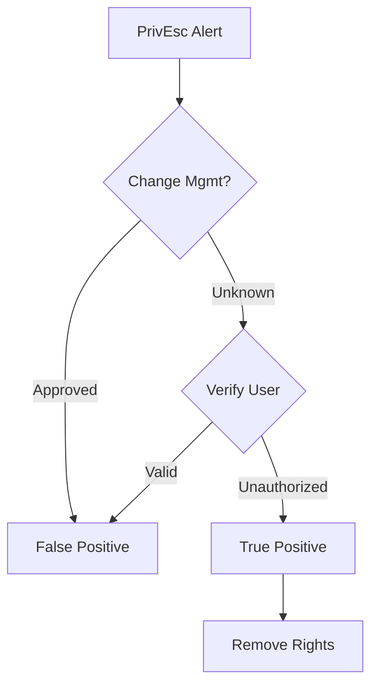

# Playbook: Privilege Escalation

**ID**: PB-07
**Severity**: High
**Trigger**: EDR Alert ("Mimikatz detected"), Security Log ("Member added to Domain Admins").

## 1. Analysis (Triage)

-   [ ] **Verify User**: Did an admin legitimately add this user? Check Change Management logs.
-   [ ] **Check Process**: What process made the change? (e.g., `net.exe`, PowerShell).

## 2. Containment
-   [ ] **Remove Privilege**: Immediately remove the user from the Admin group.
-   [ ] **Disable Account**: Disable the suspicious account.
-   [ ] **Isolate Host**: Isolate the machine where the command originated.

## 3. Eradication
-   [ ] **Review GPO**: Check Group Policy Objects for unauthorized modifications.
-   [ ] **Scan for Backdoors**: Look for other accounts created or scheduled tasks.

## 4. Recovery
-   [ ] **Restore Permissions**: Revert permissions to the baseline state.
-   [ ] **Full Audit**: Conduct a full audit of the Active Directory.
-   **Attribute**: [Integrity]

## References
-   [MITRE ATT&CK T1098 (Account Manipulation)](https://attack.mitre.org/techniques/T1098/)
-   [Active Directory Security Best Practices](https://docs.microsoft.com/en-us/windows-server/identity/ad-ds/plan/security-best-practices/best-practices-for-securing-active-directory)
