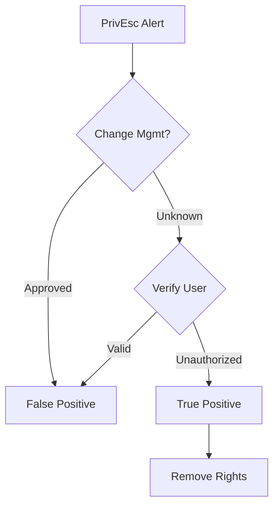

# Playbook: การยกระดับสิทธิ์ (Privilege Escalation)

**ID**: PB-07
**ความรุนแรง**: สูง
**ตัวกระตุ้น**: แจ้งเตือน EDR ("พบ Mimikatz"), Security Log ("มีการเพิ่มสมาชิกใน Domain Admins")

## 1. การวิเคราะห์ (Analysis)

-   [ ] **ตรวจสอบผู้ใช้**: แอดมินเป็นคนทำรายการนี้จริงหรือไม่? เช็คบันทึก Change Management
-   [ ] **ตรวจสอบ Process**: โปรแกรมอะไรเป็นตัวสั่งการ? (เช่น `net.exe`, PowerShell)

## 2. การจำกัดวง (Containment)
-   [ ] **ถอนสิทธิ์**: ลบชื่อออกจากกลุ่ม Admin ทันที
-   [ ] **ปิดบัญชี**: Disable บัญชีที่น่าสงสัย
-   [ ] **แยกเครื่อง**: ตัดการเชื่อมต่อเครื่องต้นทางที่สั่งการ

## 3. การกำจัด (Eradication)
-   [ ] **ตรวจสอบ GPO**: เช็ค Group Policy ว่ามีการแก้ไขแอบแฝงหรือไม่
-   [ ] **หา Backdoor**: ค้นหาบัญชีอื่นๆ ที่ถูกสร้างใหม่ในช่วงเวลาเดียวกัน

## 4. การกู้คืน (Recovery)
-   [ ] **คืนค่าสิทธิ์**: ปรับสิทธิ์กลับสู่สถานะปกติ
-   [ ] **Audit**: ตรวจสอบ Active Directory ทั้งระบบอย่างละเอียด
-   **ผลกระทบ (Attribute)**: [Integrity]

## เอกสารที่เกี่ยวข้อง (Related Documents)
-   [กรอบการตอบสนองเหตุการณ์](../Framework.th.md)
-   [แบบฟอร์ม Incident Report](../../templates/incident_report.th.md)
-   [แบบฟอร์มส่งมอบกะ](../../templates/shift_handover.th.md)

## References
-   [MITRE ATT&CK T1098 (Account Manipulation)](https://attack.mitre.org/techniques/T1098/)
-   [Active Directory Security Best Practices](https://docs.microsoft.com/en-us/windows-server/identity/ad-ds/plan/security-best-practices/best-practices-for-securing-active-directory)
