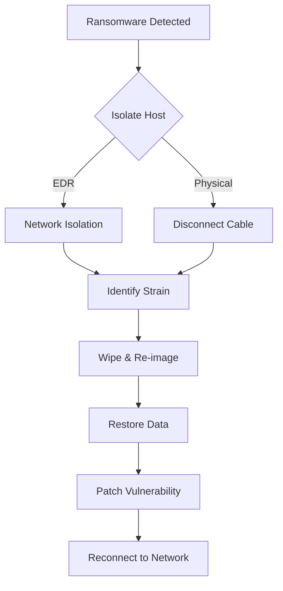

# Playbook: Ransomware Response

**Severity**: Critical | **Category**: Malware

## 1. Analysis Flow

## 1. Analysis
-   **Verify**: Check for `.encrypted` extensions or ransom notes.
-   **Lateral Movement**: Check logs for SMB/RDP traffic from the infected host to others.
-   **Data Exfiltration**: Check Firewall logs for large outbound transfers.

## 2. Containment
-   **Isolate Host**: Use EDR to "Network Isolate" the infected host immediately.
-   **Disconnect Network**: If EDR fails, physically disconnect cable/Wi-Fi.
-   **Disable User**: Disable the compromised user account in AD.

## 3. Eradication & Recovery
-   **Wipe & Re-image**: Do not attempt to clean. Format the drive and reinstall the OS from a clean image.
-   **Restore Data**: Restore files from the last known good backup (Offline/Immutable backups preferred).
-   **Attribute**: [Availability / Confidentiality]
-   **Patch**: Ensure the vulnerability (e.g., RDP, Phishing) used for entry is patched before reconnecting.

## 4. Notification
-   Notify Legal/Compliance teams immediately due to potential data breach (GDPR/PDPA).

## References
-   [MITRE ATT&CK T1486 (Data Encrypted for Impact)](https://attack.mitre.org/techniques/T1486/)
-   [CISA Ransomware Guide](https://www.cisa.gov/stopransomware/ransomware-guide)
